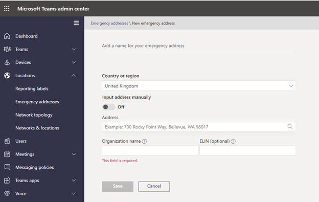

Several countries/regions around the world have specific regulations and policies that require phone numbers are aligned to the physical address of the user(s) so that emergency calls are routed to the correct Public Safety Answering Point (PSAP), and they are aware of the users' address to dispatch any emergency services.

A Public Safety Answering Point (PSAP) is a call center where emergency calls are routed. They will talk to the caller and displace the appropriate services, like police, fire brigade or ambulance.

Microsoft Teams supports "emergency calling," which ties a specific static address to a phone number, and "dynamic emergency calling," which provides the capability to provide the current location of the user based on the network they are currently connected to.

We are looking at configuring Emergency Calling addresses first in this module as a phone number must be aligned to an emergency calling address. How this is configured varies by country/region. In the United States, you need to associate an emergency location when you assign the phone number to the user. In Europe, you need to associate an emergency location to the phone number when you acquire the phone numbers from Microsoft or your Operator Connect provider.

## Define emergency calling addresses

To add phone numbers to Teams, the first step is to configure emergency addresses. To Assign Calling plan numbers successfully in many European countries/regions such as Belgium, France, Germany, Ireland, Netherlands, and Spain, the emergency address must match the area code of the phone number area code of the number ordered from Microsoft.

You do this by following these steps:

1. Navigate to the Microsoft Teams admin center at [https://admin.teams.microsoft.com](https://admin.teams.microsoft.com/).

1. Select **Locations** and **Emergency addresses**.

1. Select **Add** to create a new entry.

1. Enter the following information for the new address:

    1. **Country or region** – The region of the new emergency address
    
    1. **Input address manually** – Off, to look up the address automatically
    
    1. **Address** – The address of office/site
    
    1. **Organization name** – Organization name is your organization name. It will be prepopulated with the tenant organization name
    
    1. **ELIN** 1. Session Border Controllers (SBCs) can include Emergency Location Identification Number (ELIN) records. These are only relevant to Direct Routing and do not apply to Calling Plans or Operator Connect. This field can be left blank.

1. Select **Save** to finish creation.

By default, Microsoft will attempt to look up the address, when you entered it as shown in the following picture.

[!div class="mx-imgBorder"]

If it can't be found, you can also toggle to input addresses manually by following these steps:

1. Navigate to the Microsoft Teams admin center at [https://admin.teams.microsoft.com](https://admin.teams.microsoft.com/).

1. Select **Locations** and **Emergency addresses**.

1. Select **Add** to create a new entry.

1. Enter the following information for the new address:

    1. **Country or region** – The region of the new emergency address
    
    1. **Input address manually** – On, to look up insert the address manually
    
    1. **House number/name** 1. The address of office/site
    
    1. **Street name** – The address of office/site
    
    1. **City/town** 1. The address of office/site
    
    1. **Postal code** 1. The address of office/site
    
    1. **Latitude** – latitude coordinates
    
    1. **Longitude** 1. longitude coordinates
    
    1. **Organization name** – Organization name is your organization name. It will be prepopulated with the tenant organization name
    
    1. **ELIN** - Session Border Controllers (SBCs) can include Emergency Location Identification Number (ELIN) records. These are only relevant to Direct Routing and do not apply to Calling Plans or Operator Connect. This field can be left blank.

1. Select **Save** to finish creation.

> [!TIP]
> When inputting an address manually, you should include Latitude and Longitude, if you do not know these, input the address into Bing maps, and when the location comes up on the map, right select the location to see the Latitude and Longitude.

After performing the described steps, you have added an emergency calling address. Once added, the address it will show in the list. Usually addresses will show as Validated straight away, but sometimes Microsoft may need to manually validate the address. Once Validated, addresses can be used.

## Configure emergency calling policies

Emergency calling policies define what happens when a user in your organization makes an emergency call. For Calling Plans, only Emergency calling policy applies. Emergency call routing policy is only for Direct Routing and will be explained in another module.

The emergency calling policy allows us to notify a person in your organization, typically the security team, when a user dials an emergency number.

You can assign emergency calling policies directly to users or to network sites to be inherited by the users dynamically when located on those sites. Users will automatically get the global policy unless you create and assign a custom policy, or a network site policy applies.

For example, an emergency calling policy might be assigned to the "London site" so that any user that roams from home or another location is configured. Therefore, when they are on the London site, the London security team are notified and conferenced in if they dial an emergency number.

Emergency calling Policies configured by following these steps:

1. Navigate to the Microsoft Teams admin center at [https://admin.teams.microsoft.com](https://admin.teams.microsoft.com/).

1. Select **Voice** and **Emergency polices**.

1. Select **Add** to add an Emergency Policy.

1. Enter a meaningful **Name** and **Description**.

1. Select Notification mode, the options are:

    1. **Send notification only**: A Teams chat message is sent to the users and groups that you specify.
    
    1. **Conferenced in muted and unable to unmute:** A Teams chat message is sent to the users and groups that you specify, and they can listen (but not participate) in the conversation between the caller and the PSAP operator.
    
    1. **Conferenced in muted but can unmute**: A Teams chat message is sent to the users and groups that you specify, and they can unmute to listen and participate in the conversation between the caller and the PSAP operator.

1. Define the **Numbers to dial for emergency calls notifications**. If you select one of the conference modes, you can put in a E.164 PSTN phone number or a security group or you can put in both.

1. In **Users and groups for emergency calls notifications**, you can define one or more users and groups that will be notified for emergency calls via email. You can send notifications to the email addresses for users, distribution, and security groups.

1. Select **Apply**

After performing the described steps, you have configured your emergency calling policy.

## Configure network locations for dynamic emergency calling

Dynamic emergency calling provides the capability to configure and route emergency calls, provide the correct emergency calling address, and optionally notify security personnel (via emergency calling policies) based on the current network location of the Teams client.

For Microsoft Calling Plan users, dynamic location for routing emergency calls is only supported in the United States.

This works by the Teams voice administrator populating a database that maps specific network address to physical locations/addresses. Location Information Service (LIS) is the service that provides the correct details to the Teams client.

During startup and periodically afterward, the Teams client sends a location request that contains its network connectivity information to LIS. If there is a match, LIS will provide the correct details.

To configure dynamic emergency calling, firstly we need to map the relevant Network Regions, Network sites, network subnets, and Trusted IP addresses. This is done under Locations > Network topology in the Teams Admin Center.

### Adding a network site to Network Topology

Select Add to add a Network Site. Network Site is the level where you can align an Emergency Calling policy (as well as Location based routing and Emergency call routing policy for Direct Routing). Multiple network Subnets can be associated with a single network site.

Network Region is a collection of Network Sites; you can configure your network region by selecting or adding one when adding a network site.

### Adding a trusted IP to Network Topology

Trusted IP addresses are the enterprises public external IP addresses that a Teams user will show as routing from on the public internet. These are important as they validate that the user is on an enterprise network, and the system should check if they are on a mapped subnet. If the public IP of the user does not match a Trusted IP address, the location map will not be checked. This prevents subnets on different networks, but with the same internal subnet numbering, being accidentally mapped to the wrong emergency address. You do not need to map Trusted IPs to specific networks.

### Mapping a network to a physical location (emergency address)

Once the network topology of Region, Site, and subnet is complete, you can now map specific network locations to physical Emergency Addresses. This is populating the Location Information Service (LIS) database.

> [!TIP]
> This configuration refers to Emergency Locations, but when you are defining them Teams Admin Center calls them Emergency Addresses. They are the same thing.

You can map emergency location\addresses to:

- Wireless Access Point (WAP) by BSSID (Basic Service Set Identifier) - Each AP has a BSSID.

- Ethernet switch by Chassis ID. Each network switch is stamped with a Chassis ID that is used to identify a specific switch on a network.

- Ethernet switch port, which maps both the Chassis ID and the port ID. This allows a switch that spans multiple locations to be more accurately mapped down to the port.

- Subnet: Not tied to any physical equipment address, this is the network address the user has. Unlike mapped subnets in the Teams Network topology, The Location Information Service (LIS) doesn’t maintain a list of Networks and Subnet masks, it relies on the NetworkID of the subnet.

This is configured by following these steps:

1. Navigate to the Microsoft Teams admin center at [https://admin.teams.microsoft.com](https://admin.teams.microsoft.com/).

1. Select **Locations** and **Networks & locations**.

1. Select the tab that represents the network identifier that you want to add, **Subnets, Wi-Fi access points, Switches, or Ports.** Select **Subnets** for this example.

1. Select **Add** to add a subnet and Emergency Location.

1. Select and IP version, IPv4 or IPv6, as appropriate for the network you wish to map.

1. For **Subnet**, enter the Network ID of the subnet to add.

1. Enter a meaningful **Description**.

1. Search for and select an **Emergency Location** from one of the Emergency addresses you have already defined. Or, if you have not yet defined the emergency location you need, Select **Add an emergency location**.

After performing the described steps, you have mapped a network to an emergency address location.

