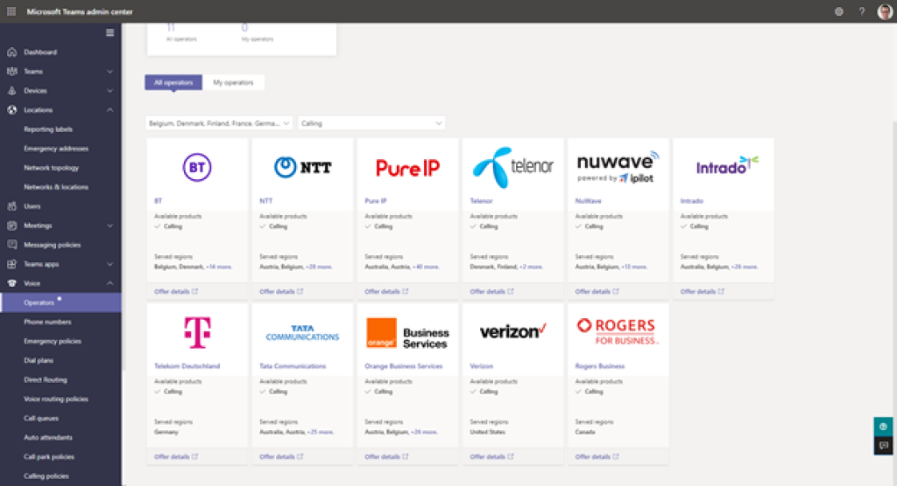

Operator Connect is the newest option to provide Public Switched Telephone Network (PSTN) connectivity with Teams Phone. It joins Microsoft Calling plans and Direct Routing and another option. All three options can be mixed and matched as appropriate for your organization.

Operator connect allows you to consume user phone numbers directly from Microsoft certified and approved third-party PSTN Carriers/Operators. You can request a relationship with the operator directly from the Teams Admin Center and phone number assignment, and administration is done through the Teams Admin Center.

The billing and commercial agreement is between you and the third-party operator.

There is no technical setup, SBC setup, or anything equipment related, as Operator Connect carriers are already directly network connected with Microsoft. This makes it much simpler to engage with carriers and order/assign numbers.

Operator connect allows you to maintain existing telco operator relationships as well as make new ones easily for specific countries you require phone numbers in.

> [!NOTE]
> Note, you can have more than one operator concurrently for different users or countries, or even the same country. There is no limit to the number of operators you can have.

## Connector to an Operator

The first step on your operator connect journey is to select your operator. The Teams Admin Center makes this easy. Under Voice, on the left menu, there is an Operators tab that shows all currently available operators (the list will continue to expand as new operators are added).

You may want to pick an operator you already know and use, or, if you wish to find out which operators can serve the country or countries you need, you can use Teams Admin Center to filter the All Operators tab by country and capability. The following picture shows several available Operators for different regions:

To configure an Operator Connect operator, firstly select an operator.
- Navigate to the Microsoft Teams admin center at [https://admin.teams.microsoft.com](https://admin.teams.microsoft.com/).

- Select **Voice** and **Operators.**

- You will see a list of operators to choose from. For each operator, there is an "Offer Details" link that links to their site. Operators define their commercial models and packages, and other add-on services, so it is worth checking out the different options.

- Select the **operator** you wish to enable.

- Select the **regions** you are interested in procuring numbers.

- Tick the boxes to agree that the **operator can contact me** and that you **accept the data transfer notice**, which allows Microsoft to share select information with the carrier for the provisioning, use, and technical troubleshooting of the service.

After performing the described steps, you have indicated you wish to sign up with an operator.

From here the operator will email you to provide details of the service and how to sign up. This typically involves a sign-up process completed on an operator web portal or via email and PDF/online contract depending on the operator. You'll need to provide your tenant ID to the operator. If you don't know your tenant ID, review the links in the resources for help.

When you sign up the operator, they will appear in the Voice > Operators > My Operators Tab.

> [!TIP]
> TIP: The operators will have access to see all emergency addresses in your tenant in the countries that you selected services for, but they cannot create them. Be sure to configure Emergency address locations for all countries and locations you want numbers for.

## Manage Operator Connect phone numbers

You cannot order phone numbers from within the Teams Admin Center, like you can with Microsoft Calling plans. To order numbers, you work directly with your carrier in their online portal or directly via phone/email.

The numbers they provision to your account will be available in the Teams Admin Center:

- Navigate to the Microsoft Teams admin center at [https://admin.teams.microsoft.com](https://admin.teams.microsoft.com/).

- Select **Voice** and **Phone numbers**.

- The numbers will be listed with the appropriate operator as the **Number provider.**

After performing the described steps, you will be able to review and manage your operator connect number inventory on your tenant.

