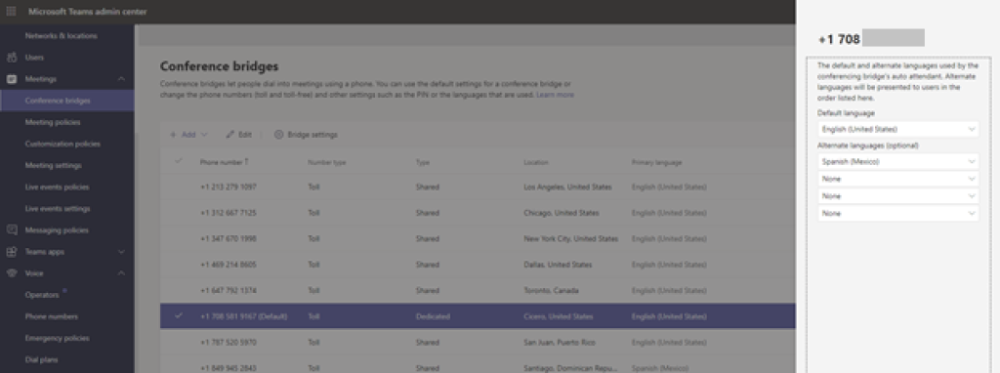

Audio Conferencing in Microsoft's terminology for PSTN phone numbers dial into or out from a meeting. These numbers are sometimes referred to as "conference bridges."

This requires a per user Audio-Conferencing license. Even though this is a "meetings" feature, because it involves the PSTN, it is often given to the Teams voice administrators to configure.

## Set a default Audio Conferencing Bridge

The default phone number of your conference bridge defines the caller ID that will be used when an outbound call is placed by a participant or the organizer from within a meeting.

The phone number assigned as the default number of the bridge will be one from the country/region of the organization.

To change the default audio conferencing bridge number for your organization, navigate to Meetings / Conference bridges in the Teams Admin Center, select at bridge number, then select "Set as Default."

## Configure Communication Credits

Some conferencing and Calling Plan scenarios are charged per minute. Some per minute scenarios include:

| Scenario| Description|
| :--- | :--- |
| Toll-free numbers used with Audio Conferencing meetings, auto attendants, or call queues. Toll-free calls are billed per minute and require a positive Communications Credits balance.| Some organizations like to provide toll free numbers for their customers to dial in on so their customers do not incur any call charges.|
| Dialing out from an Audio Conference meeting to somewhere not included or beyond your inclusive dial out minutes| Sometimes in meetings, it is easier to bring someone into the meeting by dialing out to them on their PSTN number. Some users also like the service to dial their PSTN number, so they can pick up the meeting on their phone.|
| Dialing any international phone number when you have Domestic Calling Plan subscriptions| This is a common configuration. It is more cost effective for users who rarely make international calls to be on a domestic calling plan, but they may need to make the occasional international call.|
| Pay per minute audio conferencing (available to enterprise customers).| Enterprise Agreement customers can have a conferencing license that cost nothing per user per month, but there is a per minute charge for both inbound and outbound PSTN calls to/from the conference.|

Any scenarios that are charged per minute are managed through “communications credits.” Communication credits are a prepaid bucket of credit. It can be a one-time funded bucket or an auto-recharge amount with a minimum balance that will trigger a purchase for that recharge amount.

### Setup Communication Credits

Perform the following steps to set up Community Credits:

- Navigate to the Microsoft 365 admin center at [https://admin.microsoft.com](https://admin.microsoft.com/)

- Select **Billing** and **Purchase Services**.

- Select **Add-ons** and **Communications Credits**.

- On the Communications Credits subscription page, fill in your information.

- Here you add funds via **credit card** and if it will **auto-recharge** (keep adding credit when it runs out) and how much the **trigger amount** should be to auto recharge and the **recharge amount**.

- Enter your **payment information** and Select **Place order**.

After performing the described steps, you have enabled communications credits on your tenant.

> [!TIP]
> TIP: Any funds not used within 12 months of the purchase date will expire and be forfeited. So be sure not to add more money than you will use within the next 12 months.
> TIP: If you are a volume licensing customer, you may choose your enterprise agreement number for payment rather than using a credit card.

### Assign Communications Credits license to users

Control of which users can incur communication credits costs is managed by assigning a zero-cost license to users.

Perform the following steps to assign this license to users:

- Navigate to the Microsoft 365 admin center at [https://admin.microsoft.com](https://admin.microsoft.com/)

- Select **Users** and **Active users.**

- Select a user from the list.

- Select **Licenses** and **Apps**.

- Toggle **Communications Credits** to on to assign this license.

- Select **Sav**e

After performing the described steps, you have assigned the communications credits license to a user.

## Configure a new Toll Conference Bridge Number

Teams will come with many conference bridge/meeting PSTN numbers by default. These numbers allow users to dial into the meeting via regular phone numbers rather than over VoIP. Many numbers are given by default to attempt to give users all around the world a local number to dial in, while minimizing their call costs.

Some organizations may want to add conference numbers because they have customers in those particular cities, or they want to present a conference dial-in number with an area code more local to your main office location.

To do this, you must acquire a new service number from Microsoft. You can then assign it to the Conference Bridge Service by following these steps:

- Navigate to the Microsoft Teams admin center at [https://admin.microsoft.com](https://admin.microsoft.com/)

- Select **Meetings** and **Conference bridges**.

- Select Add to create a new entry.

- Select either **Toll** or **Toll free** number.

- Select the number and **Apply**.

After performing the described steps, you have assigned a service number as a Dedicated conference number for your tenant.

The above picture shows the ability to define the default language for a conference bridge number.

Since this is a dedicated number for your tenant, you can optionally choose the default and alternate languages used for the audio prompts when dialing into it. This can be useful if you want to present a number to customers and have the default prompts be in their local language. To do this, do the following:

- Navigate to the Microsoft Teams admin center at [https://admin.microsoft.com](https://admin.microsoft.com/)

- Select **Meetings** and **Conference bridges**.

- Select the number from the list and select **Edit**,

- You can now select the default and alternate languages.

- Select **Apply**

After performing the described steps, you defined the default language for your dedicated conference number.

## Configure Toll-Free Conference Bridge Number

Teams does not come with any Toll-free Conference numbers by default. If you choose to provide users with toll free numbers, the use of these numbers will be charged per minute through communication credits.

You must first have Communications Credits configured to acquire and use a toll-free conferencing number.

> [!TIP]
> TIP: Toll free numbers only operate within each country/region. For example, your users won't be able to call an Australian toll-free number outside of Australia.

Firstly, you must acquire a new toll-free service number from Microsoft.

You can then assign it to the Conference Bridge Service by performing the following steps:

- Navigate to the Microsoft Teams admin center at [https://admin.microsoft.com](https://admin.microsoft.com/).

- Select **Meetings** and **Conference bridges**.

- Select **Add** and select **Toll free number**.

- Select the configured phone number and select **Apply**.

As with the toll number, you can optionally define the default and alternate languages.

