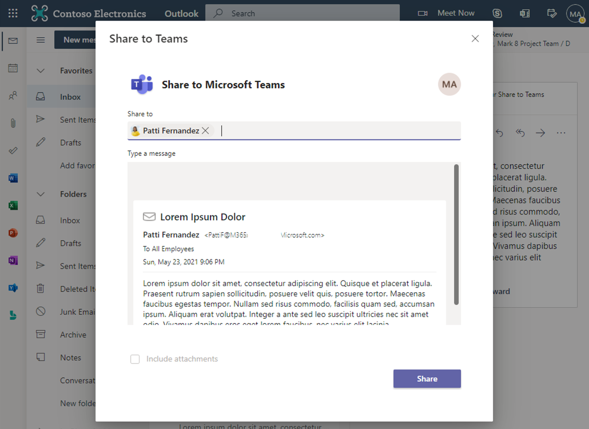
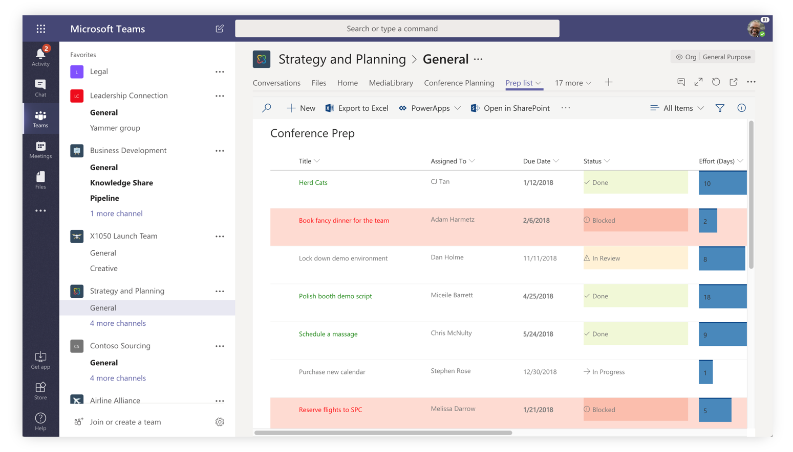
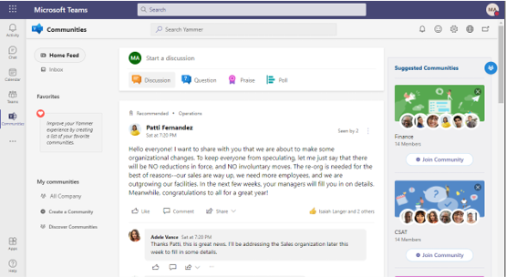
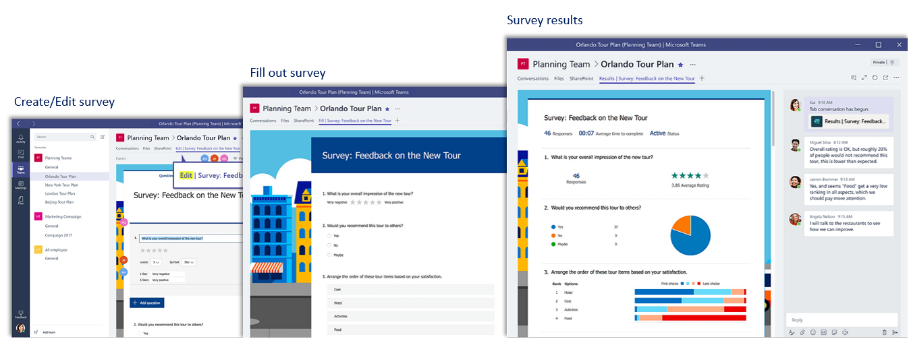
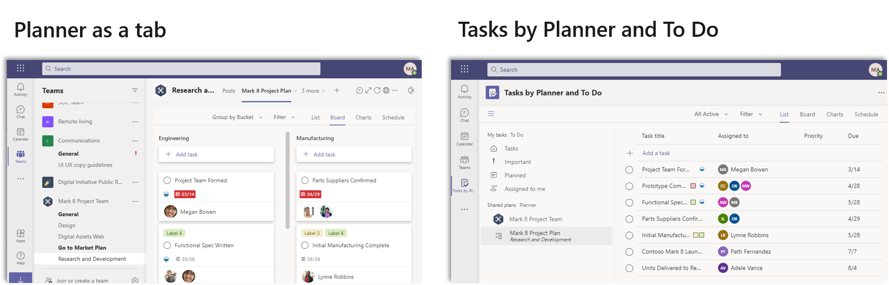

Microsoft 365 is the productivity cloud designed to help each of us achieve what matters, in our work and life, with best-in-class Office apps, intelligent cloud services, and advanced security. Microsoft Teams is part of Microsoft 365, meaning your collaboration experience in Teams will be integrated with the files, information, and services your team needs to get things done.

There are multiple ways to apply Microsoft 365 apps and services in Microsoft Teams. The most common scenario is to add a new tab to a team channel. Users can also add the content to a chat from Microsoft 365 services. The followings are examples of integrating Microsoft 365 in Microsoft Teams:

## Outlook
The integration between Outlook and Teams makes it easy to collaborate no matter where the conversation is taking place. 

- **Share to Outlook**: Users can share chats or channel conversations to Outlook without leaving Teams by selecting on the "Share to Outlook" in more options ("...") icon in a conversation. 

- **Share to Teams**: Users can move an email conversation from Outlook, including attachments, into a Teams chat or channel conversation by selecting on the "Share to Teams" in Outlook. 

- **Actionable missed activity emails**: Users can set the notification for missed activity emails to stay on top of missed conversation in Teams. The missed activity emails show the latest replies from the conversation, and allow users to respond directly from within Outlook.

> [!div class="mx-imgBorder"]
> 

## SharePoint 
In Microsoft Teams, users can add published SharePoint pages or lists as a tab in a Teams channel. SharePoint pages let users share ideas using images, video, links, and documents. SharePoint lists are a great way to collaborate on content and data. Team members can view pages, edit lists, and add comments in the Teams tabs. Add the SharePoint tab in Teams to quickly paste any page, news post, or list from a published SharePoint site.

## Yammer
Users are able to add a Yammer page to a channel in Teams or install then pin the Yammer app (named *"Communities"*) to the app bar. This allows team members follow and share conversations in Yammer without having to leave Teams. The team members can participate in the Yammer conversation right from Teams, or discuss a Yammer conversation in Teams before posting a reply to the wider Yammer group. When a Teams member goes to the Yammer tab, they are authenticated again by Yammer, so that they only see Yammer content that they have access to.

## Forms
Users can access Microsoft Forms directly in Microsoft Teams. Easily set up a Forms tab, create a new form to collect responses, add an existing form to collect responses or show survey results, collaborate with your team on a form, create notifications for your form, or conduct a quick poll to a Teams chat, channel, or meeting.

 

## Planner and Tasks

**Microsoft Planner** is a task management tool that small teams of individuals can use to manage their work and associated tasks visually and openly with the rest of the team. Having Planner as a tab in Microsoft Teams enables the team to work more collaboratively and closer together without any added effort.

**Tasks** in Teams gives you a new unified view of your personal and team tasks, powered by Planner and To Do. It consolidates your tasks across Microsoft To Do, Planner, and Outlook. 

There are two places in Teams where you can access Tasks: as an **app** in the left apps menu and as a **tab** within individual teams. 

 

## Streams
Microsoft Stream is an Enterprise Video service where people in your organization can upload, view, and share videos securely. Users can collaborate using video by adding a Microsoft Stream channel or video as a tab in Microsoft Teams. Users can also watch Streams videos in Teams, such as meeting record or live events.

### Office documents (Word, Excel, PowerPoint)
Users can add document files as a tab in Microsoft Teams. Additionally, files stored in team's file library are accessible to every member of the Team. Users and their team members can coedit Word, PowerPoint, or Excel documents, or comment on Visio files.

### OneNote
Within Microsoft Teams, users can interact with Notebook by visiting the OneNote tab in a channel in Teams. For example: 

- Create a tab of OneNote to a channel in Teams to store text, images, handwritten notes, and more.
- Add a tab of OneNote to a channel in Teams from an existing notebook to centralize content. 

