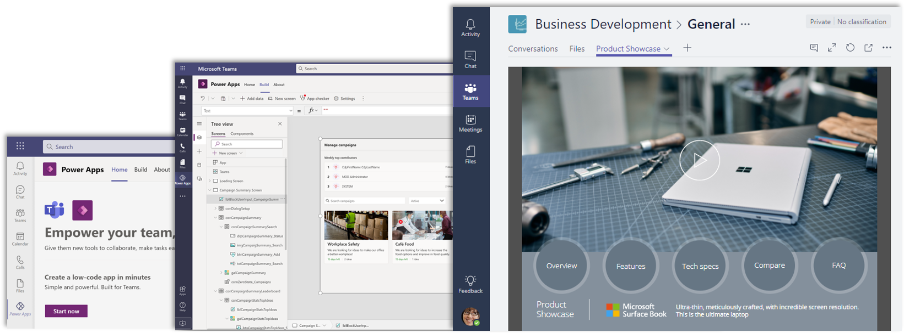
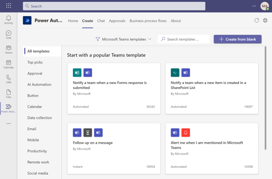
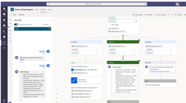
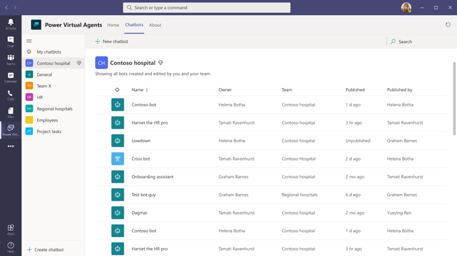
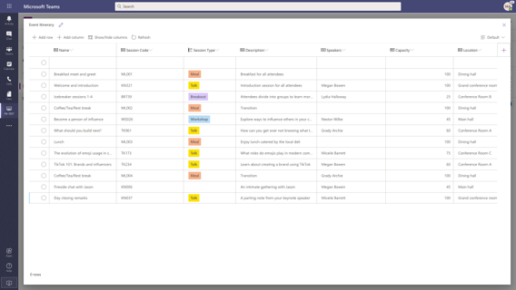

Today's business problems increasingly require modern digital solutions. With the integration of Microsoft Power Platform apps into Teams, organizations can streamline business processes, respond to changing business needs more rapidly to drive greater collaboration, and create and share custom solutions to be more productive.

With a low-code platform, anyone with a great idea can build a digital app. Microsoft Power Platform helps users accelerate their development with low-code tools to analyze data using **Power BI**, build custom apps using **Power Apps**, automate processes using **Power Automate**, and create intelligent bots using **Power Virtual Agents** more quickly than ever. 

Microsoft Power Platform provides many integration capabilities with Teams where you can embed **Power BI** reports in the Teams workspace, embed apps created using **Power Apps** as a tab or personal app, trigger a **Power Automate** flow from any message or use adaptive cards, and add your bot created using **Power Virtual Agents** to Teams for other members of your organization to interact with.

## Power Apps in Teams
Power Apps provides a rapid low code development environment for building custom apps for business needs. It has services, connectors, and a scalable data service and app platform (Microsoft Dataverse) to allow simple integration and interaction with existing data. Combined with Microsoft Teams, Power Apps can be used to build a modern workplace through custom tabs and apps in the app bar all with little to no code. 

The followings are examples to use Power Apps in Microsoft Teams:

- Use the **Power Apps tab** for Teams to embed a canvas or model-driven app as a tab app in Teams channels.

- Pin a canvas app to the Microsoft Teams app navigation bar as a **Teams personal app**.

- Use the **Power Apps app** in Teams to create canvas apps within Teams backed by Dataverse for Teams.

## Power Automate in Teams

Power Automate lets users create automated workflows between applications and services. It helps automate repetitive business processes such as communication, data collections, and decision approvals. Not only for the individual user, Power Automate allows for the creation of enterprise-grade process automation. The integration of Power Automate and Teams streamlines processes to make the work in Teams even more efficient. Users can use prebuilt templates to easily automate common business processes. 

The followings are examples to use Power Automate in Microsoft Teams:

- Create and manage flows automations directly from Teams.

- Trigger flows from Teams messages.

- Post messages to channels from a flow.

- Streamline approvals by aggregating and automating all team's approval processes in Teams.

    

    

## Power Virtual Agents in Teams

Power Virtual Agents enables anyone to create powerful chatbots using a guided, no-code graphical interface, without the need for data scientists or developers.

It minimizes the IT effort required to deploy and maintain a custom solution by empowering subject matter experts to build and maintain their own conversational solutions. For example, a human resources (HR) employee creates a bot that can answer questions about vacation balance, time off, and benefits.

The followings are examples to use Power Virtual Agents in Microsoft Teams:

- create, author, test, and publish chatbots directly from Teams.
- Review and analyze the performance of the bot.
- Have bots take actions on someone's behalf.

    

    

## Power BI in Teams

Power BI enables users to connect and transform data into accessible visualizations seamlessly. Measuring and tracking results is essential for teams to achieve their objectives. Users can visualize insights with Power BI in Teams and discuss data effortlessly to enable data-driven decisions. 

The followings are examples to use Power BI in Microsoft Teams:

- Create Power BI tab in Teams to make data-driven decisions quickly.

- Embed interactive reports in Microsoft Teams channels and chats.

- Get notifications in Teams about activity from Power BI.

## Microsoft Dataverse for Teams

Microsoft Dataverse for Teams, which is built on Microsoft Dataverse, provides relational data storage, rich data types, enterprise-grade governance, and one-click solution deployment to the Microsoft Teams app. 

Microsoft Dataverse for Teams is a built-in, low-code data platform for Microsoft Teams that lets users build custom apps, bots, and flows in Microsoft Teams by using Power Apps, Power Virtual Agents, and Power Automate. 

If your organization requires extra capabilities, such as more granular control for security and governance, or capacity beyond the approximately 1 million rows a Dataverse for Teams environment can contain, Dataverse for Teams can be upgraded to Dataverse.

The four types of Dataverse for Teams solutions are:

* **Apps** - Use Power Apps in Teams to create custom apps that are built by using the enhanced performance and scalability of Dataverse for Teams. 

* **Workflows** - Build flows that can respond to new Teams messages when data changes in Dataverse for Teams or when a Teams message is selected and has started a process. 

* **Chatbots** - Share expertise through FAQs and interact with your data in Dataverse for Teams.

* **Dashboards** - Users can explore and interact with their data in Dataverse for Teams.

    

## Knowledge check 

Choose the best response for the following question. Then select “Check your answers.”