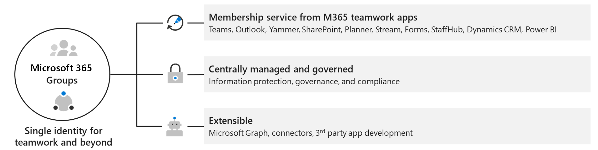

Microsoft 365 Groups is the cross-application membership service in Microsoft 365. It is an object in Azure Active Directory. 

A Microsoft 365 Group can be created directly from Microsoft 365 admin center or indirectly from creation of associated workloads, such as a team. When you create a team in Microsoft Teams, on the back end, you're creating a Microsoft 365 Group and the associated cloud applications. 

Teams shares the same group privacy and membership roles with the associated Microsoft 365 group. 

> [!div class="mx-imgBorder"]
> 

## Shared resources for Microsoft 365 Groups
Microsoft 365 Groups is the foundational membership service that drives all teamwork across Microsoft 365. With Microsoft 365 Groups, you can give a group of people access to a collection of shared resources. These resources include:

* A shared Outlook inbox
* A shared calendar
* A SharePoint document library
* A Planner
* A OneNote notebook
* Power BI
* Yammer (if the group was created from Yammer)
* A Team (if the group was created from Teams)
* Roadmap (if you have Project for the web)
* Stream

## Microsoft 365 Groups privacy
When creating a Microsoft 365 group, you must decide if you want it to be a private or public group. The group privacy also applies to the privacy of the associated team. 

- **Public group.** Any user in your organization can join public groups without the need of an administrator or owner to add or approve them. Therefore, content in a public group can be seen by anybody in your organization as soon they join the group. 

- **Private group.** Content in a private group can only be seen by the members of the group. People who want to join a private group must be approved by a group owner. 

## Group membership and roles

With a Microsoft 365 group, you don't have to manually assign permissions to each of shared resources. Adding people to the group automatically gives them the permissions they need.

When you create a team, a Microsoft 365 group is created to manage team membership. If you remove a member of a team, they are removed from the Microsoft 365 group as well. Removal from the group immediately removes the team and channels from the Teams client. If you remove a person from a group using the Microsoft 365 admin center, they will no longer have access to the other collaborative aspects such as SharePoint document library.

Groups have the following roles:

* **Owners** - Group owners can add or remove members and have unique permissions like the ability to delete conversations from the shared inbox or change different settings about the group. Group owners can rename the group, update the description or picture and more.

* **Members** - Members can access everything in the group, but can't change group settings. By default group members can invite guests to join your group, though you can control that setting.

* **Guests** - Group guests are members who are from outside your organization.

## Compare groups 

The following table identifies the differences between Microsoft 365 Groups and other types of groups. Distribution groups can be upgraded to Microsoft 365 groups.

| **Name**                     | **Description**                                                                                                                                                           | **Used when…**                                                                                                         |
|------------------------------|---------------------------------------------------------------------------------------------------------------------------------------------------------------------------|------------------------------------------------------------------------------------------------------------------------|
| Microsoft 365 Groups            | Used for collaboration between users, both inside and outside your company                                                                                                | a collaborative workspace for a group of users is required, such as a department or users working on a common project. |
| Distribution groups          | Used for sending notifications to a group of people                                                                                                                       | sending email communication to a defined group of users, such as "People in Building A" or "Everyone at Contoso."      |
| Security groups              |Used for granting access to resources and for managing devices.                                                                                     | Used for granting access to resources such as SharePoint sites. |
| Mail-enabled security groups | Same as security groups but includes email distribution to members.  Mail-enabled security group membership cannot be dynamic and cannot contain devices. |  Used for granting access to resources such as SharePoint, and emailing notifications to those users.                          |

 