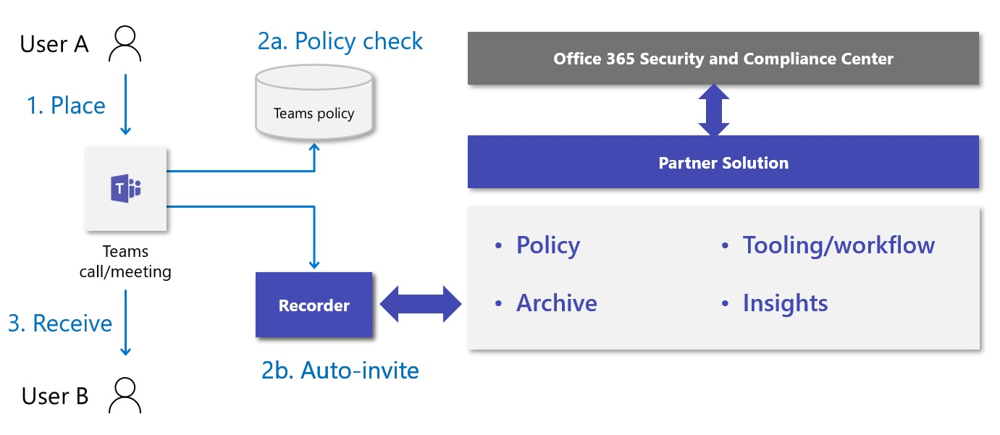

An important requirement for many organizations is having calls and meetings recorded for regulatory or compliance reasons. While Teams has recording built in, it is user controlled and is designed for the convenience of the user to choose to record select calls or meetings for their own use.

> [!NOTE]
> While several countries/regions and industries require compliance recording features, other countries/regions have data protection regulations which forbid recording without direct confirmation of all attendees. Know your local users’ legal requirements as well as your business requirements before enabling compliance recording features at all.

Policy-based compliance recording is different; it allows Microsoft certified partner solutions to connect to Microsoft Teams and be configured to automatically record every call, meeting, or specific calls or meetings. Unlike the built-in convenience recording, the end user cannot turn this off and usually will not have direct access to the recordings.

Compliance recording can be configured to capture audio, video, screen share, and chat. This is only possible with certified third-party solutions. Choose compliance recording solutions when you have an industry or legal requirement to capture calls and meetings for some or all the organization’s users.

## Comparing built in Teams convenience recording and third-party policy-based recording

It is important to understand the differences between the in-the-box convenience recording and policy-based recording that requires a certified third-party partner solution. The following table provides a comparison when to use the integrated features and when it is required to use a third-party solution to fulfill special business needs:

| **Type**| **convenience recording**| **Compliance policy-based recording**|
| :--- | :--- | :--- |
| Requires a third-party solution| No| Yes|
| Recording Initiator| User| Automatically records, configured by an administrator|
| Target| Recording is per-call / meeting| Per-user – system can be configured to record all calls and/or meetings involving that user.|
| Where is the recording stored| User OneDrive or Team OneDrive – accessible to users| Separate storage, controlled Admin team / compliance team|
| Owner of the recording file| User| Admin / compliance team|
| Notification of call being recorded required?| Yes- always on| On by default but can be disabled by customer/vendor if necessary and disclaimer signed.|
| Access Owner| User| Compliance|
| Retention Policy?| On by default, can be configured| Can be configured|

## How policy-based compliance recording works

All certified policy recording solutions use Microsoft bots deployed in Azure who “follow the recorded user” and silently join their calls and meetings to collect the meeting audio and video.
The following picture shows how the recording process works:

> [!div class="mx-imgBorder"]
> 

Once configured, this is how the system works:

1. A user makes a call or joins a meeting. 

1. There is a Teams policy check to see if the user has compliance Recording policy set to enabled.

    - If compliance recording is enabled, a bot is silently invited/added to the call or meeting. They will not show in the meeting roster. 

1. Once the bot has joined, the call or meeting proceeds normally and the bot will stream the call media to the recorder, which will be stored in the third-party solution.

## Configuring Compliance policy-based recording

Compliance policy-based recording is provided by certified third-party solutions. Many are available as SaaS solutions and allow you to deploy your own dedicated instances in your Azure tenant. The solution you choose will have its own administration experience to configure aspects of recording such as:
- License users for recording
- Retention of recording
- Storage and storage locations
- Access to recordings

How third-party solutions integrate to Microsoft Teams is the same for all solutions. This unit will show you how to configure Teams for policy-based recording. This allows you to control who is recorded. All configuration is done using Teams PowerShell Module. It is not possible via the Teams Admin Center.

This module does not cover the third-party solution configuration. See the vendors documentation for that.

> [!NOTE]
> This configuration will not record any Teams users for compliance reasons without you also signing up too and configuring a third-party certified compliance recording solution.

Complete the following steps to configure compliance recording:
1. Connect to the Microsoft Teams PowerShell module to your tenant.

1. Create an application instance in your tenant and sync the application instance from Azure Active Directory into Agent Provisioning Service.

This creates an application instance and resource account in Azure Active Directory. You define your UPN and display name. The ApplicationId is the Bot AppID that will be given to you by your compliance recording provider.

```PowerShell
New-CsOnlineApplicationInstance -UserPrincipalName teamsrecorder@tenantname.onmicrosoft.com -DisplayName "Recording Assistant" -ApplicationId d2c1b87d-35e3-49a2-aab8-8c158f74c2e5

```

The output will give the ObjectId for the new Application Instance and confirm the Tenant ID, User Principal Name, Application ID, display name, and Phone number if you set one.

```PowerShell
RunspaceId        : c6df03f9-8be5-400a-9f63-d89b0a9cacbb

ObjectId          : 4876b469-67ff-4bad-861f-62f0879af039

TenantId          : 0a8642c4-070e-4854-a2ab-44d845945bac

UserPrincipalName : teamsrecorder@tenantname.onmicrosoft.com

ApplicationId     : d2c1b87d-35e3-49a2-aab8-8c158f74c2e5

DisplayName       : Recording Assistant

PhoneNumber       :

```

3. Sync the application instance

For Sync-CsOnlineApplicationInstance, use the ObjectId of the newly created application instance

```PowerShell
Sync-CsOnlineApplicationInstance -ObjectId 4876b469-67ff-4bad-861f-62f0879af039

```

4. Create a Compliance Recording policy.

```PowerShell
New-CsTeamsComplianceRecordingPolicy -Tenant 0a8642c4-070e-4854-a2ab-44d845945bac -Enabled $true -Description "Teams Compliance Recording” -Identity Comprecpolicy

```

The output confirms the identity, description that it is enabled. WarnUserOnRemoval is a parameter reserved for future use, so it can be ignored.

```PowerShell
WARNING: Length of the Compliance Recording Application list should be non zero.

Identity                                            : Tag:Comprecpolicy

ComplianceRecordingApplications                     : {}

Enabled                                             : True

WarnUserOnRemoval                                   : True

DisableComplianceRecordingAudioNotificationForCalls : False

Description                                         : Teams Compliance Recording

```

5. Add the synchronized application to the policy. Users with this policy will be recorded by the applications included in their assigned policy.

```PowerShell
Set-CsTeamsComplianceRecordingPolicy -Tenant 0a8642c4-070e-4854-a2ab-33d845945bac -Identity Comprecpolicy -ComplianceRecordingApplications ` @(New-CsTeamsComplianceRecordingApplication -Tenant 0a8642c4-070e-4854-a2ab-44d845945bac -Parent Comprecpolicy -Id 4876b469-67ff-4bad-861f-62f0879af039)

```

6. Assign the Compliance Recording policy to a user by using the following cmdlet:

```PowerShell
Grant-CsTeamsComplianceRecordingPolicy -Identity user@domain.com -PolicyName CompRecPolicy

```

Setting and changing these policies may take hours to take effect on the user's calls & meetings due to the time it takes for policies to replicate across Office 365.
> [!TIP]
> Compliance recording providers can configure their solution to be completely transparent to the user with no audible notifications or banners telling the user that the call is being recorded.

## Configuring strict mode

Strict mode is the default configuration of Teams compliance recording. It means that in the event of any issues with the recording platform that prevent the recording from happening, the call will be blocked from happening or disconnected.

The Teams Compliance Recording Policy allows the following configuration:

| Name| Description|
| :--- | :--- |
| RequiredBeforeCallEstablishment| Defines if the bot must join the call before the recorded user can place or receive calls|
| RequiredBeforeMeetingJoin| Defines if the bot must join the call before the recorded user can join the meetings|
| RequiredDuringCall| Defines if the recorded user will be disconnected from the call if the recorder bot connection is lost|
| RequiredDuringMeeting| Defines if the recorded user will be disconnected from the meetings if the recorder bot connection is lost|

These allow you to configure what will happen in the event of an issue with the recording bot or third-party solution. These are all defaulted to true.  This means the call or meeting will be canceled or blocked from being established if the policy-based recording application fails to join the call or drops during the call or meeting. This is sometimes referred to as “strict mode.”

If you would prefer calls to be allowed to carry on in the event of a recording issue, you can set these values to false in the recording policy with PowerShell by using the following cmdlet from the Microsoft Teams PowerShell module:

```PowerShell
Set-CsTeamsComplianceRecordingApplication –Identity “Comprecpolicy/4876b469-67ff-4bad-861f-62f0879af039” -RequiredBeforeMeetingJoin $false -RequiredDuringMeeting $false -RequiredBeforeCallEstablishment $false -RequiredDuringCall $false

```

After issuing the cmdlet, strict mode is disabled, allowing calls and meetings to be established and carry on even if there is an issue with the compliance recording.

> [!TIP]
> Organizations recording for monitoring and training purposes may disable strict mode, but those that must record for legal or regulatory reasons will usually not disable strict mode.
