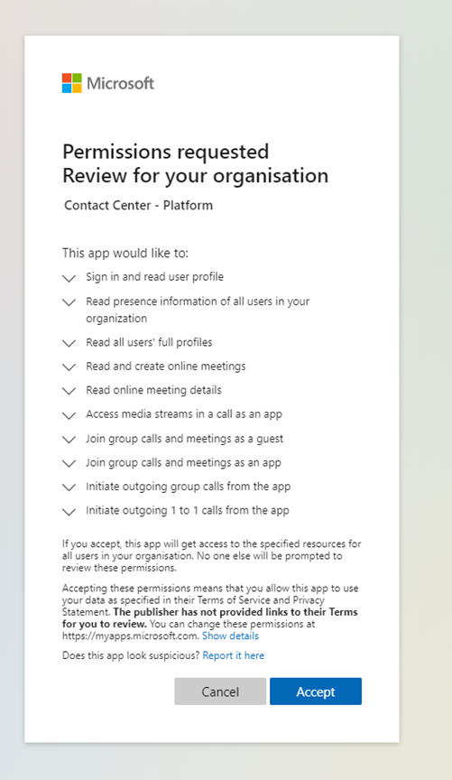

While Teams provides Auto Attendant and Hunt Groups, some organizations require a full featured contact center experience.

Examples of features third-party contract centers can offer include:

| **Feature**| **Use case**|
| :--- | :--- |
| Advanced Reporting| Detailed reporting of how calls flowed through the system, which menu items were chosen, and which agents talked to the person and for how long|
| Real-Time Reporting / Wall boards| Live reporting of calls in queue and agent status, often on large screens in the contact center|
| Complex Routing scenarios – Skills-based routing, dynamic queue balancing| Route calls to the best available agent considering the skills and abilities they have|
| Granular queue administration/Supervisor RBAC| Allow business users to administer just one queue or set of agents|
| Omni-channel - Phone, chat, email, SMS, social, video| Communicate with customers on many different platforms and with different modalities, not just voice|
| Whisper and Barge| Listen into live calls, talk to just the agent without the caller being able to hear for training purposes. Barge in and take over the call|
| Queue “call back”, announcements in queue etc.| Allow callers to press a button to be called back when they reach the front of the queue. Announce wait time and queue position to waiting callers.|
| Outbound calling / campaigns| The system can auto dial a set of numbers and pass the call to an agent when someone answers.|
| CRM / Line-of-business integrations for agents| Records about the caller, their name, and previous purchases; for example, can be presented to the agent automatically.|
| Bot / Line of Business Application Integrations for callers| Allow callers to directly interact with a bot and business systems; for example, dialing into a bank and using DTMF tones (pressing numbers) to check your balance.|
| Sentiment Analysis| Live or post calls: Systems will review the audio and report on the sentiment or feelings of the caller. For example, were they angry or unhappy with the experience?|
| Compliance recording / Payment Card Industry Data Security Standard (PCI DSS)| Many platforms include compliance recording with the option to pause recording to take payments.|

Microsoft has several certified partner solutions that can integrate to Microsoft Teams to meet these requirements. Features will vary between vendors.

There is a link to the list of certified vendors in the resources section.

There are two integration models for these solutions:

- Microsoft certified SBCs and Direct Routing to connect contact center solutions to Teams

- Leveraging Microsoft APIs to integrate to Microsoft Teams

In both models, the solutions will have their own configuration and administration experience, usually via an online portal. How this is configured will vary from vendor to vendor, and you should refer to their documentation. This unit will take you through how the two integrations are configured.

## Configure third-party certified contact center with Direct Routing

The Direct Routing model allows the third-party contact center to answer calls, manage, and route them as appropriate and then send them to an agent using Teams via a Direct Routing Teams Phone Call from the Contact Center Platform to Teams. Phone numbers will generally be provided by the contact center vendor.

Solutions may also use the Graph API to do presence-based routing to Teams users, not routing them contact center calls if they are already on a call or in a meeting, but there is no API integration for voice routing or voice control.

You will be required to set up direct routing before connecting a Certified Contact Center. This will allow the solution vendor to route calls to your users.

All configuration of the contact center elements will be done on the third-party solution.

> [!NOTE]
> In this model, all contact center agents must have a Teams Phone license as they need to be Phone enabled to receive Direct Routing calls.

## Configure third-party certified contact center with Microsoft API

With the Microsoft API integration model, the contact center solution is more tightly integrated into Microsoft Teams. In this model, customers can bring their own Direct Routing or Microsoft Calling plan PSTN numbers into the contact center. Since agents are not receiving a PSTN/Phone call from the contact center solution, they do not need a Teams Phone license to receive these calls.

How you configure the contact center solution will vary by vendor via their online admin portal, but the setup of the integration will involve admin consent to approve tenant access, configure users, and create one or more endpoints and resource accounts.

### Contract center bot application permissions

Bots will typically require the following Microsoft Graph rights. Check with vendor documentation to confirm the exact rights needed for your chosen solution.

The vendor will provide a URL for you to select and grant this access to their application.

| **Permission Name**| **Type**| **Description**|
| :--- | :--- | :--- |
| Calls.AccessMedia.All| Application| Access media streams in a call as an app|
| Calls.Initiate.All| Application| Initiate outgoing 1-to-1 calls from the app|
| Calls.InitiateGroupCall.All| Application| Initiate outgoing group calls from the app|
| Calls.JoinGroupCall.All| Application| Join group calls and meetings as an app|
| Calls.JoinGroupCallAsGuest.All| Application| Join group calls and meetings as a guest|
| Presence.Read.All Delegated| Delegated| Read presence information of all users in your organization|

The URL will be in the format: https://login.microsoftonline.com/common/adminconsent?client_id=\<VENDOR GUID\>

And permissions approval will look like the following:

> [!div class="mx-imgBorder"]
> 

It is important to review the permissions you are granting the application and ensure you understand the level of access you are granting the application/vendor. Ensure you only approve access to applications and vendors you trust. Never grant permissions to any application or service you do not recognize or understand.

Should you later want to revoke access to any application, you can do it in the Azure Active Directory portal under Enterprise Applications.

### Web application permissions

The web application will be used for contact center administration and configuration

Web applications will typically require the following Microsoft Graph rights. Check with vendor documentation to confirm the exact rights needed for your chosen solution.

The vendor will provide a URL for you to select and grant this access to their application.

| **Permission Name**| **Type**| **Description**|
| :--- | :--- | :--- |
| User.Read – Azure AD Graph| Delegated| Sign in and read user profile|
| User.Read.All| Delegated| Read all users' full profiles|
| User.Read.All| Application| Read all users' full profiles|

Once you have granted access to the application, you will need to assign users or groups of users to roles with the contact center solution.

1. Navigate to the Azure AD portal at [https://aad.portal.azure.com](https://aad.portal.azure.com/)

1. Sign in with an account owning the Global Administrator role.

1. Select the search box on top, enter and select **Azure Active Directory**.

1. Select **Enterprise Applications** from the left-hand navigation pane.

1. Search for the vendors application, , “**Vendor X Contact Center**”

1. Open vendors Web Applications.

1. Under Getting started select **1. Assign users and groups**

1. Select Add User

1. Select **Users and Groups**

1. Select the users or groups that will have access to the admin portal or other feature group.

1. Select **Select**

1. Select **Select Role**

1. Select **Administrator**

1. Select **Select**

1. Select **Assign**

After completing these steps, you have configured users to have roles in the vendors contact center solution.

### Create an application instance

Each dialable endpoint will require a resource account to be created. Resource accounts are non-enabled user accounts that are used to represent system resources. In Teams, you can create resource accounts, and then assign them to voice features such as call queues and auto attendant or third-party solutions like policy recording and contact centers.

Steps to create an application instance:

Connect to the Microsoft Teams PowerShell module to your tenant.

- Create an application instance in your tenant. This creates an application instance and resource account in Azure Active Directory. You define your UPN and display name. The ApplicationId is the Bot AppID that will be given to you by your vendor solution.

```powershell
New-CsOnlineApplicationInstance -UserPrincipalName helpdesk@tenantname.onmicrosoft.com -DisplayName "Helpdesk" -ApplicationId c8372cce-0657-11ec-9a03-0242ac130003

```

The output will give the ObjectId for the new Application Instance and confirm the Tenant ID, User Principal Name, Application ID, display name, and Phone number if you set one.

```powershell
RunspaceId        : d8d24c62-0657-11ec-9a03-0242ac130003

ObjectId          : df3745ee-0657-11ec-9a03-0242ac130003

TenantId          : 0a8642c4-070e-4854-a2ab-44d845945bac

UserPrincipalName : helpdesk@tenantname.onmicrosoft.com

ApplicationId     : d2c1b87d-35e3-49a2-aab8-8c158f74c2e5

DisplayName       : Helpdesk

PhoneNumber       :

```

- Sync the application instance from Azure Active Directory into Agent Provisioning Service. For Sync-CsOnlineApplicationInstance, use the ObjectId of the newly created application instance.

```powershell
Sync-CsOnlineApplicationInstance -ObjectId df3745ee-0657-11ec-9a03-0242ac130003

```

### Assign a PSTN phone number

To route a PSTN number to the application endpoint, it will need to be assigned a Teams Phone Virtual User-license. Virtual User license is a free license.

Steps to assign Virtual User-license in the Office 365 admin portal.

1. Navigate to Microsoft 365 admin center at [https://admin.microsoft.com](https://admin.microsoft.com/).

1. Select **Users** and **Active Users.**

1. Find and select the relevant resource account.

1. Select the **Licenses and apps** tab.

1. Select and assign the **Microsoft 365 Phone System - Virtual User** license.

1. Select **Save changes.**

After performing the described steps, you have assigned the virtual user license to the resource account.

> [!TIP]
> Your organization is allotted Teams Phone – Virtual User licenses depending on its overall size. Any organization that has at least one license including Phone System or has Phone System added has 25 Virtual User licenses available at no cost. When you add 10 Phone System user licenses in your organization, one more Microsoft 365 Phone System – Virtual User license becomes available.
> No virtual user license is needed for resource accounts that won’t be aligned to a PSTN number.

Assign a Calling Plan PSTN number to the resource account:

1. Navigate to the Microsoft Teams admin center at [https://admin.teams.microsoft.com](https://admin.teams.microsoft.com/)

1. Select **Org-wide settings** and **Resource accounts**.

1. Find and select the relevant resource account.

1. Select the **Assign/unassign** button.

1. Select **phone number type** Online.

1. Add the appropriate phone number.

1. Select **Save**

To assign a Direct Routing PSTN number to the resource account run the following PowerShell. Replace Identity with your resource account name.

```powershell
Set-CsOnlineApplicationInstance -Identity " helpdesk@tenantname.onmicrosoft.com" -OnpremPhoneNumber +1235435340

```

After performing the described steps, you have assigned a phone number to the resource account.

The vendor contact center solution will be able to use that resource account for its queue. You will need to go into the admin portal of the contact center solution and add it to a queue, usually by referencing the GUID.

