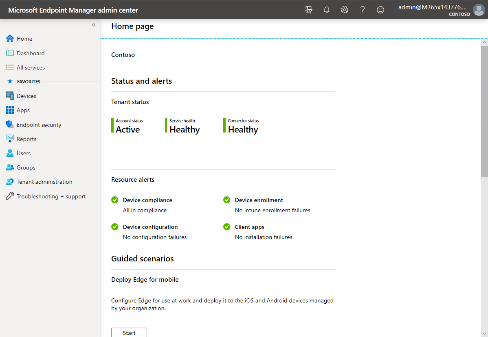

Microsoft Endpoint Manager is the convergence of Microsoft Intune and Configuration Manager functionality and data—plus new intelligent actions—offering a seamless, end-to-end management solution without the complexity of a migration or disruption to productivity. Microsoft Endpoint Manager provides transformative modern management and security that meets customers where they are and helps them move to the cloud. In addition to Intune and Configuration Manager, Microsoft Endpoint Manager includes the Device Management Admin Center (DMAC) and Desktop Analytics.

Intune helps you manage computers, laptops, tablets, and other mobile devices, including iOS, Android, and macOS devices. It uses Azure Active Directory (Azure AD) as a directory store for identity, and can integrate with local management infrastructures such as Configuration Manager. Intune is especially useful for devices that are beyond the management scope of Group Policy, such as mobile phones, devices that are not Active Directory Domain Services (AD DS) domain members, or Windows 10 devices that are joined to Azure AD. 

By using Intune, you can:
- Let your organization's employees use their personal devices to access organizational data (commonly known as "Bring Your Own Device (BYOD)").
- Manage organization-owned phones.
- Control access to Microsoft 365 from unmanaged devices, such as public kiosks and mobile devices.
- Help ensure that devices and apps that do connect to corporate data comply with security policies.

For example, when a user attempts to access data through a line of business app (LOB app) on their phone, Microsoft 365 checks with Azure AD to authenticate the user and verify whether that user can access the data from that app on that device. The results depend on: 
- Conditional Access policies defined within Azure AD. 
- Whether Intune tells Azure AD that the device is compliant with device configuration and data protection policies.
- Whether the app on that device complies with app configuration and data protection policies. 

If the device and app are both compliant with all policies, Azure AD notifies Microsoft 365 that the data can be accessed.