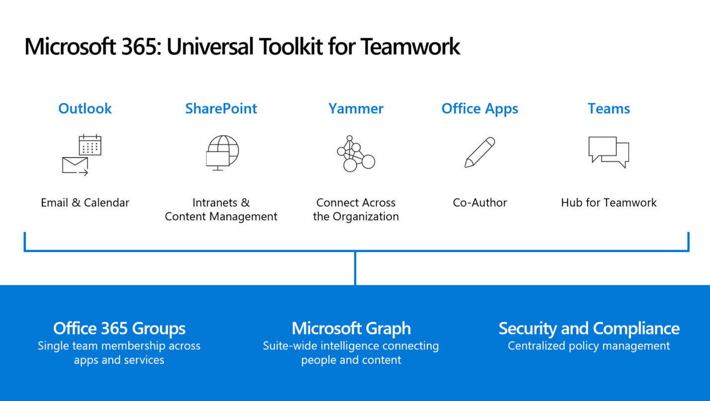

In this module, you'll learn about the Microsoft 365 tools that facilitate teamwork for all workers, no matter where they're located or how they connect to your organization’s resources.

## Learning objectives
In this module, you will:
- Define the teamwork scenarios that are enabled in Microsoft 365.
- Name the products in Microsoft 365 that are part of the teamwork toolkit.
- Understand how Microsoft 365 can help you run meetings and projects more effectively.
- Explain how Microsoft 365 analytics tools can improve efficiency.

## Pre-requisites
- None

>[!VIDEO https://www.microsoft.com/videoplayer/embed/RWtSX2]

Teams accomplish their goals in varying and complex ways. And no two teams have the same needs. Microsoft 365 gives your teams the right tools to enable effective and secure teamwork in any situation. Coupled with common services these tools help you work fluidly across applications with the same enterprise-level security, compliance, and manageability as the rest of Microsoft 365.

*The Microsoft 365 tools that support teamwork*

With the familiar **Outlook** email-based experience you can stay in touch with colleagues, and share calendars, files, and tasks, to make sure important deliverables get attention. 

You can store your content in the cloud with **SharePoint** and **OneDrive for Business**. This lets you access your files on any device and share them with others inside and outside your organization. Because the files are in the cloud, team members can collaborate on them in real time using familiar Office applications like Word, Excel, and PowerPoint.

**Microsoft Teams** is the digital hub for teamwork in Microsoft 365. It brings together team conversations and content so your users can stay up-to-date on critical projects. It includes everything teams need to stay connected—chat, phone calls, content, and meetings—and can be customized with applications and bots that support a given project. With guest access in Teams, you can invite people from both inside and outside your organization to work on projects. 

**Yammer** is a community conversation tool designed to help encourage open dialogue, idea generation, and connections across the company. Yammer lets you create communities of interest and forums that bring people together, improve transparency, and give everyone a voice. You can even grant external access to partners and customers as needed.

The teamwork tools in Microsoft 365 are built on an intelligent fabric that keeps it all connected and secured no matter what app or service you are working in as a team. **Microsoft Graph** provides a connection between people and relevant content. **Microsoft 365 Groups** enable a single team identity across apps and services and **centralized policy management** enhances security and compliance. 

## Learn more

When you're done with a link, use the **Back** arrow in your browser to come back to this page.

- [Overview of Microsoft Graph](/graph/overview)
- [Understand Teams management tools-Microsoft Graph API](/training/modules/m365-teams-collab-prepare-deployment/management-tools)
