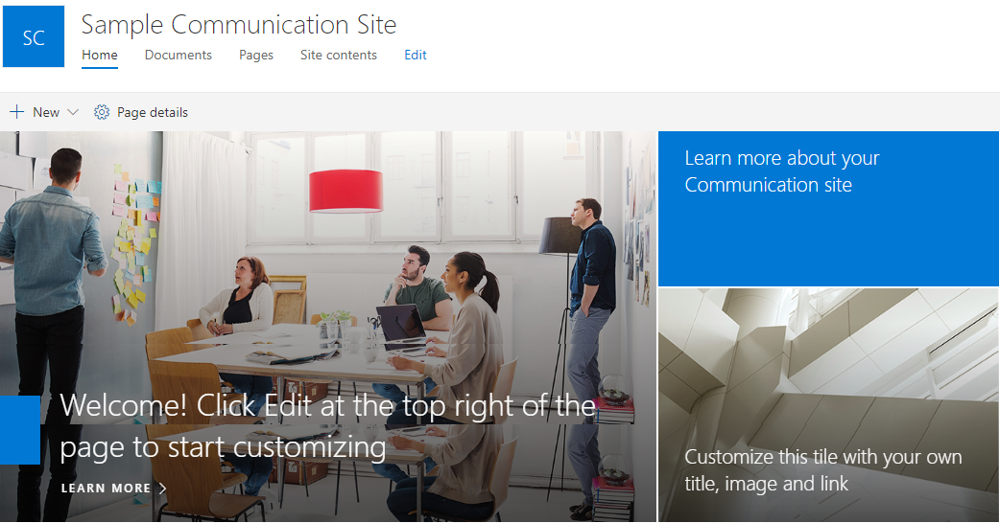

In large organizations, especially orgs with multiple geographic locations, employees can feel disconnected from one another and from the decisions made in headquarters. Providing forums for open, transparent communication is one of the most important steps you can take to keep your employee community connected. From modern intranet sites to engaging discussion tools, Microsoft 365 helps you communicate at scale to reach people where they are with compelling digital employee experiences. 

With **SharePoint** you can create communication sites. These sites are designed to publish curated news, important announcements, stories, and resources to employees, regardless of their device or location. Easy-to-use templates available on the SharePoint home page in Microsoft 365 help you quickly create a professional design.

*A communication site created in SharePoint*

Once you’ve created a communication site, you can adjust page layouts and add web parts to pull in valuable content from other services, like conversations from Yammer, videos from Microsoft Stream, and content from across Microsoft 365. You can use these sites to communicate about upcoming events, campaigns, or product launches, or share team insights and expertise on various topics. The result is a vibrant, interactive, dynamic experience for your site visitors that keeps them informed and engaged.
