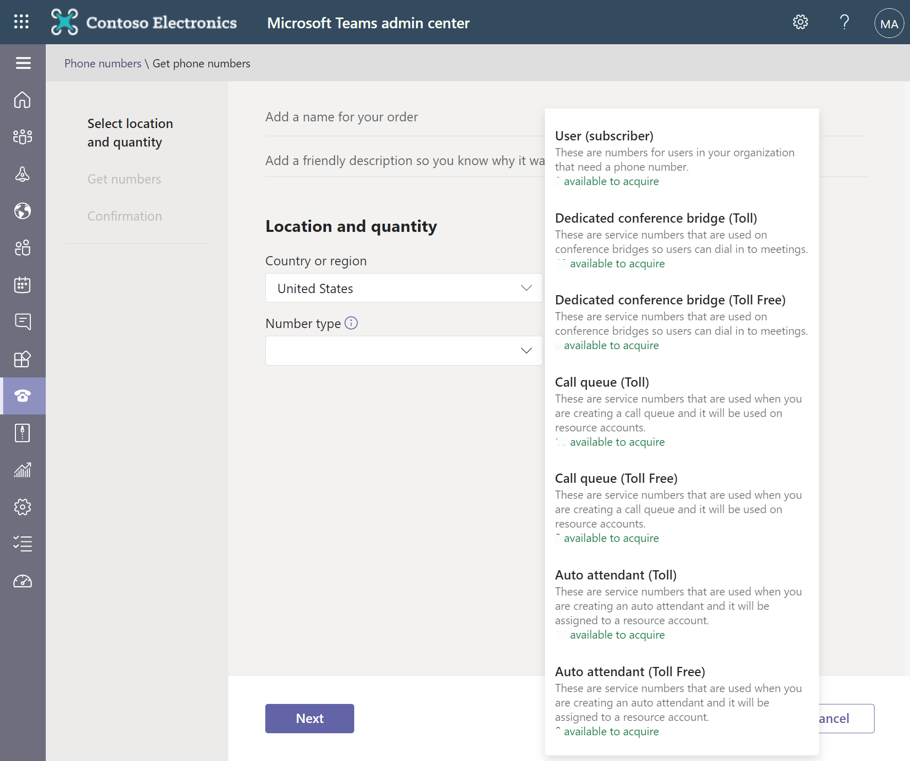
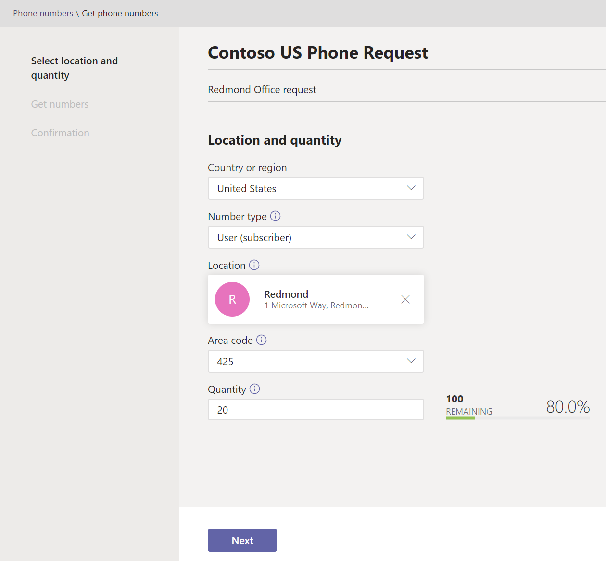
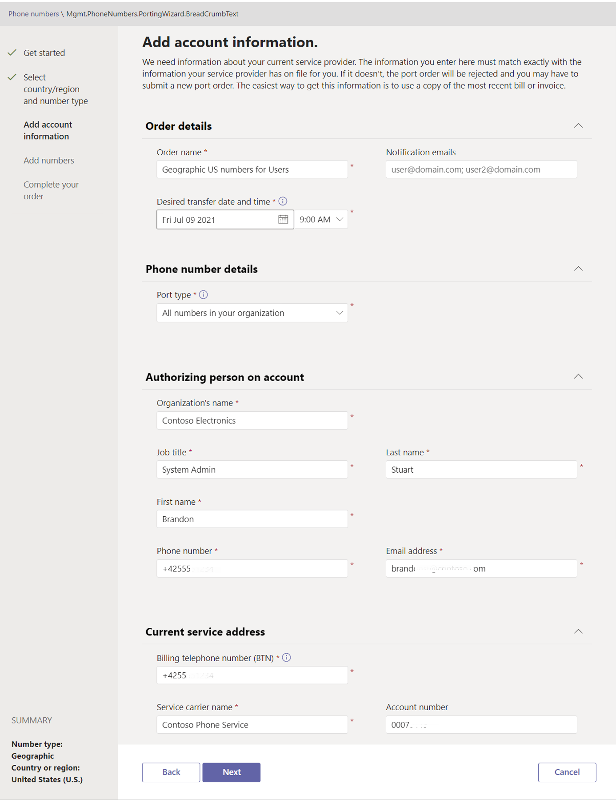

Before an organization can assign phone numbers to its users or services, it must first get phone numbers. 

Each country or region has different instructions, different types of phone numbers (geographic/non-geographic and service (toll/toll-free)), and different rules/regulations for getting phone numbers. An organization should consider the following issues when getting phone numbers:

- What types of phone numbers should it get?
- How many phone numbers can it get?
- Does it want to get new phone numbers or port existing numbers?
- What are supported ways to get phone numbers in the countries/regions in which it operates?

## Types of phone numbers

Microsoft Teams uses different telephone number types depending on the purpose for which the phone number will be used:

- **User numbers.** These numbers can be assigned to users in an organization for calling purposes. There are two kinds of user numbers: **geographic numbers** and **non-geographic numbers**.

- **Service numbers.** These numbers are assigned to services such as Audio Conferencing, auto attendants, and call queues. Service phone numbers have a higher concurrent call capacity than user numbers and will vary by country/region and the type of number (whether it's a toll or toll-free service numbers).

## Number of phone numbers you can get

When an organization is looking for phone numbers, it can get more phone numbers than it has assigned licenses. But this situation depends on the types of phone numbers and types of licenses it's purchased and assigned. 

- **User numbers.** The number of phone numbers for users (subscribers) is equal to the total number of **Domestic Calling Plan** and **Domestic and International Calling Plan** licenses you've assigned multiplied by 1.1, plus 10 extra phone numbers. For example, if you have 50 users in total between a Domestic Calling Plan and a Domestic and International Calling Plan, you can acquire **65** phone numbers **(50 x 1.1 + 10)**.

- **Service numbers.** The number of phone numbers is based on the total number of Phone System and Audio Conferencing licenses. For more information, see [How many phone numbers can you get?](/microsoftteams/how-many-phone-numbers-can-you-get).

## Sources of phone numbers

The sources of phone numbers can be:

- Net new phone numbers purchased from Microsoft.
- Existing phone numbers ported to Microsoft. 

	If an organization currently has a phone service provider or carrier and already has phone numbers for its users or services, it must create a "port order" to transfer those phone numbers to Microsoft Teams. After it ports its phone numbers over to Teams, Microsoft becomes its service provider. At that point, the organization can disconnect its service with its old service provider or carrier.

	In general, any phone number can be transferred that's from a supported provider, including:

	- Land line phone numbers.
	- Mobile device phone numbers such as those used for cell phone and tablets.
	- Toll phone numbers.
	- Toll-free phone numbers.
	- Service phone numbers such as those used for conference bridges, auto attendants, and so on.
	- Fax phone numbers, although they can't be used for faxing. They must be assigned to a user.
	- VoIP phone numbers from a phone provider such as Vonage or RingCentral.
	- Skype for Business hybrid phone numbers.

	An organization can't transfer the following types of phone numbers:

	- Phone numbers used for data connections such as DSL lines or broadband Internet connections.
	- Phone numbers dedicated to faxing.

	If an organization has existing dedicated phone numbers that are being used for faxing, it can transfer these numbers over to Teams. However, its fax services won't continue to work as expected. Faxing services aren't available to Teams customers, even if the organization has licenses for Phone System, Domestic Calling Plan, or International Calling Plan. If the organization ports the phone number to Teams, it can assign this phone number to a user in the organization instead of using it for faxing.

## How can an organization get phone numbers?

There are different ways for an organization to get phone numbers:

- **Use the Teams admin center**. An organization can get new phone numbers using the Microsoft Teams admin center. If it wants to keep existing phone numbers and it needs 999 or fewer phone numbers for its users, it can use the **porting wizard** in the Microsoft Teams admin center to port or transfer existing numbers from its current service provider or phone carrier.

- **Use the Phone Number Support Center**. Sometimes an organization can't get or port phone numbers using the Microsoft Teams admin center. When this situation occurs, it must submit a request to the Phone Number Support Center. 

The following table identifies how an organization can get phone numbers in these two scenarios:
	
||Use the Teams admin center|Use the Phone Number Support Center|
|--|--|--|
|Get new phone numbers|If using the Teams admin center is supported in your country/region|If get new phone numbers isn't listed in the Teams admin center   If you need specific phone numbers or area codes |
|Port existing phone numbers|If your country or region is listed in the porting wizard   If you need to port 999 or fewer user numbers |If your country or region isn't listed in the porting wizard   If you need to port more than 999 user numbers|

### Use the Teams admin center to get new phone numbers

You must be a Teams service admin to use the Teams admin center to get new phone numbers. 

> [!WARNING]
> You have 10 minutes to select your phone numbers and place your order. If you take more than 10 minutes to complete these steps, the phone numbers will be returned to the pool of numbers.

1. Sign into the **Microsoft Teams admin center**.

2. From the left-hand navigation pane, select **Voice** > **Phone Numbers**.

3. On the **Phone numbers** window, below **Numbers**, select **+ Add** to create a new phone number request.

4. On the main pane, enter a **name** and **description**.

5. On the **Select location and quantity** pane, enter the following information:

	- **Country or region** - select country or region.
	- **Number type** - select the appropriate option that determines whether the phone numbers are for users or for services, such as conference bridge, call queue, or auto attendant.  
‎
	  
‎
	- **Location** - choose a location for connecting the new phone numbers. If you need to create a new location, select **Add a location** and enter the required location’s data.
	- **Area code** - select a valid area code for the country/region and location.
	- **Quantity -** enter the number of phone numbers that you want for your organization. 

6. Select **Next** to continue.   
‎	
	 

7. On the **Get numbers** page, select the phone numbers you want to apply to your tenant. 

8. Select **Place order**.   
‎

### Use the Teams admin center to port existing phone numbers

If you need 999 or fewer phone numbers for your users, use the porting wizard in the Microsoft Teams Admin Center. You can see all the orders you've placed in the **Order history tab**.

1. Sign into the **Microsoft Teams admin center**.

1. From the left-hand navigation pane, select **Voice** > **Phone numbers**. 
1. On the **Phone numbers** window, select **Numbers**, and then select **Port** to start the porting wizard.
1. Review the information on the **Get started** page, and then when you're ready, select **Next**.
1. On the **Select country/region and number type** page, update the following settings and then select **Next**:

    - **Country or region** - Country or region where you're getting numbers.
    - **Type of phone numbers** - Type of number, such as geographic or toll-free numbers.
    - **Numbers assigned to** - What the numbers are assigned to. For example, users, or conferencing or voice features.

1. On the **Add account information** page, update the information, and then select **Next**.

	The information displayed on this page is determined by the country or region and number type. Each country and region has different regulations about the information that's required to port numbers. What you see on this page may be different from the following screenshot.

	

1. On the **Add numbers** page, select **Select a file**. Browse to the CSV file that contains the phone numbers that you want to transfer, select it, and then select **Next**.

1. On the **Complete your order** page, select **Upload a signed Letter of Authorization** to upload a scanned copy of the signed Letter of Authorization (LOA).

    If you haven't already downloaded and signed the LOA, then complete the following steps:
      1. Select **Download the template** to download the LOA for your country or region.
      2. Print the LOA.
      3. The person who's authorized to make changes to the account must sign the LOA. 
      4. Scan the signed LOA, and then select **Upload a signed Letter of Authorization** to upload it.

1. Review your order details, and then select **Submit**.

### Use the Phone Number Support Center to get phone numbers

An organization must use the Phone Number Support Center to get phone numbers when any of the following scenarios apply:

* It can't get new phone numbers using the Microsoft Teams admin center in its country or region. 

* It needs specific phone numbers (vanity requests) or specific area codes. 

* It must port more than 999 phone numbers. 

* The Porting wizard isn't available in its country or region.

You can submit the requests by creating a new case in the [Phone Number Support Center](https://pstnsd.powerappsportals.com/?azure-portal=true). 

1. In the Teams admin center, go to **Voice** > **Phone numbers**. 
1. On the **Phone numbers** window, select **Get phone number support** in te upper-right corner.

1. Select **Create a new case** and follow the instructions.

For porting existing phone numbers, you must complete a Letter of Authorization (LOA), which gives Microsoft permission to request and transfer, on your behalf, those existing numbers from a different service provider into Microsoft Teams. A LOA provides Microsoft permission, on your behalf, to request transfer of existing phone number(s) from a different service provider.

For detailed instruction on how to get phone numbers in your specific country/region, see [Manage phone numbers for your organization](/microsoftteams/manage-phone-numbers-for-your-organization/manage-phone-numbers-for-your-organization).

## Show phone numbers for your organization

In the left-hand navigation pane of the **Microsoft Teams admin center**, go to **Voice** > **Phone numbers** to view the phone numbers for your organization, including location, number type, and status information.

