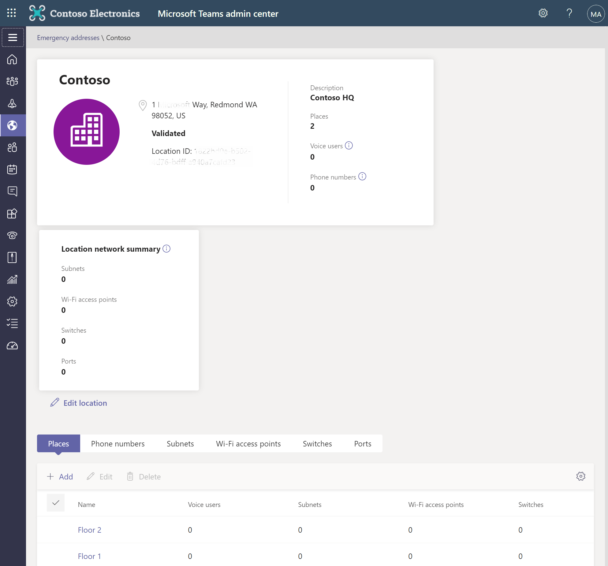
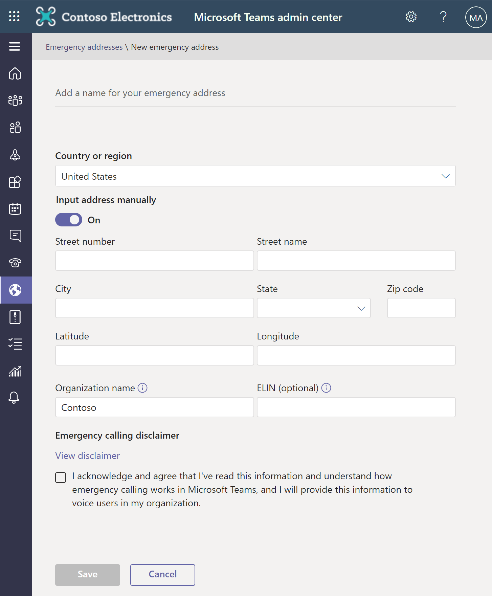

In the United States, 911 calls first go to a certified Emergency Routing Service Provider (ERSP). The call taker at the ERSP will find out the location of the emergency and route the call to the proper Public Safety Answering Point (PSAP) that serves the caller’s location. The PSAP can then dispatch the proper units located closest to the location of the caller.

The caller’s address must be attached to the caller’s phone number. How and when this association happens can vary among country and regions. To implement emergency calling, you should understand the following concepts:

* **Emergency address**. The physical address of a place of business for the organization. For example, 123 South Corner Street, Redmond, WA, 98052.

* **Place**. Refers to a building, floor, or wing. This location is associated with the emergency address to provide a more precise location within a building.

* **Emergency location**. A civic address, along with an optional place. If your organization has more than one physical location, you'll probably require more than one emergency location. For each emergency address you create, a unique location ID is automatically generated for it.

* **Registered address**. An emergency address assigned to a Calling Plan user. Sometimes this address is referred to as an address of record, or a static emergency address. Registered addresses aren't supported if you're using Direct Routing. 

‎‎  ‎ 

## Emergency address validation

Address validation ensures an address is legitimate. When an emergency address is assigned to a user or to a network identifier, you must ensure the emergency address is marked as "validated." An emergency address can be defined by using the address map search feature in the Teams admin center. When using this feature, the address is automatically marked as validated.

A validated address can't be modified. If the address is ever changed, the new address must be entered and revalidate.

## Emergency address geo codes

Each emergency address can have a latitude and longitude (geo code) associated with it. Geo codes are used in some countries/regions to help routing of emergency calls with dynamic locations.

A geo code is automatically associated with an emergency address when you use the address map search feature in the Teams admin center to define an emergency address. You can also associate geo codes with an address if you define the address by using PowerShell.

It's recommended that you create emergency addresses for Calling Plan by using the map search feature in Teams admin center. Using this feature ensures the addresses are formatted, validated, and have the appropriate geo codes.

## Emergency call enablement for Calling Plans

Each Calling Plan user is automatically enabled for emergency calling. They're also required to have a registered emergency address associated with their assigned telephone number. Associating an emergency address with a telephone number depends on the country/region:

- In the United States and Canada, an emergency location is required when a number is assigned to a user.
- For other countries/regions, such as in Europe, the Middle East, and Africa (EMEA), an emergency location is required when you get the phone number from Microsoft 365, or when it's transferred from another service provider or carrier.

## Dynamic emergency calling for Calling Plans

Dynamic emergency calling for Microsoft Calling Plans provides the capability to configure and route emergency calls based on the current location of the Teams client. The ability to automatically route to the appropriate Public Safety Answering Point (PSAP) or to notify security desk personnel varies depending on the country/region of usage of the Teams user.

For Calling Plan users, dynamic location for routing emergency calls is only supported in the United States as follows:

- If a Teams client for a United States Calling Plan user dynamically acquires an emergency address within the United States, that address is used for emergency routing instead of the registered address. The call will be automatically routed to the PSAP in the serving area of the address.

- If a Teams client for a United States Calling Plan user doesn't dynamically acquire an emergency address within the United States, the registered emergency address is used to help screen and route the call. However, the call will be screened to determine if an updated address is required before connecting the caller to the appropriate PSAP.

In the United States, the civic address must be configured that's part of the emergency locations that are assigned to network identifiers and include the associated geo codes. 

## Emergency call routing for Calling Plans

When a Teams Calling Plan user dials an emergency number, how the call is routed to the PSAP depends on the following conditions:

- Whether the emergency address is dynamically determined by the Teams client
- Whether the emergency address is the registered address associated with the user's phone number
- The emergency calling network of that country/region

**In the United States:**

- If a Teams client is located at a tenant-defined dynamic emergency location, emergency calls from that client are automatically routed to the PSAP serving that geographic location.
- If a Teams client isn't located at a tenant-defined dynamic emergency location, emergency calls from that client are screened by a national call center to determine the location of the caller before transferring the call to the PSAP serving that geographic location.
- If an emergency caller is unable to update their emergency location to the screening center, the call will be transferred to the PSAP serving the caller's registered address.

**In Canada, Ireland, and the United Kingdom**, emergency calls are first screened to determine the current location of the user before connecting the call to the appropriate dispatch center.

**In France, Germany, and Spain**, emergency calls are routed directly to the PSAP serving the emergency address associated with the number regardless of the location of the caller.

**In the Netherlands**, emergency calls are routed directly to the PSAP for the local area code of the number regardless of the location of the caller.

**In Australia**, emergency addresses are configured and routed by the carrier partner.

**In Japan**, emergency calling isn't supported.

## Manage emergency addresses

### Use the Teams admin center

Complete the following steps to add an emergency address:

1. Sign into the **Microsoft Teams admin center**.
2. On the left-hand navigation pane, select **Locations** > **Emergency addresses.**
3. On the **Emergency addresses** page, select **+ Add** to add a new location.  
4. Type the name and description for the location.
5. Select the country/region, and then enter the **Address**.
6. If the address can't be found, you can turn on **Input address manually** and type the address.
7. Select **Save**.
‎‎
      ‎ 

Once you created an emergency address, you can select **Edit** or **Delete** to change to remove emergency addresses. 

> [!IMPORTANT]
> You can only change the address information for a location when the address isn't validated. If the address was previously validated, you must delete the location and then create a new location with the correct address.

### Use PowerShell

The following PowerShell cmdlets can also be used to manage emergency addresses:

* To add an emergency address, use [New-CsOnlineLisCivicAddress](/powershell/module/skype/new-csonlineliscivicaddress).
* To update an emergency address, use [Set-CsOnlineLisCivicAddress](/powershell/module/skype/set-csonlineliscivicaddress).

* To remove an emergency address, use [Remove-CsOnlineLisCivicAddress](/powershell/module/skype/remove-csonlineliscivicaddress).

## Knowledge check 

Choose the best response for the following question. Then select “Check your answers.”