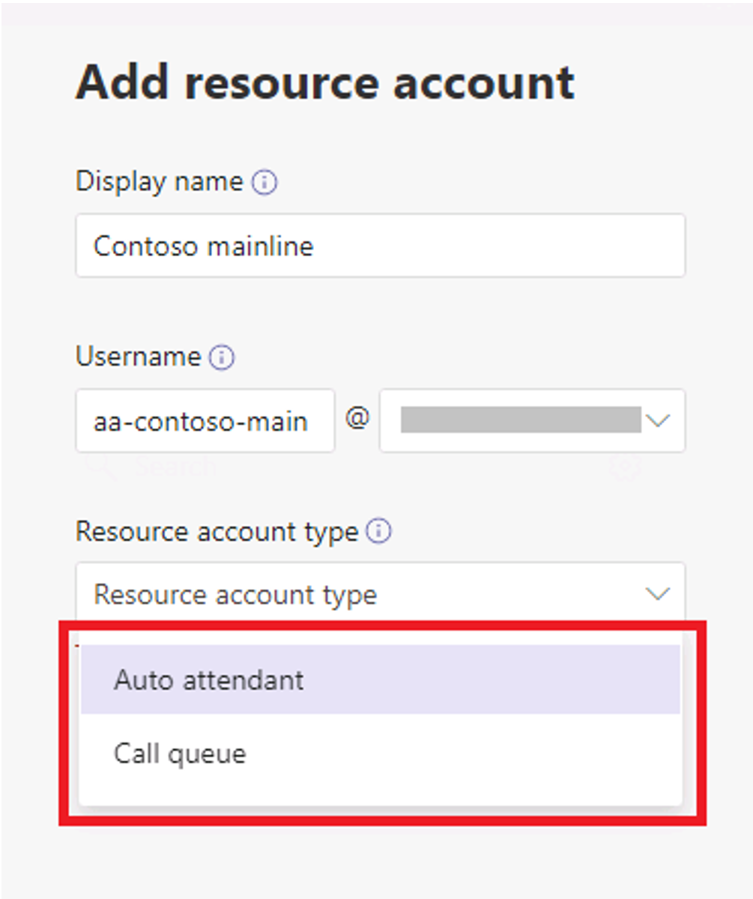
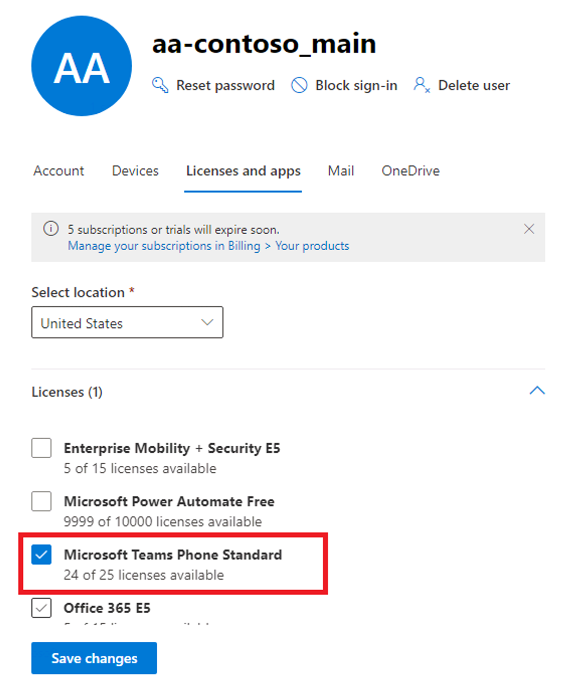

Microsoft Teams requires a resource account for each auto attendant or call queue. Resource accounts may also be assigned service telephone numbers. This design enables organizations to assign phone numbers to auto attendants and call queues, which allows callers from outside Teams to reach the auto attendant or call queue.

> [!NOTE]
> Teams resource accounts aren't the same as Microsoft 365 resource accounts. Microsoft 365 resource accounts are tied to an Exchange Online mailbox and enable booking of shared resources, such as rooms.

## Create a resource account

You can create a resource account in the Teams admin center by completing the following steps:

1. In the Teams admin center, in the left-hand navigation pane, select **Org-wide settings**, and then select **Resource accounts**.

2. Select **Add**.

3. In the **Add resource account** pane, enter the **Display name** and **Username** fields, and then select the appropriate **Resource account type** value. The resource account type can be either **Auto attendant** or **Call queue**, depending how you intend to use this resource account.

	

4. Select **Save**.

	

## Assign a license

Each resource account requires a license to work with auto attendants and call queues. You can assign a **Microsoft 365 Phone System - Virtual User** license or a **Phone System** license to the resource account. 

1. In the Microsoft 365 admin center, select the resource account to which you want to assign a license.

2. On the **Licenses and Apps** tab, under **Licenses**, select **Microsoft 365 Phone System - Virtual User**.

3. Select **Save changes**.

	

## Assign a service number

Service numbers are optional for auto attendants and call queues. However, an organization must have at least one service number for callers to reach its auto attendant and call queue configuration. 

For any auto attendant or call queue that an organization wants to be reachable directly by a service number, it must have a resource account with an associated service number. Resource accounts can use either toll or toll-free service numbers.

If you're planning to use the resource account with an auto attendant or call queue that requires a service number, complete the following steps to assign a number to the resource account:

1. In the Teams admin center, on the **Resource accounts** page, select the resource account to which you want to assign a service number, and then select **Assign/unassign**.

2. In the **Phone number type** dropdown, choose the type of number that you want to use.

3. In the **Assigned phone number** box, search for the number you want to use and select **Add**.

4. Select **Save**.

	

## Manage resource accounts 

Complete the following steps to manage resource accounts using the Microsoft Teams Admin Center:

1. In the **Teams Admin Center**, navigate to **Org-wide settings** > **Resource accounts**.
2. Select the account you want to modify.
3. Select **Edit**.
4. Modify the following options:

	- **Display name**
	- **Call queue** or **Auto attendant.** The options displayed depend on the selection made at time the resource account was created.

5. Select **Save** to apply the changes.

