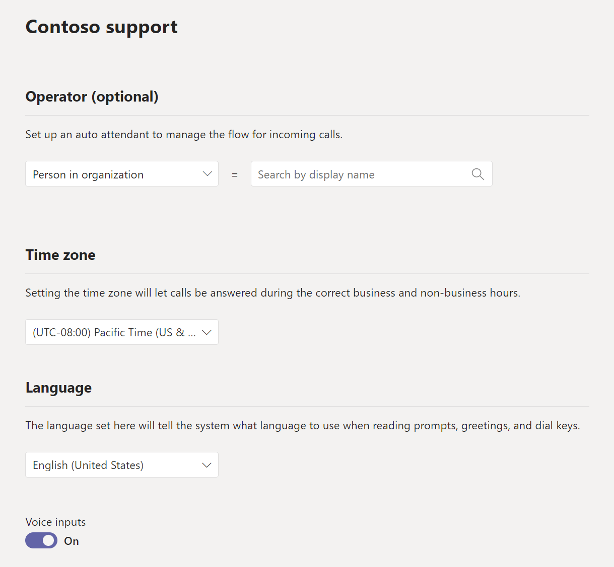
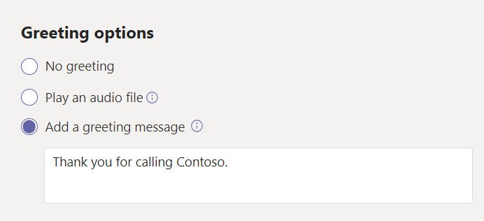
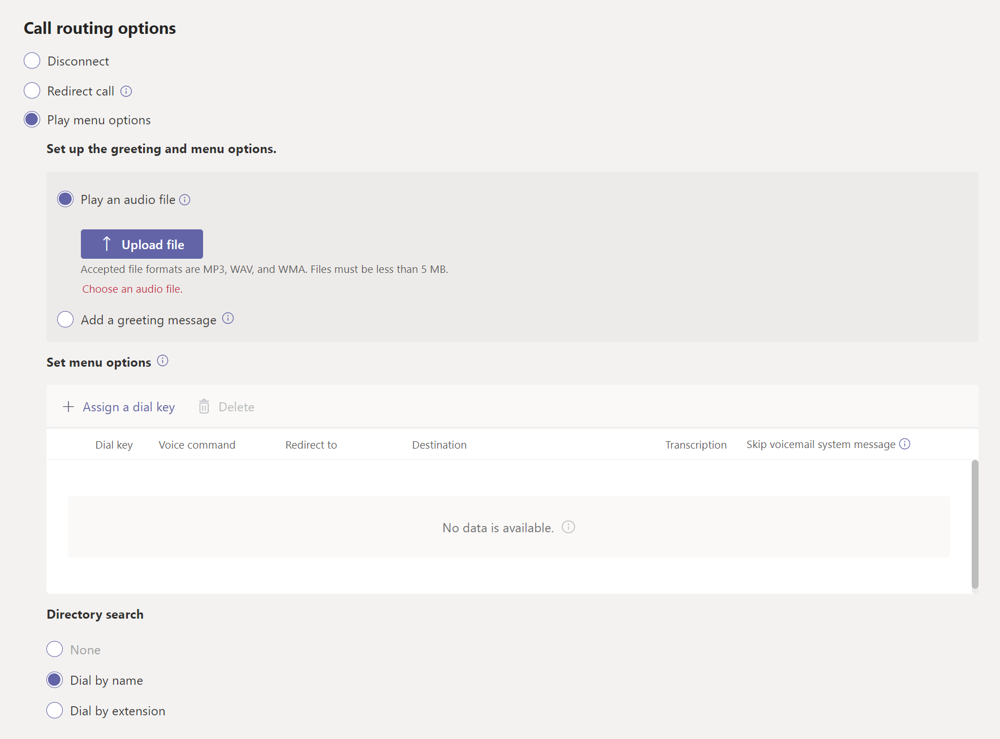
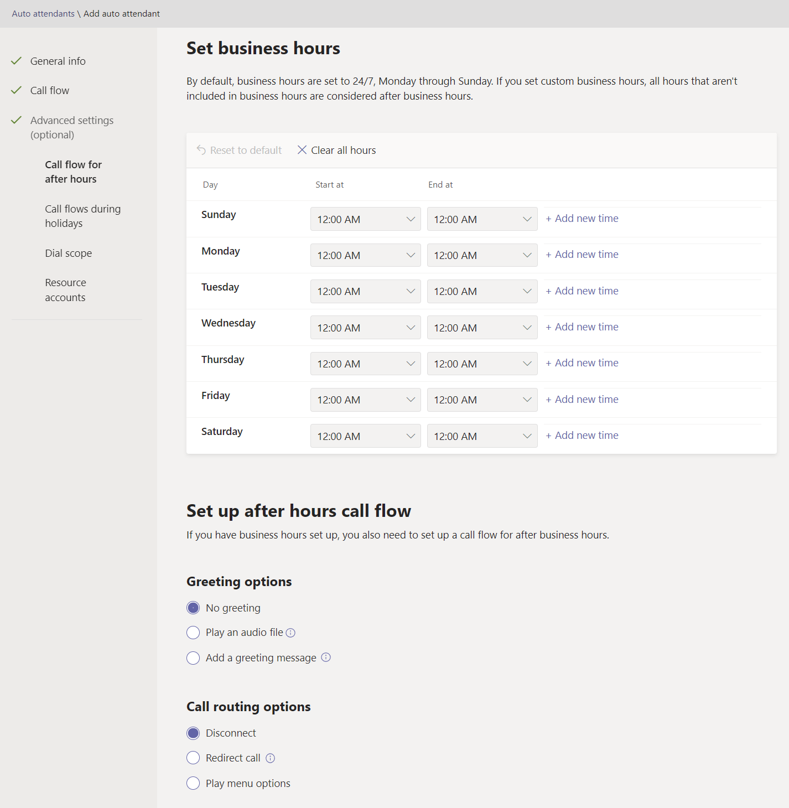

When people call an organization, its auto attendant service enables the callers to navigate a menu system to speak to the right department, call queue, person, or an operator. You can create auto attendants for your organization with the Microsoft Teams admin center, or with PowerShell.

To set up a call queue, in the Teams admin center, expand **Voice**, select **Auto attendants**, and then select **Add**. Provide the following information with your auto attendants design. 

### General Info

Configure the following settings when creating an auto attendant:

- **Operator**. To configure an operator, specify the destination for calls to the operator. This designation is optional (but recommended). Set the **Operator** option to allow callers to break out of the menus and speak to a specific person.

	- **No Operator**  
	- **Person in the organization** - a person in your organization who can receive voice calls. This person can be an online user or a user hosted on-premises using Skype for Business Server.
	- **Voice app** - another auto attendant or a call queue. (Choose the resource account associated with the auto attendant or call queue when choosing this destination.)
	- **External phone number** - any phone number. 

- **Time zone**. Specify the time zone for this auto attendant. The time zone is used for calculating business hours if you create a separate call flow for after hours.

- **Language**. Specify a supported language for this auto attendant. This language will be used for system-generated voice prompts.

- **Voice inputs**. Choose if you want to enable voice inputs. When enabled, the name of every menu option becomes a speech-recognition keyword. For example, callers can say "One" to select the menu option mapped to key 1, or they can say "Sales" to select the menu option named "Sales."

	

### Call flow

This section provides settings on what the system should do when the auto attendant answers a call. You'll then configure how the call should be routed.

- **First play a greeting message**. If you want a greeting, choose whether to play a greeting when the auto attendant answers a call. There are two types of greetings to choose from:

    * **Play an audio file**. You can use the **Upload file** button to upload a recorded greeting message saved as audio in .WAV, .MP3, or .WMA format. The recording can be no larger than 5 MB.

    * **Type a greeting message**. The system will read the text that you type (up to 1000 characters) when the auto attendant answers a call.

	

- **Then route the call**. Choose how you want to route the call from the following options:

    * **Disconnect**. The auto attendant will hang up the call.

    * **Redirect call**. Choose one of the call routing destinations.

    * **Play menu options**. If this option is selected, then you must configure the following groups of settings:
	
	    - **Set up the greeting and menu options**. You can select whether to play an audio file or enter a text message that will be read to the caller.

	    - **Set menu options**. For dialing options, assign the 0-9 keys on the telephone keypad to one of the call routing destinations. (The keys \* (Repeat) and \# (Back) are reserved by the system and can't be reassigned.)

		    Key mappings don't have to be continuous. It's possible to create a menu with keys 0, 1, and 3 mapped to options, while the number 2 key isn't used.

		    It's recommended that you map the zero key to the operator if you've configured one. If the operator isn't set to any key, the voice command "Operator" is also disabled.

    		For each menu option, specify the following settings:
    
    	    - **Dial key**. The key on the telephone keypad to access this option. If voice inputs are available, callers can also say this number to access the option.

		    - **Voice command**. Defines the voice command that a caller can give to access this option, if voice inputs are enabled. It can contain multiple words like "Customer Service" or "Operations and Grounds." For example, the caller can press 2, say "two," or say "Sales" to select the option mapped to the two keys. This text is also rendered by text to speech for the service confirmation prompt, which might be something like "Transferring your call to sales."

		    - **Redirect to**. The call routing destination used when callers choose this option. If you're redirecting to an auto attendant or call queue, choose the resource account associated with it.

	    - **Directory search**. When searching for users as part of the auto attendant functionality, callers can search by name or by extension.

		**Dial by Name.** This feature enables the people who call your auto attendant to use voice (speech recognition) or their phone keypad (DTMF) responses to enter a full or partial name to search your company's directory, locate the person, and then have the call transferred to them.    
		‎
		‎**Dial by Extension.** This feature enables a caller to use voice (speech recognition) or their phone keypad (DTMF) responses to enter the phone extension of the user they're trying to reach, and then have the call transferred to them. 

		

### Advanced settings

The Auto Attendant form provides an optional set of advanced settings that can be configured:

- **Call flow for after hours**. Business hours can be set for each auto attendant. If business hours aren't set, all days and all hours in the day are considered business hours because a 24/7 schedule is set by default. Business hours can be set with breaks in time during the day. All the hours that aren't set as business hours are considered after-hours. You can set different incoming call-handling options and greetings for after-hours.

- **Call flows during  holidays**. Your auto attendant can have a call flow for each holiday you've set up. You can add up to 20 scheduled holidays to each auto attendant.

- **Dial scope**. Defines which users are available in the directory when a caller uses dial-by-name or dial-by-extension. The default of **All online users** includes all users in your organization who are Online users or hosted on-premises using Skype for Business Server.

	You can include or exclude specific users by selecting **Custom user group** under **Include** or **Exclude** and choosing one or more Microsoft 365 groups, distribution lists, or security groups. For example, you may want to exclude executives in your organization from the dialing directory. If a user is in both lists, they'll be excluded from the directory.

- **Resource account**. All auto attendants must have an associated resource account. First-level auto attendants must have at least one resource account that has an associated service number. You can optionally assign several resource accounts to an auto attendant, each with a separate service number.

	

 
