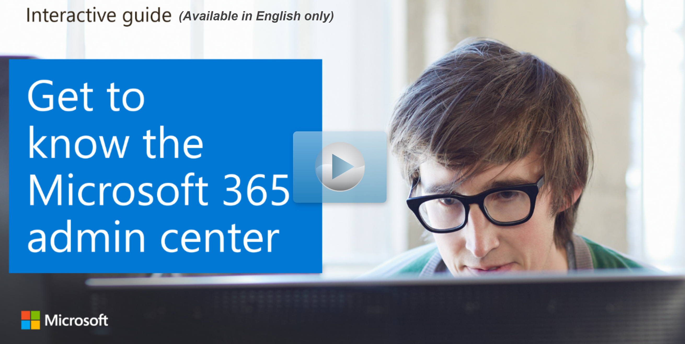

The **Microsoft 365 admin center** is the common entry point for all teams and roles managing Microsoft 365 and offers a centralized and simplified way to manage your Microsoft 365 and Office 365 services. It provides a tailored experience based on the unique needs of your role or organization, improves efficiency for everyday tasks, and provides actionable insights that help you make data-driven decisions to deliver a better experience for your users.

## Perform tasks with the Microsoft 365 admin center

You’ll use the Microsoft 365 admin center to perform tasks such as creating user accounts, managing users rights and access to resources, managing licenses and subscription billing, monitoring service health, and creating service requests. You’ll also find links to specialist workspaces such as SharePoint, Teams & Skype, Exchange, Security, Compliance, Device Management, and Azure Active Directory from the Microsoft 365 admin center navigation pane.

### Explore the Microsoft 365 admin center

View a [video version](https://www.microsoft.com/videoplayer/embed/RE44vAc) of the interactive guide (captions available in more languages).

  

Be sure to click the full-screen option in the video player. When you're done, use the **Back** arrow in your browser to come back to this page. 
