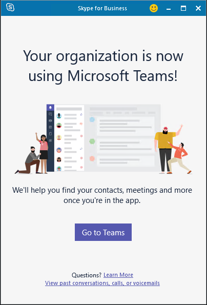

In a Hybrid environment, the location a user is active (whether in Skype for Business Server or Microsoft Teams) is known as the user's Skype for Business home:

- Users who are on-premises interact with on-premises Skype for Business servers.

- Teams users inherently have a Skype for Business home even though they do not use Skype for Business Online. If you have on-premises Skype for Business users that are also using Teams (side by side), those users are homed on-premises.

When you move a user online, they move to Teams Only mode, which will ensure that routing of all incoming chats and calls lands in their Teams client.

## Considerations when moving from Enterprise Voice to Teams Phone System

There are two relevant calling scenarios when moving a Skype for Business Server user to Teams Phone System:

1.  A user in Skype for Business Server with Enterprise Voice, who will be moving to online and keeping on-premises PSTN connectivity. Migrating this user to Teams requires moving the user’s on-premises Skype for Business account to the cloud and coordinating that move with migration of the user to Direct Routing.

1.  A user in Skype for Business Server with Enterprise Voice, who will be moving to online and using a Microsoft Calling plan. Migrating this user to Teams requires moving the user’s on-premises Skype for Business account to the cloud and coordinating that move with either:
    1. The port of that user’s phone number to a Microsoft Calling Plan
    1.  Assigning a new subscriber number from available regions.

## Moving users and common area phones

When a user is moved from Skype for Business Server to Microsoft Teams, the user’s Skype for Business home is moved from on premises to online, and the user is assigned the TeamsOnly mode upgrade policy by default. The result of this is the following:

- All incoming calls and chats from other users (whether sent from Skype for Business or Teams) will land in the user’s Teams client.

- The user will be able to interoperate with other users who use Skype for Business (whether online or on premises).

- The user will be able to communicate with users in federated organizations.

- New meetings scheduled by that user are Teams meetings.

- Users can still join any Skype for Business meetings.

- The user’s pre-existing meetings scheduled for the future will be migrated from on-premises to Teams.

- Contacts that existed on-premises are available in Teams shortly after the user logs on for the first time.

- Users cannot initiate calls or chats from Skype for Business, nor can they schedule new meetings in Skype for Business. If they attempt to open the Skype for Business client, they will be redirected to use Teams as shown below. If the Teams client is not installed, they will be directed to the web version of Teams using their browser.

When users launch the Skype for Business client after migration, they will be informed that they have moved to Microsoft Teams in the client. This will provide them the opportunity to launch Microsoft Teams.

The following image shows the user experience in the Skype for Business client post-migration:

  

## Prerequisites required to migrate users and common area phones

A Hybrid environment with Skype for Business Server and Microsoft Teams must be configured, as described in the previous unit. Teams Phone System or Direct Routing must be configured to support migrating Enterprise Voice users to Microsoft Teams.

Each user must be assigned a license for Teams and Skype for Business Online (Plan 2). Even after retirement of Skype for Business Online, the Skype for Business Online license is still required.

In addition, if the user is enabled for dial-in conferencing in on premises, by default, the user must also have an Audio-Conferencing license assigned in Teams before you move the user online. Once migrated to the cloud, the user will be provisioned for audio conferencing in the cloud.

If for some reason you want to move a user to the cloud, but not use audio conferencing functionality, you can override this check by specifying the BypassAudioConferencingCheck parameter in Move-CsUser.

## Required administrative credentials

To move users between on-premises and the cloud, you must use an account with sufficient privileges in both the on-premises Skype for Business Server environment as well as in the Microsoft 365 tenant. You can either use one account that has all the necessary privileges, or you can use two accounts, in which case you would access the on-premises tools using on-premises credentials, and then in those tools you would supply additional credentials for a Microsoft 365 administrative account:

| On-premises| Microsoft 365|
| :--- | :--- |
| In the on-premises environment, the user performing the move must have the **CSServerAdminstrator** role in Skype for Business Server.| In Microsoft 365, the user performing the move must either be a **Global Administrator** or it must have both **Skype for Business Administrator** and **User Administrator** roles.|

## Voice configuration requirements

If users are configured for enterprise voice in on premises, you will need to coordinate updating their voice configuration when you move them to online, or, alternatively, you could migrate them without telephony capabilities. The available options depend on whether the user will be using the Teams or Skype for Business client once they are online:

You can update a user’s telephony provider to use a Microsoft Calling Plan or configure users for Direct Routing. Direct Routing is only available after the user is moved from on-premises to online.

### Move to Teams using Move-CsUser

Move-CsUser is available from an on-premises Skype for Business Server Management Shell PowerShell window or from a Lync Server Management Shell PowerShell window. To move a user to TeamsOnly mode using Move-CsUser:

    - Specify the user to move using the Identity parameter.

    - Specify the -Target parameter with the value “sipfed.online.lync.com”.

If you do not have one account with sufficient permissions in both on-premises and the cloud service (Microsoft 365), use the -credential parameter to supply an account with sufficient permissions in Microsoft 365.

If the account with permissions in Microsoft 365 does not end in “onmicrosoft.com,” you must specify the -HostedMigrationOverrideUrl parameter with the correct value.

The following cmdlet sequence can be used to move a user to TeamsOnly and assumes the Microsoft 365 credential is a separate account and supplied as input for the Get-Credential prompt. The behavior is the same whether -MoveToTeams switch is specified or not.

```powershell
$cred=Get-Credential

$url="https://adminXX.online.lync.com/HostedMigration/hostedmigrationService.svc"

Move-CsUser -Identity username@contoso.com -Target sipfed.online.lync.com -Credential $cred -HostedMigrationOverrideUrl $url

```

> [!NOTE]
> Note: It is no longer required to specify the -MoveToTeams switch in Move-CsUser to move users directly from on-premises to TeamsOnly. Previously, if this switch was not specified, users transitioned from being homed in Skype for Business Server on-premises to Skype for Business Online, and their mode remained unchanged. Now, when moving a user from on-premises to the cloud with Move-CsUser, users are automatically assigned TeamsOnly mode, and their meetings from on-premises are automatically converted to Teams meetings, just as if the -MoveToTeams switch had been specified, regardless of whether the switch was actually specified.

### Move to Teams using Skype for Business Server Control Panel

- Open the Skype for Business Server Control Panel app, then in the left navigation, choose **Users**.

- Use **Find** to locate the user(s) you would like to move to Teams.

- Select the user(s), and then, from the **Action** dropdown above the list, choose **Move selected users to Teams** or **Move selected users to Skype for Business Online**.

- Either option now moves users directly to TeamsOnly.

- In the wizard, click **Next**.

- If prompted, sign in to Microsoft 365 with an account that ends in .onmicrosoft.com and has sufficient permissions.

- Click **Next**, and then **Next** one more time to move the user.

> [!NOTE]
> Note that status messages regarding success or failure are provided at the top of the main Control Panel app, not in the wizard.

## Other considerations

The policies (such as to control messaging, meeting, and calling behavior) in on-premises and online environments are independent.

Configure policies in the environment and assign them to the user before you move that user from on-premises to the cloud, so that they have the correct configuration as soon as they are migrated to online.

