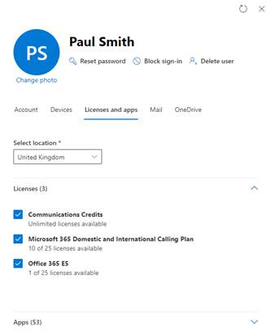

Users can't use Teams Phone unless they have a phone number, in this module you will learn how to diagnose and troubleshoot issues with assigning a phone number to users.

## Cannot find a specific user to assign them a phone number

If you have phone numbers available and unassigned, but the username is not showing up when you search to assign a phone number, check that they have been assigned a Phone System license.

- Sign into the Microsoft admin center at [https://admin.microsoft.com](https://admin.microsoft.com/).

- Go to **Users** and select **Active Users**.

- Find the user and select into them then go to **License and apps**.

- Check they have a Phone System license, or E5 that includes Phone System license and a Calling plan license assigned.

- If not assigned, assign the user a Phone System and Calling Plan license.

- Select **Ok** and **Save**.

There is often some latency between assigning a user a Teams Phone license and them being available in search to assign a phone number. This is because of the backend latency between Office 365 and Teams. It can take up to 24 hours after license assignment for them to appear in the assign search. Therefore you should assign licenses to users at least 24 hours ahead of needing to assign them phone numbers. There can also be additional latency from assigning the phone number to the user being able to use it.

The following picture shows the required licenses for a calling plan user to be able to make calls. Microsoft E5 includes both the phone system license and the Domestic and International Calling Plan.

> [!div class="mx-imgBorder"]
> [  ](../media/user-licenses-assignment.png#lightbox)

## Cannot edit or assign phone numbers for any user

If some users have phone numbers assigned, but when you go Teams Admin Center > Voice > Phone numbers you cannot edit and therefore also not assign numbers, the first thing to check is Check your account has the correct role to administer phone numbers. To manage phone numbers in TAC. you must have Teams Administrator.

> [!TIP]
> Teams Communications Administrator can manage voice, including calling policies and phone number inventory and assignment via PowerShell ONLY. It will not allow you to edit or assign phone numbers in the Microsoft Teams admin center.

## User is assigned phone number, but it is not appearing in their Teams client

Because of the latency between Microsoft 365 or Office 365 and Teams, it can take up to 24 hours for users to be enabled. If the phone number isn't assigned correctly after 24 hours, contact Microsoft support.

## Cannot find Direct Routing phone numbers in the Teams admin center

This is expected behavior. Direct Routing numbers can only be assigned with PowerShell.

## When assigning numbers with PowerShell the error: "There seems to be a problem with the provided SIP address. Use a SIP address that contains only standard characters, e.g. sip: [username@contoso.com](mailto:username@contoso.com)" is returned

In this case the user, and maybe other users, have an MCOValidationError.

> [!NOTE]
> “MCO” stands for “Microsoft Communications Online” – a variant of an early name of the products that lead to Microsoft Teams. So, this just means there is an issue with user configuration that is preventing assigning the phone number.

To find users with MCOValidationErrors, run the following command in PowerShell, which will give you a PowerShell variable with a list of users with errors:

```powershell
$UsersWithMCOValidationErrors =  get-CSOnlineUser | ? {$_.MCOValidationError -ne $null} | select windowsemailaddress, sipaddress, displayname, mcovalidationerror

Foreach ($user in $UsersWithMCOValidationError)

    {

        $user.WindowsEmailAddress

        $user.MCOValidationError

        Write-Host ""

        Write-Host ""

    }

```

This will print a list of uses email address and expand the MCOValidationError JSON, which includes text that will give you the validation error and a suggested solution.

For example:

```powershell
<ErrorCode>OnPremDeploymentDetected</ErrorCode>

<ErrorDescription>The DNS record lyncdiscover.domain.com (HostName=92.60.106.123) does not resolve to the Skype for Business Online domain name space. Please update the DNS record to the Skype for Business Online domain name space if users from this domain are to be hosted in Skype for Business Online, or configure Azure AD Connect to sync the AD attribute msRTCSIP-DeploymentLocator if this user is hosted on premises. DNS record last queried @ 08/10/2019 16:37:23.</ErrorDescription>

</ErrorRecord>

```

This suggests there is a DNS error to fix.

Another example:

```powershell
<ErrorCode>

Value of msRTCSIP-PrimaryUserAddress or the SIP address in ProxyAddress field in your local Active Directory is not unique. Correct the value in your local Active Directory. After you correct it, the value will be updated in your Microsoft Online Services directory during the next Active Directory synchronization. .</ErrorDescription>

</ErrorRecord>

```

The users SIP address is not formatted correctly or unique. If you don't use directory synchronization, contact Office 365 technical support. If you're using directory synchronization, locate and correct the duplicate attributes.

Search Active Directory Domain Services (AD DS) for the duplicate msRTCSIP-PrimaryUserAddress attributes and correct them.

To do this, follow these steps:

- On a domain controller, open Active Directory Service Interfaces (ADSI) Edit. To do this, select **Start**, select **Run**, type adsiedit.msc, and then select **OK**.

- Create a new query in the AD DS domain in which the users reside. To do this, follow these steps:

- In ADSI Edit, in the console tree, select **Default naming context**, point to **New** on the **Action** menu, and then select **Query**.

- Type a name for the query, select **Browse** under **Root of Search**, and then select the top-level domain.

- Type the following text as the query, and then select **OK**.

    - msRTCSIP-PrimaryUserAddress=sip:joe@contoso.com

> [!NOTE]
> Replace joe@contoso.com with the value of the duplicate email address.

Any users who have duplicate msRTCSIP-PrimaryUserAddress attributes are listed in the query results.

The results are listed under **Default naming context** in the ADSI Edit console tree.
Right-select the user, and then select **Properties**.
Edit the msRTCSIP-PrimaryUserAddress attributes of the users so that the values are unique within the organization.
> [!NOTE]
> If you currently have Skype for Business Server deployed on-premises, you'll want to change the user's SIP address through the Skype for Business Server Control Panel.

Force directory synchronization and wait approximately 15 minutes for the changes to take full effect.

