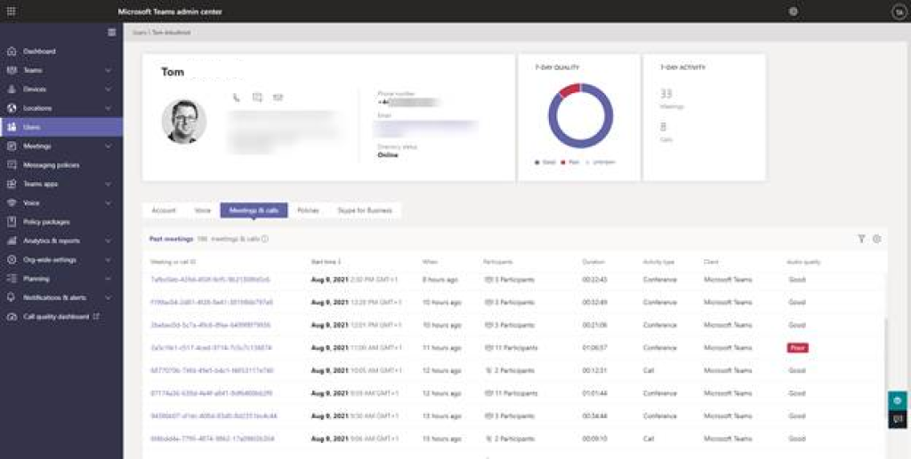
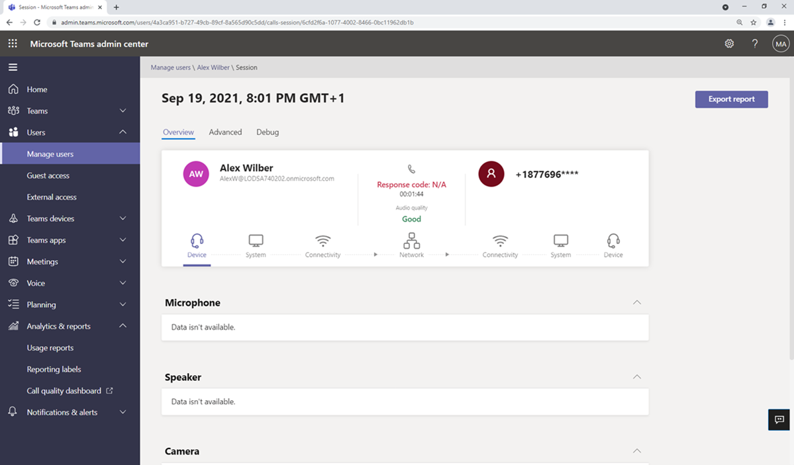
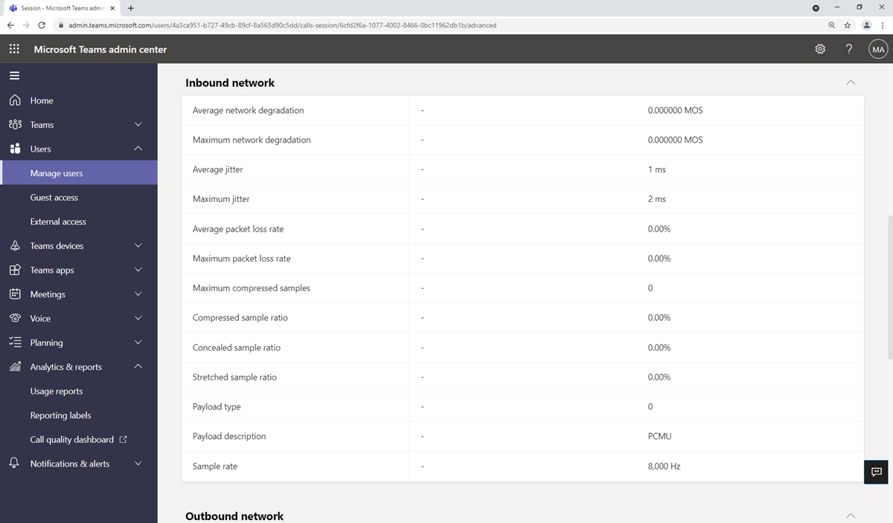
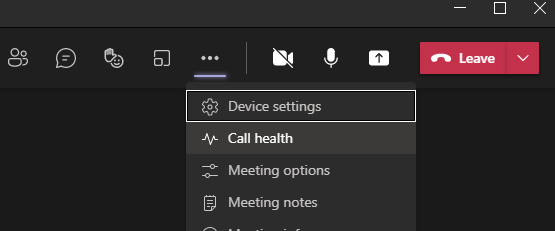
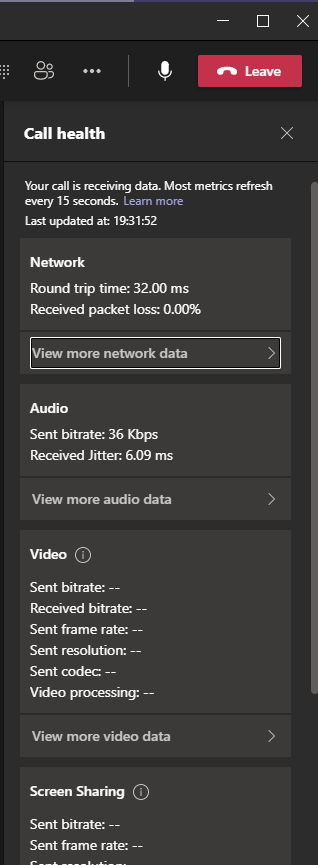
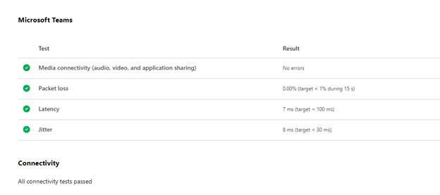
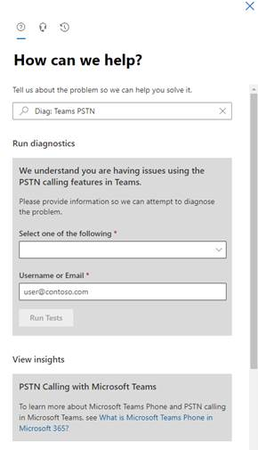

Nobody wants their call to fail or have bad quality, so knowing why failures and quality issues happen and how to avoid them in the future is key for a Teams Voice Administrator.

In this unit, we look at failed calls and how to diagnose and troubleshoot them.

There are two types of failure, when a user tries to make a call and it fails to establish, these are setup failures and calls that are established, but cut out mid call or do not end in an expected way, these are dropped calls.

Call quality issues will appear to the user as audio or video missing or being choppy or robotic.

## Report on calls with Call Analytics

Microsoft Teams admin center Call Analytics is the place to go to analyze call quality and performance issues for individual users or individual calls and meetings. If a user reports a bad call experience, this is where you can find a potential root cause.

All Analytics are found by first looking up the user in the Users Tab of the Teams Control Panel. Then, select the user and select the Meetings and Calls Tab. From here, you can look at any call or meeting the user was involved in.

Call Analytics records give details of network performance, devices, and endpoints in the call and highlight any issues.

> [!div class="mx-imgBorder"]
> 

## Troubleshoot calls using advanced Call Analytics and perform root cause analysis

When a user reports they had a failed call, the first place to go to try to understand the issue is Teams Admin Center Call Analytics.

To get to this, go to Users and lookup the user in question, select their name to get into their details and then the "meetings and calls" tab to give list of all their meetings and calls.

Find the call in question and select it. Select the Advanced tab, and then look for yellow and red items, which indicate poor call quality or connection problems.

Yellow meaning warning or outside of normal range, red is a significant problem.

When looking over the sessions for a specific user, the Audio quality column highlights any calls or meetings with poor audio quality. A meeting will be broken down into sessions.

> [!div class="mx-imgBorder"]
> 

Going into Advanced will highlight the metric(s) that has caused the poor call conditions. In this case, Average round-trip time as seen on the following picture:

> [!div class="mx-imgBorder"]
> 

Common issues that Call Analytics will report on include:

- Call setup failures, Microsoft diagnostic error codes 20-29 indicates the call setup failed

- Audio network classified poor call caused by packet loss, jitter, NMOS degradation, RTT, or concealed ratio

- Device not functioning, where the audio or USB device did not function correctly

You can export the report by selecting the top right "Export Report" button, which is handy when you need to share a report with Microsoft or someone who doesn't have Teams Admin Center Access. Reports are exported in Excel format.

## Troubleshooting calls with Teams client call health network telemetry

A great way for users to understand call quality issues is to use call health in the Teams client during the call. Under the ellipse (three dots) select Call Health as shown in the picture below:

> [!div class="mx-imgBorder"]
> 

This will give snapshots of network performance every 15 seconds for overall network as well as audio, video, and screen sharing if they are being used.

> [!div class="mx-imgBorder"]
> 

## Troubleshoot call issues using Microsoft 365 connectivity tool

The Microsoft 365 connectivity tool can perform some basic Teams network performance tests, such as Media connectivity, Packet loss, Latency, and Jitter.

> [!div class="mx-imgBorder"]
> 

To run the test, perform the following steps:

1. Navigate to the Microsoft 365 network connectivity test at [https://connectivity.office.com/](https://connectivity.office.com/)

1. Sign in with your Office 365 account for the best test experience

1. Either automatically detect location or add your location manually.

> [!TIP]
> If you let the tool automatically detect your connection, make sure it is correct on the map to make the test valid.

Once the test is complete select Details for the detailed results. Under Microsoft Teams you will see tests for media connectivity, packet loss, latency, and jitter. If any of these are above target, you have a network issue.

## Troubleshoot calling issues using the self-help diagnostics in Microsoft 365 admin center

Microsoft offers some Self-help diagnostics tools that can be run before raising a support ticket.

Specifically for voice scenarios, the following tests are available

| Diagnostic| Diagnostic Shortcut command| Description|
| :--- | :--- | :--- |
| Teams Direct Routing| Diagnostic: Teams Direct Routing| Validates that a user is correctly configured for direct routing.|
| Teams Call Queue| Diagnostic: Teams Call Queue| Validates that a call queue can receive calls.|
| Teams Remove Number from Conference Bridge| Diagnostic: Remove Conference Bridge Number| Validates that the number can be removed from the conference bridge.|
| Teams Dial Pad is Missing| Diagnostic: Teams Dial Pad Missing| Validates that the dial pad is visible within Teams.|
| Unable to Make Domestic or International PSTN calls in Teams| Diagnostic: Teams PSTN| Validates that a user can make or receive domestic or international PSTN calls.|
| Teams Auto-Attendant| Diagnostic: Teams Auto Attendant| Validates that an auto attendant can receive calls.|
| Teams Voicemail| Diagnostic: Voicemail| Validates that a user is properly configured to use Voicemail in Teams.|
| Teams Call Forwarding| Diagnostic: Teams Call Forwarding| Validates that a user is properly configured to forward calls to a specified number.|

More non-voice scenarios are available too. For more information, see the links in the resources.

To run these diagnostics tests:

1. Go to the Microsoft 365 admin center at [https://admin.microsoft.com](https://admin.microsoft.com/).

1. Sign in as a Global Administrator.

1. Select **Support** and **New service request**.

1. The form will ask " Tell us about the problem so we can help you solve it." Here you can input the Diagnostic Shortcut command in the above table to jump straight to the diagnostic test.

    > [!div class="mx-imgBorder"]
    > 

1. Follow the steps to complete the test as appropriate.

> [!TIP]
> This feature isn't available for Microsoft 365 Government, Microsoft 365 operated by 21Vianet, or Microsoft 365 Germany.

## Troubleshoot tenant dial plans

A dial plan allows you to transform the number dialed by the user into another number, for example from a local dialing format to the international E.164 format, or to allow users to dial short extension numbers for users. Administrators can create additional dial plans rules with tenant scoped dial plan. Teams traverses the list of normalization regex rules from the top down and uses the first rule that matches the dialed number.

There are two PowerShell cmdlets that are useful for troubleshooting dial plan issues:

1. `Get-CsEffectiveTenantDialPlan` is used to retrieve an effective tenant dial plan for a specific user.

    The returned effective Tenant Dial Plan contains the Identity and the Normalization rules that are effective for the user. The Identity is in the form `TenantGUID_GlobalVoiceDialPlan_TenantDialPlan`. In the above case, we can see the value is `DefaultTenantDialPlan_GB`.

    ```powershell
    Get-CsEffectiveTenantDialPlan -Identity [user@domain.com](mailto:user@domain.com)
    
    ```

    The output shows a RunspaceId and the associated dial plan, such as `EffectiveTenantDialPlanName: 92821061-55c6-4b3f-a78c-c07ede52aa58_DefaultTenantDialPlan_GB`. It also outputs all the normalization rules for that dial plan. These are the regex rules that transform the dialed number.

    ```powershell
    NormalizationRules          : {Description=GB International Dialing Rule;Pattern=^00(\d+)$;Translation=+$1;Name=GB Intl Dialing;IsInternalExtension=False;LegacyPointer=, Description=GB Extensions                            rule;Pattern=^((\+)?(\d+))(;)?(ext|extn|EXT|EXTN|x|X)(=)?(\d+)$;Translation=$1;ext=$7;Name=GB Extension Rule;IsInternalExtension=False;LegacyPointer=, Description=GB Long Distance Dialing Rule;Pattern=^0(\d+)$;Translation=+44$1;Name=GB Long Distance;IsInternalExtension=False;LegacyPointer=}
    
    ```

1. `Test-CsEffectiveTenantDialPlan` is used to test the dial plan and how it will impact a specific dialed number. This allows us to test how a number dialed by the user will be transformed.

    ```powershell
    Test-CsEffectiveTenantDialPlan -DialedNumber 0123456789 -Identity megan.bowen@contoso.com
    
    ```
    
    The output would be like:
    
    ```powershell
    RunspaceId       : 91108f26-3cf7-43d2-acc5-5f933359e2b4
    
    TranslatedNumber : +44123456789
    
    MatchingRule     : Description=GB Long Distance Dialing Rule;Pattern=^0(\d+)$;Translation=+44$1;Name=GB Long Distance;IsInternalExtension=False
    
    ```
    
We can see that if the user dials 0123456789 it will be successfully transformed to +44123456789 and which rule is matching to make that transformation, GB Long Distance Dialing Rule.

