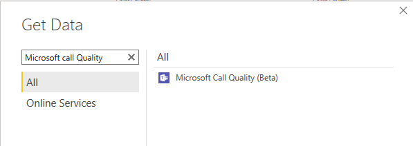

Call Quality Dashboard (CQD), available as link from Teams Admin Center or at [https://cqd.teams.microsoft.com](https://cqd.teams.microsoft.com/) reports on Teams call and meeting quality, at an organizational level.

Microsoft provides two curated CQD templates are provided: one is for managing all networks and the other is filtered for managed (internal) networks only. These are useful to review regularly. There is a link to them in the resources section.

This tool is for those focused on call and meeting usage and performance, particularly for those interested in device usage and network performance. With CQD, you can look at patterns and trends in issues and use them to improve performance and user experience. CQD has both web-based reports and an excellent Power BI report pack.

To make the most of CQD, you should both upload your network data and install the Power BI reports.

## Metrics to review regularly in Call Quality Dashboard

A Voice Administrator should look at the call failures across the entire environment. This can be done by reviewing the Microsoft Call Quality Dashboard

Most user problems can be grouped into the following categories:

- Incomplete firewall or proxy configuration

- Poor Wi-Fi coverage

- Insufficient bandwidth

- Using VPNs

- Inconsistent or outdated client versions and drivers

- Unoptimized or built-in audio devices

- Problematic subnets or network devices

There are three key service metrics in CQD to review regularly, which are shown below:

| Metric| Description|
| :--- | :--- |
| **Poor Stream Rate (PSR)**| The poor stream rate (PSR) represents the organization's overall percentage of streams that have poor quality. This metric is meant to highlight areas where your organization can concentrate effort to have the strongest impact toward reducing this value and improving the user experience.|
| **Setup Failure Rate**| The setup failure rate, otherwise known as the Total Call Setup Failure Percentage measurement in CQD, is the number of streams where the media path couldn't be established between the endpoints at the start of the call.  This represents any media stream that couldn't be established. Given the severity of the impact of this problem on the user experience, the goal is to reduce this value to as close to zero as possible. A high value for this metric is more common in new deployments with incomplete firewall rules than a mature deployment, but it's still important to watch regularly.|
| **Drop Failure Rate**| The drop failure rate, otherwise known as the Total Call Dropped Failure Percentage measurement in CQD, is the percentage of successfully established streams where the media path didn't terminate normally.  This represents any media stream that terminated unexpectedly. Although the impact of this isn't as severe as a stream that failed to set up, it still negatively affects the user experience. Sudden and frequent media drops can have a severe impact on the user experience, resulting in the need for users to reconnect, resulting in lost productivity.|

## Configure tenant, endpoint building data for Call Quality Dashboard

CQD has several reports that can map performance to specific networks and locations with friendly names like "London Office-" these are called " Location-Enhanced Reports." It can also report on specific endpoints by friendly names: For example, if you have asset numbers for laptops or want to report my laptop make and model.

Both abilities require you to upload information to CQD; so, it can map the information it gathers to your friendly names.

To enable Location-Enhanced Reports, download the template CSV or TSV template from Microsoft doc, see Reference links. This is the same template that is used for the Call Analytics reports, but is uploaded in a different place for CQD. Once the template is complete, from the CQD Summary Reports dashboard ([https://cqd.teams.microsoft.com](https://cqd.teams.microsoft.com/)), select Tenant Data Upload from the CQD Settings gear icon then "Tenant Data Upload."

To enable reports to show endpoint makes, models and friendly names you must upload another CSV or TSV (either works) to the same place.

## Configure CQD Power BI query templates for Call Quality Dashboard

While CQD has web-based reports right out of the box, there are also some great Power BI templates. The templates cover the following report areas:

  - Teams Auto Attendant & Call Queue Historical Report

  - Helpdesk Report

  - Location Enhanced Report

  - Mobile Device Report

  - PSTN Direct Routing Report

  - Summary Report

  - Teams Utilization Report

> [!NOTE]
> The Microsoft Call Quality connector and Power BI reports only supports DirectQuery in Power BI; Import mode is not supported.

To set up the Power BI templates and create a new PowerBI.com workspace to host the Power BI reports, follow these steps:

1. Navigate to Power BI at [https://PowerBI.com](https://powerbi.com/).

1. Sign in with an account with the Teams Administrator role and a Power BI Pro license.

1. Select **Workspaces** and **Create a workspace**.

1. Enter a workspace name and a suitable description.

1. Select **Save**

Continue with the following steps to create the new template:

6. Download the CQD Power BI Query Templates from Microsoft (link in the references)

1. Extract the ZIP file to a folder on your local PC such as C:\PowerBITemplates

1. Install Microsoft Power BI Desktop on your PC (link in references)

1. Check to see if your computer already has a **[Documents]\Power BI Desktop\Custom Connectors** folder. If not, create this folder

1. Copy the MicrosoftCallQuality.pqx file included in the download and place it in the Custom Connectors directory.

1. Run Power BI Desktop.

1. In the top right of Power BI Desktop select Sign in.

1. Sign in with the same account used for the Power BI website.

1. Press Get data on the Power BI Desktop Menu bar.

1. Enter Microsoft Call Quality and verify the Microsoft Call Quality (Beta) connector is available.

    > [!div class="mx-imgBorder"]
    > 
    
1. Select **Cancel**.

For each Power BI report template, the .pbit files in the CQD Power BI Query Templates download, perform the following steps:

1. Run Power BI Desktop and ensure you are signed in with the account as above.

1. Open the first pbit file in Power BI desktop.

1. Power BI Desktop will prompt you to sign in to “Microsoft Call Quality”

1. Select Sign in and provide your sign-in credentials. This must be the account with CQD access and the account that created the Power BI workspace.

1. The dialog will say “**You are currently signed in,**” once it does select **Connect**.

1. The report will now populate with your CQD data.

1. Select **File** and **Publish**.

1. You will be prompted to save the file as a .pbix file, this is no longer a template, it is now a populated file

1. You will be prompted to select a PowerBI.com workspace, select the one you created.

1. The report will now upload, wait for it to say **success**.

1. You can now select **Got it**.

The report is now uploaded to the PowerBI.com workspace, you can access it by going to **PowerBI.com** > **Workspaces** > The workspace and select the report.

Repeat the steps for all the reports.

> [!TIP]
> Power BI makes you save the file before uploading it, once uploaded these local files are no longer needed. They contain sensitive data so ensure they are deleted as appropriate.

