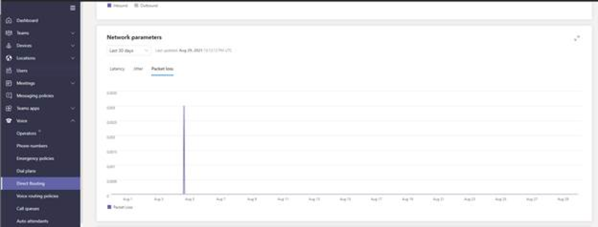

Direct Routing offers some unique abilities to troubleshoot that are not available for calling plans or operator connect. This unit covers Direct Routing troubleshooting.

## Troubleshoot certificate Issues for Direct Routing

Direct Routing requires your SBC to have a validate TLS certificate. The certificate needs to have the SBC FQDN as the common name (CN) or the subject alternative name (SAN) field. The certificate should be issued directly from a certification authority not from an intermediate provider.

Teams Admin Center will report on the TLS connectivity status for each SBC under TAC > Voice > SBC. TLS (transport layer security) Handshake monitoring will flag if a certificate is invalid or expired.

It will warn if a certificate is set to expire within 30 days so that administrators can renew the certificate before service is disrupted.

By selecting the Warning message, you can see a detailed issue description in a popup window on the right and recommendations for how to fix an issue.

## Troubleshoot SIP options issues for Direct Routing

SIP Options is a SIP method, it allows a User Agent (UA) to query another UA or a proxy regarding its capabilities. In this case the Teams Service is a User Agent, and the SBC is a User Agent.

Direct Routing uses SIP options sent by the Session Border Controllers to monitor SBC health. There are no actions required from the tenant administrator to enable the SIP options monitoring. Direct Routing takes the regular one-minute interval options three times. If options were sent during the last three minutes, the SBC is considered healthy. If the SBC is not sending SIP Options, the SBC is considered unhealthy.

You can review the health of SIP Options in the Teams Admin Center > Voice > Direct Routing.

It is recommended that your SBC is configured to send SIP Options. If it cannot or you do not want to send SIP options, you can turn off this monitoring in the SBC config on the Teams Admin Center.

- Login to Microsoft Teams admin center at [https://admin.teams.microsoft.com](https://admin.teams.microsoft.com/) as a Teams administrator

- Go to **Voice** and select **Direct Routing.**

- Select the relevant SBC to troubleshoot.

- Go to the **settings** tab and set **Send SIP Options** to **Off**.

If you turn off SIP options, the SBC will be excluded from the Teams monitoring and alerting system. Calls may continue to be routed to this SBC even if it is offline.

## Troubleshoot Direct Routing SBC connectivity

If you are seeing connectivity issues between your SBC and the Teams service, you can check on the network performance between the SBC and the service in the Teams Admin center:

1. Navigate to the Microsoft Teams admin center at [https://admin.teams.microsoft.com](https://admin.teams.microsoft.com/).

1. Sign in with an account in the Teams Administrator role.

1. Go to **Voice** and select **Direct Routing**.

1. Select the SBC in question.

1. Under Usage look at Network parameters, you have options to select 7 days or 30 days.

> [!div class="mx-imgBorder"]
> [  ](../media/network-parameters.png#lightbox)

Here you can see the average latency, jitter, packet loss, and any peaks.

Microsoft also calculates a Network Effectiveness Ratio for each SBC. This is ITU-T recommended parameter measure ability of the network to deliver calls. It is calculated based on the formula:

```console
𝑁𝐸𝑅=𝐴𝑛𝑠𝑤𝑒𝑟𝑒𝑑 𝑐𝑎𝑙𝑙𝑠+𝑈𝑠𝑒𝑟 𝐵𝑢𝑠𝑦+𝑅𝑖𝑛𝑔 𝑛𝑜 𝐴𝑛𝑠𝑤𝑒𝑟+𝑇𝑒𝑟𝑚𝑖𝑛𝑎𝑙 𝑅𝑒𝑗𝑒𝑐𝑡𝑆𝑒𝑖𝑧𝑢𝑟𝑒𝑠 𝑥 100

```

The ratio calculates how many calls were delivered and ignores user-related errors, such as unanswered calls or user rejected calls. If the value decreases, it indicates that network has a problem that requires investigation.

## Inspect PSTN usage reports for SIP call failures

There is a wealth of Direct Routing troubleshooting information in a place you might not expect; the PSTN Usage Reports

To view these reports

1. Navigate to the Microsoft Teams admin center at [https://admin.teams.microsoft.com](https://admin.teams.microsoft.com/).

1. Sign in with an account in the Teams Administrator role.

1. Go to **Analytics & reports** and select **Usage Reports.**

1. Select the dropdown below **Report** and select **PSTN and SMS (preview) usage.**

1. Select a date range, Last 28 days is fine for this troubleshooting

1. Select **Run report**

1. Select the **Direct Routing** tab

Here you can see the Direct Routing call log with all the usual call details, but also, for each call:

| Parameter| Description|
| :--- | :--- |
| Invite time (UTC)| The time when the initial Invite was sent on an outbound call from a Teams user or bot call to the SBC or received on an inbound call to a Teams or bot call by the SIP Proxy component of Direct Routing from the SBC.|
| Failure time (UTC)| The time the call failed. For failed calls only. Final SIP Code, Final Microsoft subcode, and Final SIP Phrase provide the reasons why the call failed and can help with troubleshooting.|
| End time (UTC)| The time the call ended (for successful calls only)|
| Success| If the call was successful or not|
| Azure region for Media| The data center that was used as media path in a non-bypass call.|
| Azure region for Signaling| The data center that was used for signaling for both bypass and non-bypass calls.|
| Final SIP code| The code with which the call ended.|
| Final SIP Phrase| The description of the SIP code and Microsoft subcode.|
| Media bypass| Indicates whether the trunk was enabled for media bypass.|

You can also download this to excel for easier filtering and reporting.

Here is what to look out for in the Final SIP code:

- 5xx SIP codes indicated Server Failure Responses

- 6xx SIP codes indicate Global Failure Responses

You should review the log for 5xx and 6xx codes and troubleshoot if you are getting them consistently.

Somewhat confusingly-named, 4xx "Client Failure Responses" are often "expected failures" and are not, for example, bad 403 Forbidden. The server understood the request but is refusing to fulfill it. Often this means the call has been rejected by the receiver. 4xx Codes to watch for an investigation include:

- 408 Request Timeout

- 488 Not Acceptable Here

## Investigate and diagnose calling issues with SBC SIP logs

Most complex, but also quite powerful, with Direct Routing you can go directly to your SBC to get full SIP logs of calls. Direct Routing sends a detailed description of any issues to the SBCs; these issues can be read from the SBC logs. Some vendors will even visualize the SIP call flows in their user interface.

How you gather the logs will vary by SBC vendor, but since SIP is a standard the issues you will be looking for will be the same. Look for any unexpected call failures and any sessions with 5xx and 6xx SIP codes, indicating failures.

If you are seeing 5xx and 6xx error codes, confirm the number dialed is correct and has been normalized correctly to an E.164 format that the PSTN carrier supports. If that is correct confirm that number is able to be dialed on a different system to prove the number is in service and works. You could, for example, dial the number from a cell phone. If the number works outside of this system and is formatted correctly, raise a support issue with your PSTN operator.

