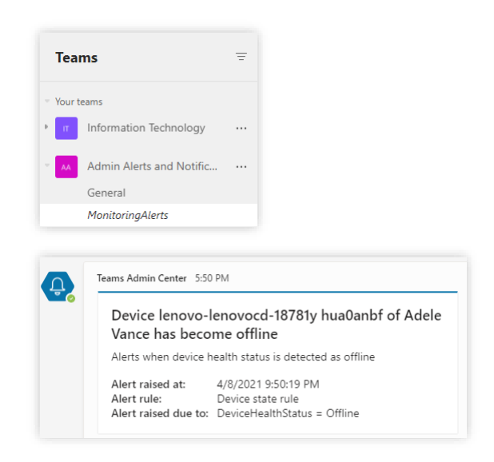
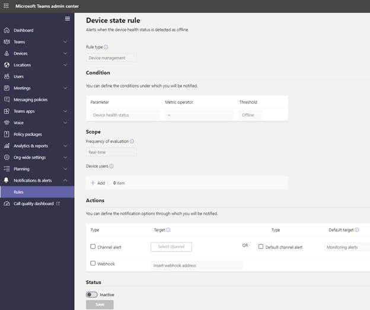
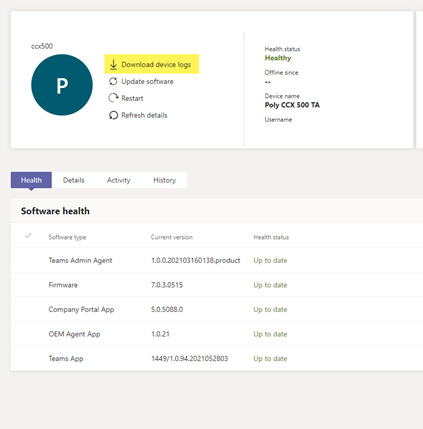

Microsoft Teams has many different types of devices available from USB audio and Video devices to Phones to Room Systems.

For the Teams Voice Engineer learning path, we are focused mainly on Teams Phone devices that run Android, we will also consider Microsoft Teams Rooms for Android.

## Manage and configure Teams Devices

When Devices are signed in with an account on your tenant, they will automatically appear in under the relevant subcategory in the Microsoft Teams Admin Center below Devices.

For Android based IP Phones use the IP Phones Tab, for Microsoft Teams Rooms for Android, the section is still called Collaboration Bars, their previous name.

IP Phones can be filtered into User phones, common area phones, and conference phones. You can also choose to template-specific phone configuration files that control features like screen lock timeout, display contras, office hours, network settings, and can also toggle on logging

This is where you can manage and configure devices. You can select devices primarily by the user display name of the user or account signed into them. If no user account is signed in Display name will show as N/A

## Evaluate and monitor Teams device health status

In Teams Admin Center Each Device will list a "Health Status", status can include:

  - Healthy the device is online and in good condition.

  - Offline The device is offline and can't be used

  - Non-Urgent there are issues or notifications that may have a minimal impact on the performance of an online device.

  - Critical State requires urgent attention and action as it may have a significant impact on the performance of the device or make it unusable for calls and meetings.

In the cased of Non-Urgent and Critical, you can select the status to be taken right to the issue definition and Microsoft suggested remediation.

Non-Urgent will often simply be firmware updates that are available now but have not yet been automatically deployed. You can choose to manually deploy them straight away, manually schedule them for a specific date, or just wait for the next automatic update window to take place.

## Troubleshoot updating Teams devices

By default, android based devices are set to auto update, so there is no specific administration required to update devices.

Review the updates in Teams Admin center to ensure they are being successfully deployed and there are no Health Status Issues

If devices are having issues updating, try a device reboot and check network connectivity for any proxies that may be blocking connectivity to the internet.

## Managing device notifications and alerts

Microsoft Teams admin center can proactively alert you if a device goes offline. You will find the ability to configure this under Notifications and alerts. The notifications are delivered in the autocreated MonitoringAlerts channel of the Admin Alerts and Notifications Team.

A device offline notification can include the following information:

- The device name that's offline.

- The user of the offline device.

- The time the device went offline.

- The type of rule that raised the alert.

- The reason an alert is raised

The following picture shows an example of an alert:

> [!div class="mx-imgBorder"]
> 

### Configure device state monitoring rule

To configure a device state monitoring rule for a tenant, perform the following steps:

1. Sign into Microsoft Teams admin center, select Notifications & alerts > Rules.

1. In the Rules Page, select Device state rule.

    > [!div class="mx-imgBorder"]
    > 

1. Under Device users, Select the device(s) by user account to configure the state rule for enabling alerts.

1. If you want channel alerts, select **Actions** and **Channel alert**.

1. A default team named Admin Alerts and Notifications and channel named MonitoringAlerts will be created where notifications will be delivered to.

1. If you want Webhook alerts, select **Actions **and** Webhook** and insert webhook code.

1. Toggle the switch below **Status** to **active**.

1. Select **Save**.

> [!TIP]
> You cannot edit Rule type, condition, or scope. The only condition available to monitor is if the device goes offline. More rule types, conditions and scopes are planned to be added in the future.
> Microsoft provides a reference for web hook code in Microsoft Docs.

## Device log collection and review

For all Android based Teams devices, in the device settings you can remotely collect device logs for any support issues:

1. Navigate to the Microsoft Teams admin center at [https://admin.teams.microsoft.com](https://admin.teams.microsoft.com/).

1. Go to **Devices**, select **Device Category** and select **Device**.

1. Select **Download device logs**.

    > [!div class="mx-imgBorder"]
    > 

Open the file and use the following keywords to search for in the device text log:

| **Keyword**| **Event**|
| :--- | :--- |
| AdminAgentService| Admin agent events|
| AuthorizationService| Authorization flows|
| Calling| Calling Issues|
| Devicemgm| Device management|
| Enrolling| Device management|
| GetAdalAccess| AD access token for admin agent|
| MAMAcquire| AD access token for admin agent|
| SharedSecret| Device secret|

The results will help to understand why a device does not work as intended and is therefore a useful tool for troubleshooting.

## Troubleshoot sign-in issues for Microsoft Teams devices

If a Teams device cannot sign in, the first thing to do is check basic network connectivity. Check if firewalls or proxies are blocking connectivity.

If you can, plug a laptop into the same network connection, and check if you can sign into the Teams windows client. This will also validate if your account is set up correctly.

Some organizations might have Microsoft Azure Conditional Access policies in place to prevent sign-in from older devices. They may also have Microsoft Endpoint Manager with policies preventing sign-in. If this is configured, you may see an error on sign-in saying "You cannot access this right now, your sig -in was successful but does not meet the criteria to access the resource." Ask our Azure or Microsoft Endpoint manager administrator to make an exception rule.

Check device logs for events around the "AuthorizationService" Keyword.

## Microsoft Teams Rooms managed service

For an additional cost per room, Microsoft offers a Teams Rooms managed service for remote management and monitoring of Microsoft Teams Rooms devices and their peripherals. This includes the following features:

  - Room planning and rollout

  - Monitoring and troubleshooting

  - Update management

  - Insights and recommendations

  - Customer support via tickets from an online portal

