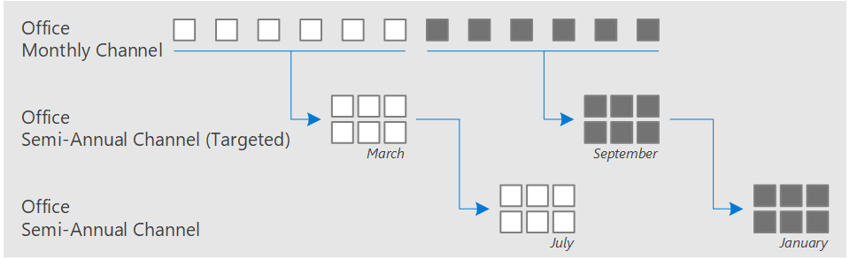

After you deploy Windows 10 and Microsoft 365 Apps, Microsoft strongly recommends that you keep them up to date as new features and other updates are released.

## Types of updates for Microsoft 365 Apps
Similar to Windows 10, one of the benefits of Microsoft 365 Apps is that Microsoft provides new or updated features for Office apps on a regular basis. For example, adding improved translation capabilities to Word or adding support for 3D animations in PowerPoint.

For Microsoft 365 Apps, Microsoft provides you options (called update channels) that allow you to control how often Microsoft 365 Apps receives feature updates. Here are the primary update channels for Microsoft 365 Apps:

- **Monthly Channel**, which receives feature updates approximately every month.
- **Semi-Annual Channel (Targeted)**, which receives feature updates in March and September. This is typically used for pilot users and application compatibility testers.
- **Semi-Annual Channel**, which receives feature updates every six months, in January and July.

Feature updates in Semi-Annual Channel have already been released in Monthly Channel in previous months. Semi-Annual Channel is the default update channel for Microsoft 365 Apps.

*The Office update channels*

As needed, Microsoft also provides each update channel with two additional types of updates:

- **Security updates**, such as updates that help keep Office protected from potential malicious attacks.
- **Quality updates**, such as updates that provide stability or performance improvements for Office.

Security updates are usually released on the second Tuesday of every month. Quality updates, which are sometimes referred to as *non-security updates*, are also usually released on this day. But, if necessary, both types of updates can be released at other times.

## Choose the appropriate update channel for your organization
Which update channel of Microsoft 365 Apps you deploy to the users in your organization can depend on several factors, such as application compatibility testing and user readiness.

If your organization has line-of-business applications, add-ins, and macros that need to be tested to determine if they work with an updated version of Microsoft 365 Apps, then Semi-Annual Channel is probably the right update channel for your organization.

If application compatibility testing isn’t a significant concern, and if your users need the newest features of Microsoft 365 Apps as soon as they are available, then Monthly Channel is probably the right update channel for your organization. If you choose Monthly Channel, keep in mind that your help desk and others need to be prepared to support these more frequent feature updates.

Not all users in your organization need to be on the same update channel. For example, you can provide your training department with Monthly Channel so they can start learning about the new Office features, while the rest of your organization is on Semi-Annual Channel.

The update channel that you choose for Microsoft 365 Apps doesn’t have to match the update channel for Windows 10.

## How updates are installed for Microsoft 365 Apps
When Microsoft 365 Apps is updated, all the available updates for that update channel are installed at the same time. There aren’t separate downloads for feature, security, or quality updates. Also, updates are cumulative, so the most current update includes all the feature, security, and quality updates that have been previously released for that update channel.

Microsoft 365 Apps checks for updates on a regular basis, and they're downloaded and installed automatically. While updates are being downloaded, your users can continue to use Office apps. After they're downloaded, the updates are installed. If any Office apps are open, your users will be prompted to save their work and close the apps, so that the updates can finish being installed.

## Choose a location for distributing updates for Microsoft 365 Apps
Because organizations have different requirements and concerns when it comes to managing software updates, Microsoft provides flexibility in how you can distribute updates for Microsoft 365 Apps in your organization.

For example, you can configure Microsoft 365 Apps to get updates from one of the following locations:
- The Office Content Delivery Network (CDN) on the internet
- A shared folder on your local network
- An enterprise software deployment tool, such as Configuration Manager

If network connectivity or other considerations based on your organization’s requirements aren’t an issue, Microsoft recommends updating Microsoft 365 Apps from the Office CDN, because it requires the least amount of administrative effort. 

If you have network bandwidth concerns or want more administrative control, you can download the latest version of Microsoft 365 Apps to a shared folder on your local network. Then you can configure devices to use that shared folder location to update Microsoft 365 Apps. If you’re using a shared folder to distribute updates, you'll need to do a manual download each time an updated version of Microsoft 365 Apps is released. Additionally, if your organization is using multiple update channels, you'll need to do separate downloads for each update channel.

If you already use an enterprise software deployment tool to deploy and update software, you can use it to manage updates to Microsoft 365 Apps. Configuration Manager, for example, has built-in capabilities that simplify the administrative effort to download and distribute updates for Microsoft 365 Apps.

Not all users in your organization need to get updates from the same location. For example, administrative staff at the corporate headquarters would get updates from Configuration Manager. But, sales associates that travel frequently and are rarely in the office would get their updates directly from the Office CDN on the internet.

## Use a pilot group to test updates for Microsoft 365 Apps

Microsoft also recommends creating a pilot group that includes a representative sample of your business groups and devices. This group is used to test updated versions of Microsoft 365 Apps before you update the majority of the users in your organization.

Your pilot group might include, for example, some users in the Finance department, because they're probably using specialized line-of-business applications and macros. The pilot group might also include other users in your organization that need to start trying out feature updates in advance, such as application developers or testers, training or help desk staff, or other members of the IT department.

To help with this testing, Microsoft provides other update channels for Microsoft 365 Apps, for example, Semi-Annual Channel *(Targeted)*. This update channel provides an advanced look at the next feature update for Semi-Annual Channel. This gives you several months to test the new features before they're available to Semi-Annual Channel.