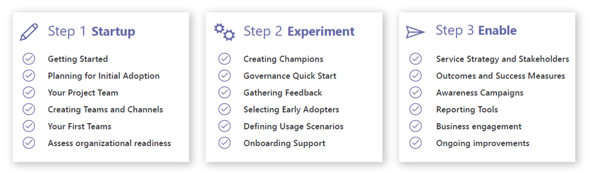

User adoption is vital to the success of any Microsoft Teams deployment. Teams combines a wide range of different workloads, such as messaging, file, and voice communication. Organizations may experience significant change to business processes to efficiently collaborate and communicate with Microsoft Teams. And as business processes change, end-users often find that their daily routines or processes change as well. It is this change that users must positively embrace to successfully implement Teams. Without buy-in from the end users who implement Teams as their primary collaboration hub, a Teams deployment will fail, even if rolled out perfectly.

The list below is high-level steps that organizations should pursue to implement Teams and drive positive user adoption. These steps, which can be altered depending on the size of the organization, will help ensure a sustained level of communication with stakeholders, champions, IT administrators, and users to land a successful deployment for Microsoft Teams.

1. Identify key stakeholders, champions, and user profiles.

2. Identify and select fitting business scenarios.

3. Conduct a pilot that includes business users, champions, and IT professionals.

4. Design, launch, and manage an adoption campaign. Download the Customer Success Kit as a starting point. A good adoption campaign includes:

	- Internal awareness materials such as posters, digital signage, and events

	- Self-help and training information in a specific location

	- A defined feedback mechanism

	- Pre-defined success measures (solution adoption, views of key materials, attendance at courses)

5. Build a champion program alongside your service deployment.

6. Provide a standard feedback method.

7. Measure and share success.

8. Adjust messaging and methods based on feedback, and then repeat.

## Identify key stakeholders, champions, and user profiles

The first rule of a successful adoption is to create a dynamic team comprised of key stakeholders and the right people who can drive and effect change in others. The team should consist of committed individuals representing a cross-section of the organization. Key stakeholder roles include an Executive Sponsors, Service Owners, IT Professionals, and Champions.

- **Executive Sponsors.** These individuals are key leaders within the organization, and their participation is essential in driving employee adoption. They have the greatest influence on company culture and can actively communicate the value and benefits of new technology and business processes.

- **Service Owners.** These individuals are responsible for ensuring people use the service and get value from it. Defining Service Owners within your organization is important to ensure the business goals set for Office 365 are realized.

- **IT Professionals and Champions.** Gaining buy-in from every user across an organization is a challenge. IT Professionals and Champions can help alleviate this challenge and play an important role in the adoption of Office 365. They are knowledgeable, committed to furthering their expertise and are willing to provide peer coaching and assistance. They help translate Office 365 into the reality of their department or team.

Organizations should plan regular meetings of these stakeholders to keep them up to date on the progress of the projects. Initiating a "collaboration council" to allow for feedback and discussion can be a useful tool depending on corporate culture.

**Best Practice:** Ironically, the people who may be the biggest obstacles to change can also become your most important allies in a deployment of this kind. You should engage with these members of organizations early and often to hear their concerns and issues. Often, they have valuable feedback that will make the Teams deployment project more successful. Once you receive their buy-in on the project, other end users who may be skeptical of the change often follow their lead and embrace the new system as well.

## User profiles

It is important to understand the types of users throughout your organization. Do you have users who are primarily mobile? Are they in constant meetings or giving presentations? Do you know which of your users have the most difficulty with your existing collaboration solutions? 

Segmenting your user community in this manner can help you identify groups that are most open to change. They are often the best targets for your early business pilots, and their feedback is valuable. Understanding the "day in the life" of your users will help you prioritize your business outcomes, design adoption goals appropriate for your deployment, and sustain usage over time.

The following table identifies some typical user profiles.

| **User profile**        | **Focus on**                                                              |
|-------------------------|---------------------------------------------------------------------------|
| Office Workers          | Works mainly in the office, creates meetings and calls                    |
| Sales Representatives   | Works externally, chats a lot, and uses file storage                      |
| Management or "C-level" | Works with sensitive data; therefore, has increased security requirements |

## Champions

Champions are essential to driving awareness, adoption, and education in your organization. A champion is a person, primarily motivated by helping others, who is interested in new technology and helping other users use it in alignment with your best practices. 

Identifying the individuals who can become your collaboration champions provides you with an extended support team that can provide essential feedback regarding your implementation plans. The incentive for those individuals selected for this program is that it provides them with early insight into the company’s plans and enables them to provide feedback to effect change that will improve their daily processes. Any investment you make in this community, whether it be time, attention, or rewards, will be returned to your implementation through their support and evangelism.

Champions will help to:

- Create the enthusiasm that grows adoption of improved business processes.

- Build a circle of influence among their teams.

- Bring to life across teams the new ways of working.

- Identify business challenges and possible solutions.

- Provide feedback to the project team and sponsors.

For a successful Champions program, individuals from all types of user profiles are required to maximize the range and efficiency of their benefits for a Teams deployment.

**Additional information.** Microsoft provides different guides and toolkits to support companies in rolling out Teams. 
- [Microsoft Teams tools and workshops](/MicrosoftTeams/planning-workshop-practical-guide).

- [Microsoft 365 adoption tools](https://adoption.microsoft.com/?azure-portal=true)