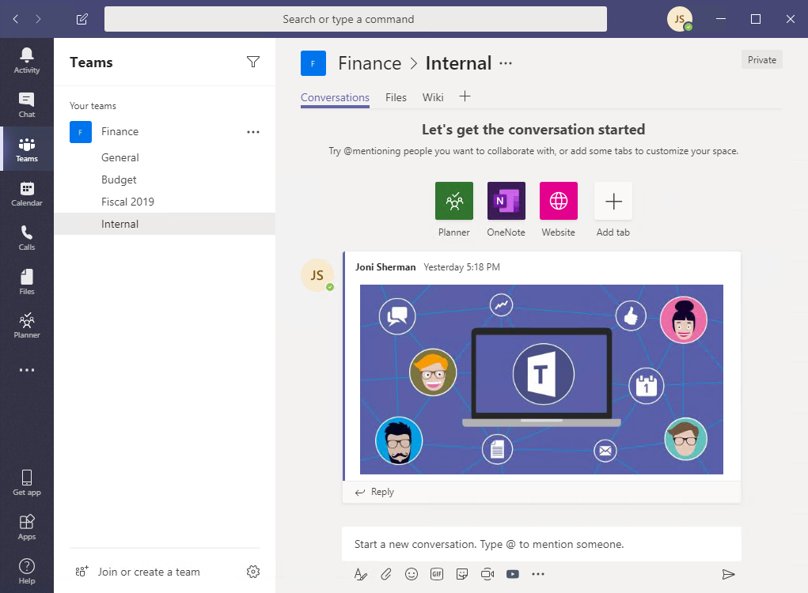

Microsoft Teams has clients available for desktop (Windows, Mac, and Linux), web, and mobile (Android and iOS). There are different ways to deploy Teams clients based on devices. 

## Deploy Teams desktop clients 
The Microsoft Teams desktop clients provide real-time communications support (audio, video, and content sharing) for team meetings, group calling, and private one-on-one calls.



The desktop client is available for the following operating systems:

- **Windows:** Windows (8.1 or later) and Windows Server (2012 R2 or later), 32-bit and 64-bit versions.
- **macOS:** the three most recent versions of macOS.
- **Linux:** .deb and.rpm formats.

As a Teams administrator, you can choose your preferred method to distribute the installation files to computers in your organization. For example, you can use Microsoft Endpoint Configuration Manager for Windows operating systems or Jamf Pro for macOS. There are several ways to deploy Teams desktop clients:

- As a part of the [Microsoft 365 Apps for enterprise](/deployoffice/teams-install) installer.
- MSI files (both 32-bit and 64-bit) for IT bulk deployment. Such as through Microsoft Endpoint Configuration Manager, Group Policy, or any third-party distribution mechanism for broad deployment.
- A standalone (.exe) installer for user installation.

The Teams desktop client on the Windows OS doesn’t require elevated permissions and every user can install the client to their profile path. On macOS systems, administrative permissions are required.


### Windows Operating Systems

The Microsoft Teams installation for Windows provides downloadable installers in 32-bit and 64-bit architecture. 

The Windows client is deployed to the AppData folder located in the user’s profile. Deploying to the user’s local profile allows the client to be installed without requiring elevated rights. 

The Windows client uses the following locations:

- %LocalAppData%\Microsoft\Teams
- %LocalAppData%\Microsoft\TeamsMeetingAddin
- %AppData%\Microsoft\Teams
- %LocalAppData%\SquirrelTemp

The Windows client requires .NET Framework 4.5 or later. The Teams installer will offer to install it for you if you don't have it. 

### Mac Operating Systems

Mac users can install Teams by using a PKG installation file for macOS computers. Administrative access is required to install the Mac client. The macOS client is installed to the /Applications folder. To install Teams by using the PKG file, do the following steps:

1. From the Teams download page, under **Mac**, select **Download**.
2. Double select the PKG file.
3. Follow the installation wizard to complete the installation.
4. Teams will be installed to /Applications folder; the installation is machine-wide.

### Linux Operating Systems 

Users can install native Linux packages in `.deb` and `.rpm` formats.
Installing the DEB or RPM package will automatically install the package repository

- DEB `https://packages.microsoft.com/repos/ms-teams stable main`
- RPM `https://packages.microsoft.com/yumrepos/ms-teams` 

The signing key to enable auto-updating using the system's package manager is installed automatically. However, it can also be found at: [https://packages.microsoft.com/keys/microsoft.asc](https://packages.microsoft.com/keys/microsoft.asc?azure-portal=true). 

Microsoft Teams ships monthly. If the repository was installed correctly, the system package manager should handle auto-updating in the same way as other packages on the system. 

To install Teams by using DEB or RPM package, do the following steps:

1. Download the package from [Download Microsoft Teams](https://www.microsoft.com/microsoft-teams/download-app?azure-portal=true).
2. Install using one of the options below:
    - Open the relevant package management tool and go through the self-guided Linux app installation process.
    - Or through Terminal,
        - To install Teams using RPM package, type: `sudo yum install <TeamsDownloadFileName>`
        - To install Teams using DEB package, type: `sudo apt install <TeamsDownloadFileName>`
    
    *Change `<TeamsDownloadFileName>` to the Teams file name you downloaded. For example:
    `sudo yum install ./teams-insiders-1.2.00.26154-1.x86_64.rpm`
    
3. You can launch Teams via Activities or via Terminal by typing `Teams`.

### Teams for Virtualized Desktop Infrastructure

Virtual Desktop Infrastructure (VDI) is virtualization technology that hosts a desktop operating system and applications on a centralized server in a data center. By using VDI, the users can enjoy a fully personalized desktop experience with a fully secured and compliant centralized source.

You can deploy the Teams desktop app for VDI using a **per-machine** installation or **per-user** installation using the MSI package. Deciding on which approach to use depends on whether you use a persistent or non-persistent setup and the associated functionality needs of your organization. To deploy the Teams desktop app to the VM, perform the following steps:


1. Download the Teams MSI package that matches your VDI VM operating system using one of the following links:

    - [32-bit version](https://statics.teams.cdn.office.net/production-windows/1.3.00.4461/Teams_windows.msi?azure-portal=true)

    - [64-bit version](https://statics.teams.cdn.office.net/production-windows-x64/1.3.00.4461/Teams_windows_x64.msi?azure-portal=true)

2. Install the MSI to the VDI VM by running one of the following commands:

    - Per-user installation  (default)
  
        ```console
        msiexec /i <path_to_msi> /l*v <install_logfile_name> ALLUSERS=1
        ```

        This process is the default installation, which installs Teams to the %AppData% user folder. At this point, the golden image setup is complete. Teams won't work properly with per-user installation on a non-persistent setup.

    - Per-machine installation

        ```console
        msiexec /i <path_to_msi> /l*v <install_logfile_name> ALLUSER=1 ALLUSERS=1
        ```

        This process adds a required registry key to the machine that lets the Teams installer know it is a VDI instance. Without it, the installer will error out, stating: "Installation has failed. Cannot install for all users when a VDI environment is not detected."

3. The next interactive logon session starts Teams and asks for credentials.

If you need to uninstall the MSI from the VDI VM, run the following command:

```console
msiexec /passive /x <path_to_msi> /l*v <uninstall_logfile_name>
```


## Deploy Teams mobile clients

The Microsoft Teams mobile apps are available for Android and iOS, and are geared for on-the-go users participating in chat-based conversations and allow peer-to-peer audio calls. For mobile apps, go to the relevant mobile stores Google Play and the Apple App Store.

- **Android**. Support is limited to the last four major versions of Android. When a new major version of Android is released, the new version and the previous three versions are officially supported.

- **iOS**. Support is limited to the two most recent major versions of iOS. When a new major version of iOS is released, the new version of iOS and the previous version are officially supported.
 
Mobile apps are distributed and updated through the respective mobile platform’s app store only. Distribution of the mobile apps via MDM or side-loading is not supported by Microsoft. Once the mobile app has been installed on a supported mobile platform, the Teams Mobile App itself will be supported provided the version is within three months of the current release.
 
## Deploy Teams web clients

The web client [https://teams.microsoft.com](https://teams.microsoft.com?azure-portal=true) is a full, functional client that can be used from various browsers. 

The web client supports Calling and Meetings by using webRTC, so there is no plug-in or download required to run Teams in a web browser. The browser must be configured to allow third-party cookies.

The Teams web client is available for various different browsers, including Edge, Chrome, and Safari. For the list of supported browser, see [Web client](https://docs.microsoft.com/microsoftteams/get-clients?azure-portal=true#web-client).


## Client update management

Most Teams clients are updated automatically by the Microsoft Teams service. No IT administrator intervention is required. If an update is available, the client will automatically download the update. When the app has idled for some time, the update process will begin.

Users can also manually download updates by selecting **Check for updates** on the **Profile** drop-down menu on the top right of the app. If an update is available, it will be downloaded and silently installed when the computer is idle.

Teams clients on Virtual Desktop Infrastructure (VDI) aren't automatically updated the way that non-VDI Teams clients are.

* With **per-machine** installation, automatic updates is disabled. You uninstall the current version to update to a newer version. 

* With **per-user** installation, automatic updates is enabled. 

For most VDI deployments, deploying Teams using per-machine installation is recommended. To update to the latest Teams version, start with the uninstall procedure followed by latest Teams version deployment.
