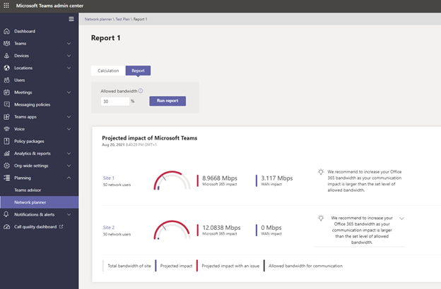
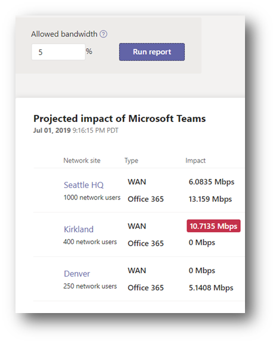
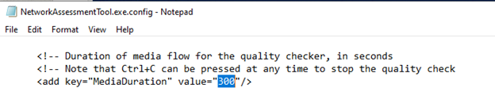
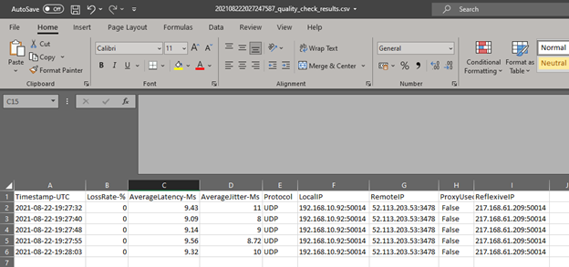

To optimize your organizational network, you must first understand Teams network requirements. This unit explains those requirements.

## Understand Office 365 URLs and IP address ranges

One of the first steps in optimizing network performance is to make sure all required endpoints in Microsoft 365 are available to the user’s client devices. If a client is not able to connect to all required endpoints, depending on which service is inaccessible, users may see errors of features not working. For example, if SharePoint Online is not accessible, users will have problems accessing files in Teams as well. Make sure that all the required Office 365 URLs and IP address ranges are accessible for your users, no matter if they connect from a company network, via VPN connections or from their home network. You can find a link to the full list of URLs and IP addresses in the Resources section.

If a company is using proxy servers, Microsoft recommends bypassing these proxies for Microsoft Teams. Teams traffic is always encrypted, and proxies can introduce network performance issues.

If you do use a proxy, against Microsoft recommendations, because your organization mandates it, be sure to monitor for network performance issues, particularly  latency and packet loss, as these can be introduced by underperforming proxies.

Microsoft strongly recommends the following are configured if you must use a proxy:

- Using external DNS resolution

- Using direct UDP-based routing

- Allow UDP traffic

## Understanding audio and video impact on the network

Microsoft Teams has the normal basic network requirements of internet connectivity and DNS, but the most important network requirements are for audio and video or the calling and meeting workloads.

Teams’ codecs will do their best to optimize the user experience for the bandwidth available. When more bandwidth is available, quality and usage will increase to deliver the best experience. Teams can reach up to 4 MB/s per client if the bandwidth is available.

Microsoft offers the following guidelines for bandwidth requirements for Teams, breaking it down into minimum, recommended, and best performance:

- Minimum experience Bandwidth requirements for video calls are up to 240p resolution, screen sharing content frame rates adaptive 1.875 fps to 7.5 fps, and Together Mode/Large Gallery video up to 540p resolution.

- Recommended experience Bandwidth requirements for video calls are up to 1080p resolution, screen sharing content frame rates adaptive 7.5 fps to 30 fps, and Together Mode/Large Gallery video up to 1080p resolution.

- Best Performance experience Guidance allows higher fidelity video for larger attendee meetings, high loss environments, and higher motion content with screen sharing content frame rates adaptive 15 fps to 30 fps.

The following table describes the minimum, recommended, and best bandwidth per user required for using Teams in different calling situations:

| Modality| Minimum Up| Minimum Down| Recommended Up| Recommended Down| Best Performance Up| Best Performance Down|
| :--- | :--- | :--- | :--- | :--- | :--- | :--- |
| Audio|||||||
| One-to-one| 10| 10| 58| 58| 76| 76|
| Meetings| 10| 10| 58| 58| 76| 76|
| Video|||||||
| One-to-one| 150| 150| 1,500| 1,500| 4,000| 4,000|
| Meetings| 150| 200| 2,500| 4,000| 4,000| 4,000|
| Screen sharing|||||||
| One-to-one| 200| 200| 1,500| 1,500| 4,000| 4,000|
| Meetings| 250| 250| 2,500| 2,500| 4,000| 4,000|
| Together Mode (Meetings Only)| 1,000| 1,500| 1,500| 2,500| 2,500| 4,000|

## Network performance requirements for audio and video

As well as raw bandwidth or throughput, Teams needs a stable and performant connection. Performance is measured in terms of latency, the time it takes for packets to get from A to B, the packet loss, packets that do not reach their destination at all and Jitter, which means packets that arrive at their destination in the wrong order. Even if you have a high bandwidth (throughput), if you have bad latency and packet loss, you will experience a much-degraded experience when using real-time communications like calling and meetings via Teams.

UDP connectivity for media is highly recommended as it is a connectionless protocol and has a lower transmission overhead. TCP is supported, and Teams will fall back to TCP if UDP is unavailable, but using TCP will impact performance.

Microsoft gives two sets of network performance targets to meet for optimal performance, which are the minimum requirements from a user’s client or endpoint to the Microsoft networks and from the user’s network to the edge of the Microsoft networks.

This separation into two target requirements allows you to separately test, analyze, and optimize the organizational network edge first and then any issues with your network before the network edge.

### Network performance requirements from your network edge to Microsoft network edge

The following table shows the metrics exclude any LAN/WAN or Wi-Fi and just measure from your corporate network edge to Microsoft via your ISP:

| Metric| Target|
| :--- | :--- |
| Latency (one way)| <30 ms|
| Latency (RTT or Round-trip Time)| <60 ms|
| Burst packet loss| <1% during any 200 ms interval|
| Packet loss| <0.1% during any 15 s interval|
| Packet inter-arrival Jitter| <15ms during any 15 s interval|
| Packet reorder| <0.01% out-of-order packets|

You can use the Microsoft Teams Network Assessment Tool on a machine or VM on the edge of your network to test if your internet connectivity meets these requirements.

### Network performance requirements from a client to Microsoft network edge

The following table is the complete path from the client to Microsoft, including any Wi-Fi and LAN/WAN and internet connection:

| Metric| Target|
| :--- | :--- |
| Latency (one way)| <50 ms|
| Latency (RTT or Round-trip Time)| <100 ms|
| Burst packet loss| <10% during any 200 ms interval|
| Packet loss| <1% during any 15 s interval|
| Packet inter-arrival Jitter| <30 ms during any 15 s interval|
| Packet reorder| <0.05% out-of-order packets|

From these tables, you have learned the network performance requirements for Microsoft Teams.

You can use the Microsoft Teams Network Assessment Tool or Microsoft 365 network connectivity test on client machines both on the organizational network and outside the organizational network. You can analyze if the connection from the client machine meets these requirements.

## Evaluate network specifications

After learning the raw values required to operate Teams in your organizations network, you must analyze the existing infrastructure with the provided tools.

### Determine network requirements using the Teams Network Planner

The Network Planner tool is available in the Teams admin center. It helps you determine the network requirements for Teams in your organization.

> [!div class="mx-imgBorder"]
> [  ](../media/network-planner.png#lightbox)


> [!NOTE]
> The tool does not configure anything, change any settings or test anything, it will simply generate reports and calculate bandwidth requirements for Teams usage based on typical usage personas and number of users on each site.

> [!TIP]
> The recommended user bandwidth personas were developed by Microsoft based on data from Teams best use scenarios and typical usage patterns. However, you can create up to three custom personas in addition to the three recommended personas if you require. This is done in Microsoft Teams admin center > Planning > Network planner > Personas 

To create a new network plan in Network planner, perform the following steps:

1. Navigate to the Microsoft Teams admin center at [https://admin.teams.microsoft.com](https://admin.teams.microsoft.com/).

1. Sign in with an account member in the role Teams Administrator.

1. Navigate to **Planning** and select **Network planner.**

1. To start, select **Add** and input a name for your plan and a description and select **Apply.**

1. Once created, select your plan, and select **add a network site** for each site.

1. For each site you need to add:

    - The number of users, called "network users"
    
    - Network subnets, these are just for reference in the report
    
    - If the site is directly connected to the internet, set the internet capacity in Mbps. If there is no local internet connectivity, set it to 0.
    
    - If the site is connected to other sites via a WAN, tick this box at set the WAN capacity, and the queue size for audio and video in Mbps if you are using QoS queues.
    
    - PSTN egress
    
    - If no local PSTN, select "**VoIP only**." If there is PSTN breakout, select **local.**
    
    - If the site is connected directly to Office 365 via ExpressRoute, tick this box.

1. Once you have added your network sites and details, go to the **Report** tab and select **Start a report.**

1. Enter a report name and select **Generate report**.

1. You are moved to the **Report** tab automatically to review the results.

1. You will need to choose to divide your network site users between the bandwidth personas. Think about the ratios of each type of user you will have on that site.

1. By default, the tool will assume 30% of a link is reserved for real-time communications. You can change this Allowed bandwidth percentage in the report page.

1. You will then get a report of the network impact in terms of bandwidth usage for each site and that sites links.

    > [!div class="mx-imgBorder"]
    > [  ](../media/network-planner-results.png#lightbox)

The above image shows an example of a network planner report with a link that does not have enough bandwidth, highlighted in red. Any figured highlighted in red indicate areas that need more bandwidth. You can access the reports at any time in the future by going back Network planner in the Microsoft Teams admin center. ****

After performing the described steps, you have mapped out your network and can plan for any sites or links that may require additional bandwidth.

### Perform a network analysis using the Teams Network Assessment Tool

While Network Planner is just a planning exercise, Microsoft Teams Network Assessment Tool performs a simple test of actual network connectivity and network performance to determine how well the network would perform for Microsoft Teams calls.

The tool enables you to analyze network connectivity in two different ways: testing connectivity to the service and performance of your network path. The tests are detailed in the following bullets:

- **Network connectivity** – Verify network connectivity between test location, and the Microsoft Network are correctly configured to enable communication to the IP addresses and ports needed for Microsoft Teams calls.

- **Network performance** – Test the connection performance from the test location to a Microsoft Teams relay by streaming packets to the nearest edge site and back for a configurable amount of time. The tool collects and outputs loss, jitter, and round-trip time. The results from set of test calls can be analyzed to determine if it meets the media quality and performance targets.

Network connectivity is mainly about checking if firewalls or proxies are blocking any connections required, and network performance test is about the actual performance of packets sent across the network.

It can also output a verbose HTTP stack infrastructure test. This would only be used in advanced troubleshooting with Microsoft support.

### Install the Teams Network Assessment Tool

To install The Teams Network Assessment Tool, follow these steps:

1. Download The Teams Network Assessment Tool Installer from the Microsoft download center.

1. Run the Installer.

1. The tool will be installed to the following path by default: %ProgramFiles(x86)%\Microsoft Teams Network Assessment Tool\

The folder contains multiple items, such as the actual executable to start the tool, which is “NetworkAssessmentTool.exe” and a Word document with the name “Usage.docx,” which includes the instructions how to use the tool. There is no Windows user interface; it is a command-line tool only. You can run it whether from the command prompt or PowerShell.

Examples will be given for the command prompt.

Network Connectivity Check
Running the tool in a command line with no switches will perform a network connectivity check.

```console
C:\Program Files (x86)\Microsoft Teams Network Assessment Tool\NetworkAssessmentTool.exe

```

Firstly, the tool will check if it has connectivity to the Teams media relay. These are used to relay audio and video when direct connection between clients is not possible. The relay connectivity checker verifies network connectivity to the load-balancer relay (VIP), AND one relay instance (DIP) forwarded by the load-balancer relay. The checker tests connectivity via UDP, TCP (Pseudo-TLS/Full-TLS), and HTTPS transport protocol. The checker tests connectivity to port 3478 (control port) of the load-balancer relay, and ports 3478-3481 of the relay instance.

The checker also checks whether the load-balancer relay is QoS (Quality of Service) enabled, which means the load-balancer redirects packets to relay instance ports 3479-3481 (instead of 3478) depending on modality (audio = 3479, video = 3480, screenshare/data = 3481)

> [!TIP]
> By default, a default relay load-balancer relay FQDN for Worldwide Office 365 Endpoints is used. If you are working with a U.S. Government DoD tenant or U.S. Government GCC High tenant, you can edit the configuration file to test those endpoints

```console
Microsoft Teams - Network Assessment Tool

Starting Relay Connectivity Check:

UDP, PseudoTLS, FullTLS, HTTPS connectivity will be checked to this relay (VIP) FQDN: worldaz.tr.teams.microsoft.com

If user wants to check connectivity to a particular relay (VIP) IP, please specify in NetworkAssessment.exe.config.

Connectivity check source port range: 50000 - 50019

Relay : 52.115.84.7     is the relay load balancer (VIP)

Relay : 52.115.84.7     is reachable using Protocol UDP and Port 3478

Relay : 52.115.84.7     is QOS (Media Priority) enabled

Relay : 52.115.84.7     is the relay load balancer (VIP)

Relay : 52.115.84.7     is reachable using Protocol PseudoTLS and Port 443

Relay : 52.115.84.7     is the relay load balancer (VIP)

Relay : 52.115.84.7     is reachable using Protocol FullTLS and Port 443

Relay : 52.115.84.7     is the relay load balancer (VIP)

Relay : 52.115.84.7     is reachable using Protocol HTTPS and Port 443

Relay : 52.115.84.153   is the actual relay instance (DIP)

Relay : 52.115.84.153   is reachable using Protocol UDP and Port 3478

Relay : 52.115.84.153   is the actual relay instance (DIP)

Relay : 52.115.84.153   is reachable using Protocol UDP and Port 3479

Relay : 52.115.84.153   is the actual relay instance (DIP)

Relay : 52.115.84.153   is reachable using Protocol UDP and Port 3480

Relay : 52.115.84.153   is the actual relay instance (DIP)

Relay : 52.115.84.153   is reachable using Protocol UDP and Port 3481

Relay connectivity and Qos (Media Priority) check are successful for all relays.

```

Next, it will check if it can connect to the Teams call services.

These services include (with protocol provided):

- Call Controller (HTTP and UDP)

- Conversation Service (HTTP)

- Chat Service (HTTP)

- Trouter Service (HTTP)

- Broker Service (HTTP)

```console
Starting Service Connectivity Check:

Service verifications completed successfully.

```

A text file of the results will be output to \AppData\Local\Microsoft Teams Network Assessment Tool\service

```console
Service connectivity result has been written to: C:\Users\<alias>\AppData\Local\Microsoft Teams Network Assessment Tool\service_connectivity_check_results.txt

```

You are looking for a successful result for all tests. If tests are not a success, check the log file for more information regarding any tests that failed and look to open network connectivity for those addresses or services. Typical places to look for issues are firewalls and proxies.

Network Quality Check
The network quality check (performance test) is run with the NetworkAssessmentTool.exe /qualitycheck switch. This will test sending real packets across the network.

> [!NOTE]
> You can only run a single instance of the tool on a PC. This tool is not intended for load/stress testing by running concurrent instances all performing tests.

```console
C:\Program Files (x86)\Microsoft Teams Network Assessment Tool>NetworkAssessmentTool.exe /qualitycheck

```

The tool will initially output which relay VIP it is testing and how long the test is setup for. By default, it will test every 5 seconds for 300 seconds. To change the length of time the quality checker will run, you can change the MediaDuration setting in the config file - NetworkAssessmentTool.exe.config.

A test that is 300 seconds, or 5 minutes, is not a very long test. Setting this to 1800 or 30 minutes includes a set of results covering a longer window of time. It is best practice to gather results over a longer period of time and at different times of the day and week. You may discover whether Teams would still perform well during peak times when a high number of users are working or high-performance workloads stress the network. The following picture shows the value to modify:

> [!div class="mx-imgBorder"]
> [  ](../media/network-assessment-tool-settings.png#lightbox)

```console
Microsoft Teams - Network Assessment Tool

Initializing media flow

***************

Starting new call

Media flow will start after allocating with relay VIP FQDN: worldaz.tr.teams.microsoft.com

If user wants to allocate with a particular relay VIP IP address, please specify in NetworkAssessment.exe.config.

Waiting for call to end after 300 seconds, displaying call quality metrics every ~5 seconds.

Change the 'MediaDuration' field in the NetworkAssessmentTool.exe.config file to change the media flow duration.

```

It will then give some instruction about how to read the output.

```console
TIMESTAMP is in UTC. LOSS RATE is in percentage, out of 100.

LATENCY and JITTER are in milliseconds and are calculated as averages in ~5-second windows.

PROTOCOL displays whether UDP, TCP (PseudoTLS/FullTLS), or HTTPS protocol was used to allocate with the relay server.

Note that for PROTOCOL, UDP protocol is attempted first to connect to the relay, by default.

LOCAL ADDRESS is the local client IP and port that media is flowing from.

REMOTE ADDRESS is the peer (relay server) destination IP and port that media is flowing to.

IS PROXIED PATH shows whether a proxy server is used to connect to the relay, only applies to TCP/HTTPS connections

LAST KNOWN REFLEXIVE IP shows what your latest public (NAT translated) IP and port is that the relay sees during media flow.

[If LOSS RATE is 100%, the output lines here will be in red]

Quality check source port range: 50000 - 50019

```

Then it will output the results of each test.

> [!TIP]
> Press Ctrl+C in the middle of a test to end it early.

As soon as the test has finished, an output file with the results in CSV are crated in the following folder on your test: %appdata%\..\Local\Microsoft Teams Network Assessment Tool

```console
Call Quality Metrics:

2021-02-05 21:13:05            Loss Rate: 0          Latency: 71.45      Jitter: 10         Protocol: UDP

Local IP:                                            Remote IP: 52.114.149.101:3478

Is Proxied Path: False                               Last Known Reflexive IP:

2021-02-05 21:13:10            Loss Rate: 0          Latency: 71.65      Jitter: 8          Protocol: UDP

Local IP:                                            Remote IP: 52.114.149.101:3478

Is Proxied Path: False                               Last Known Reflexive IP:

2021-02-05 21:13:16            Loss Rate: 0          Latency: 71.75      Jitter: 6          Protocol: UDP

Local IP:                                               Remote IP: 52.114.149.101:3478

Is Proxied Path: False                               Last Known Reflexive IP:

Call Quality Check Has Finished

Call Quality Check result has been written to: C:\Users\<alias>\AppData\Local\Microsoft Teams Network Assessment Tool\quality_check_results.csv

```

The following picture shows the example results of a network test. You can see the metrics for each test as well as the protocols and IP addresses.

> [!div class="mx-imgBorder"]
> [  ](../media/network-test-output.png#lightbox)

In this test we see only five results, but your test will show many more results. You may want to use excel to look at minimums, maximums, and averages to understand your overall results.

> [!TIP]
> You should assess and gather data for all your networks over a long period of time. It’s recommended for you to perform your testing of network performance for a minimum of a week, so that you can see usage patterns for all business days and hours. This will show you peak times.

