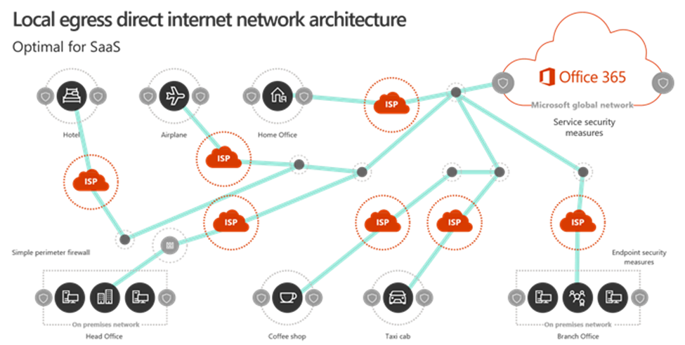
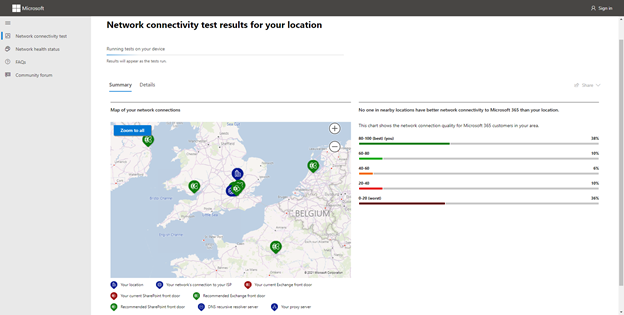
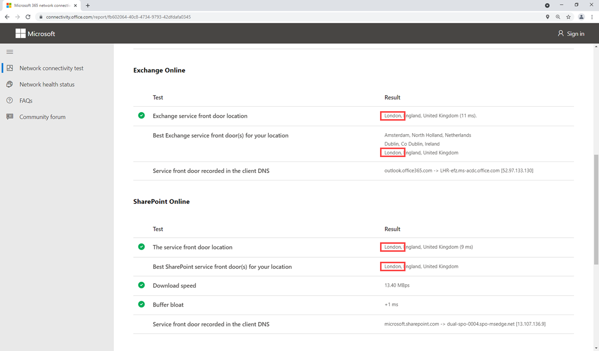
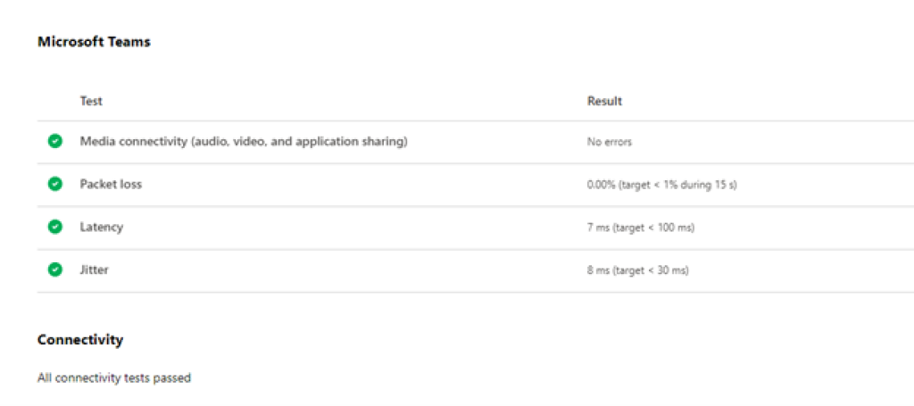
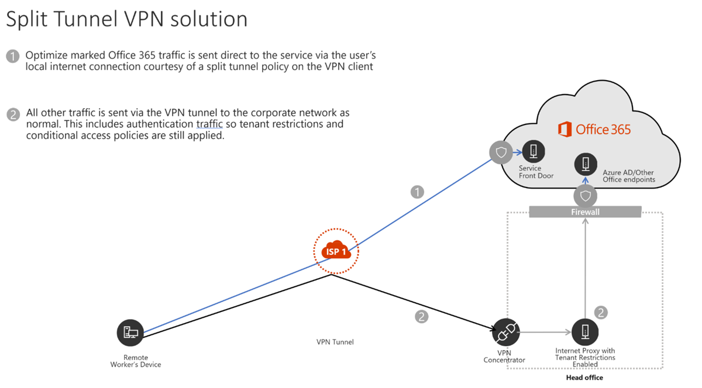
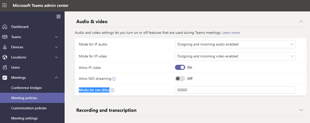

Microsoft Teams sends and receives real-time traffic over the network for its calls and meetings, features, and depends on good network connectivity. There are some configurations you can make in your network architecture to optimize performance for teams. This unit covers internet breakout strategy, VPN split tunneling, and limiting Teams bandwidth use with the Media Bit Rate configuration.

## Design local site internet breakout strategy for client media optimization

Most larger organizations will have their sites network connected via a private Wide Area Network (WAN), using technologies like Multiprotocol Label Switching (MPLS), or maybe a Software defined WAN (SD-WAN).

They may then have specific internet ingress and egress points on their global private network; for example, having all the internet connectivity for Europe route in and out of one connection. This is done to centralize internet traffic through dedicated firewalls and proxies at a single location.

While this configuration can make network management easier, it is suboptimal for real-time network traffic like teams as it must route over the WAN, then break out onto the internet at the regional internet connection. This adds latency and traffic can potentially be impacted with conjunction on the WAN links. Most Teams traffic, including all meeting traffic and Calling Plan and Operator Connect calls, will need to break out to the internet.

Microsoft has local ingress points to its network all over the world:  a so called "Distributed Service Front Door infrastructure" designed to shorten the route between customers and cloud services. If the internet is centralized, clients traffic takes a longer route to get to Office 365.

The best option for Office 365 traffic is to allow local internet breakout from each site. This is also called local egress direct internet network architecture.




In this picture, you can see each site is allowed to connect directly to the internet without going over a WAN or in the case of the remote users any VPN.

This optimizes the network route; end-user connections are dynamically routed to the nearest Microsoft 365 entry point by the Distributed Service Front Door infrastructure. It also reduces the load on the organizations WAN. All connections between the client and Office 365 are encrypted. With less traffic routing across the WAN, technologies like QoS become less important as most traffic will go direct from the site to Microsoft.

## Validate local site internet breakout with The Microsoft 365 connectivity test

If you have configured local site internet breakout and want to validate it is working or are unsure if a site has optimal internet routing, you can validate it with The Microsoft 365 connectivity test.

The Microsoft 365 connectivity test is a tool that runs basic connectivity tests against your Microsoft 365 tenant and makes recommendations for optimal Microsoft 365 performance.

Among the other test, the tool detected your location, or you can specify your location manually; it will then check the network path to the nearest Microsoft 365 service front door.

To run the test, perform the following steps:

1. Navigate to the Microsoft 365 network connectivity test at [https://connectivity.office.com/](https://connectivity.office.com/)

1. Sign in with your Office 365 account for the best test experience.

1. Either automatically detect location or add your location manually.

> [!TIP]
> If you let the tool automatically detect your connection, make sure it is correct on the map to make the test valid.

- Once the test is complete, you will see the results.



This picture shows the results of a network connectivity test. You can see the Azure front door in use is near to the site location, which is good.

- Select Details for the detailed results. You can then check your Exchange Online and SharePoint Online front door location and match the best option for your location. There is no specific front door test for Teams.

The following picture of the detailed results shows that the Exchange and SharePoint front door locations in use are one of the best front door locations, which is good:




The Microsoft 365 connectivity test tool will also perform some basic Teams network performance tests. You can see in the picture below this site passed for connectivity, packet loss, latency, and jitter tests.




After performing the described steps, you have learned how to test if you are connecting to Office 365 optionally. It is recommended to perform this test on every enterprise site and after any network changes to ensure your network and ISP are routing traffic optimally.

## Design VPN Split tunneling

A client virtual private network (VPN) allows traffic from a client or user; for example, a remote laptop user, to make a virtual point-to-point encrypted tunnel connection to a remote server, usually connects them into the organization’s network. This allows access to resources on the organization’s network.

VPN tunneling is where all remote clients route their traffic over an encrypted tunnel back to the organization’s network before being routed onto the internet. This model was designed when most organizations had most of the resource’s users needed on servers on-premises and some traffic went to the internet.

However, with more and more resources “in the cloud” or on the internet, sending all client traffic from the client to the organizations network before breakout onto the internet is suboptimal. Therefore, if you use a client VPN, Microsoft recommends letting Teams and Office 365 traffic bypass the VPN and go directly to the internet from the client machine, commonly known as split-tunnel VPN.

Microsoft strongly recommends against sending Teams traffic over a VPN, for the following reasons:

- VPNs are typically not designed or configured to support real-time media, and some don't support UDP, which is the optimum transport protocol for media traffic.

- VPNs will cause teams traffic to take a suboptimal route into the organization’s network before going onto the internet.

- VPNs also introduce an extra layer of encryption on top of media traffic that's already encrypted.

- Save load on your VPN and avoid it becoming a choke point for network traffic. This can be a real challenge with the amount of audio and video traffic teams generates.

In a split tunnel configuration, only a subset of traffic is routed over the VPN. You can either explicitly specify routes to exclude from the VPN or explicitly include routes to go over the VPN. If the VPN is used to connect to specific servers/services within the organizational network, it can be easier to configure the VPN to only route traffic for those specific IP addresses or subnets.

If your organization generally prefers to route internet traffic onto the organizations network and through the organizations proxies and firewalls before going onto the internet, you may just want to exclude the specific Office 365 addresses from the VPN route. Microsoft supplies a list of all Office 365 IP addresses (see the resources in this module for a link) that you should exclude from your VPN.

> [!NOTE]
> The services and IP address are constantly evolving; so, if choosing to explicitly exclude the Office 365 services from your VPN, you will need to check and update this configuration regularly.

In this picture, we see a split tunnel VPN. Traffic for Office 365 is specifically excluded from the VPN tunnel directly from the user to the service over their local internet connection. All other traffic is sent over the VPN to the organizations network.




How you configure your VPN will depend on which VPN client software you or your organization requires you to use, but split-tunneling is a functionality all common 3rd party vendors are providing.

> [!IMPORTANT]
> Some organizations have policies that require every user to send all incoming and outgoing traffic over firewall appliances, and a split-tunneling can possibly violate these policies. Check what your organizations policies are and ensure you have policy approval for this configuration.

## Validate VPN Split tunneling

Once you have configured split tunneling, you can validate the configuration in a few different ways.

A simple **tracert** in PowerShell on a remote VPN connected client machine to an endpoint/address that is configured to go directly to the internet, not via the VPN, should show that the path taken is directly via the clients ISP, not the VPN.

```console
tracert worldaz.tr.teams.microsoft.com

```

The result shows you the different hops your packets going to take to reach the destination:

```console
Tracing route to b-tr-teasc-euno-13.northeurope.cloudapp.azure.com [52.114.251.234]

over a maximum of 30 hops:

  1     1 ms     1 ms     1 ms  localrouter.box [192.168.10.1]

  2     8 ms    53 ms     7 ms  vt1.cor2.lond2.ptn.zen.net.uk [51.148.72.24]

  3     8 ms     7 ms     8 ms  lag-8.p1.ixn-lon.zen.net.uk [51.148.73.188]

  4     8 ms     7 ms     7 ms  lag-2.p1.thn-lon.zen.net.uk [51.148.73.132]

  5     8 ms     7 ms     7 ms  lag-1.br1.thn-lon.zen.net.uk [51.148.73.153]

  6     9 ms     *        *     104.44.6.57

  7     9 ms    22 ms    22 ms  ae29-0.icr01.lon24.ntwk.msn.net [104.44.41.162]

  8    18 ms   144 ms    18 ms  be-100-0.ibr01.lon24.ntwk.msn.net [104.44.21.107]

  9    18 ms    18 ms    18 ms  be-3-0.ibr01.dub08.ntwk.msn.net [104.44.30.47]

 10    18 ms    39 ms    17 ms  ae102-0.icr02.dub08.ntwk.msn.net [104.44.11.66]

 11     *        *        *     Request timed out.

 12     *        *        *     Request timed out.

 13     *        *        *     Request timed out.

 14     *        *

```

In this test, the remote client Internet service provider is called “Zen.” We can see we hop over addresses on the zen.net.uk  network directly to Microsoft without going via a VPN. You will need to look for names that relate to the relevant client ISP.

If you see this traceroute routing to the VPN, which you can recognize by seeing your VPN FQDN and IP addresses, you have not configured the VPN correctly for split tunneling.

It is normal for you to see “Request timed out” on the later hops. The destination’s firewall or other security device is blocking the traceroute request. Even if a firewall is preventing the final hops at the destination from showing up in traceroute output, the destination is likely still reachable, it has just been configured not to reply to a traceroute.

Another option is to run the Microsoft 365 connectivity test that will run connectivity tests for you including trace routes as above. This can be a more friendly way for a remote user to run the test who is not familiar with command-line tools.

To run the Microsoft 365 connectivity test, perform the following steps:

1. On the remote client machine, navigate to the Microsoft 365 network connectivity test at [https://connectivity.office.com/](https://connectivity.office.com/)

1. Sign in with your Office 365 account for the best test experience.

1. Either **automatically detect location** or add your **location manually**.

> [!TIP]
> If you let the tool automatically detect your connection, make sure it is correct on the map to make the test valid.

Once the test is complete select **Details** for the detailed results. Scroll down to **Network Path** and expand and look for **Traceroute to worldaz.tr.teams.microsoft.com.**


The same logic applies to interpreting the results in the above picture. The remote client Internet service provider is called “Zen.” We can see we hop addresses on the zen.net.uk network directly to Microsoft without going via a VPN. You will need to look for names that relate to the relevant client ISP

If you see this traceroute routing to the VPN, which you can recognize by seeing your VPN FQDN and IP addresses, you have not configured the VPN correctly for split tunneling.

Note, it is normal for you to see “Request timed out” on the later hops. The destination’s firewall or other security device is blocking the traceroute request. Even if a firewall is preventing the final hops at the destination from showing up in traceroute output, the destination is likely still reachable; it has just been configured not to reply to a traceroute.

> [!NOTE]
> In certain scenarios, often unrelated to Teams client configuration, media traffic still traverses the VPN tunnel even with the correct client routes in place. If you encounter this scenario, you can configure firewall rule to block the Teams IP subnets or ports from using the VPN route

## Managing bandwidth by configuring Media Bit Rate (MBR)

Microsoft Teams will dynamically optimize for the best experience it can give based on the bandwidth available. If the Teams client detects packet loss or other network issues, it will ramp down audio and video quality. If the network is uncontested, it will optimize for quality and use more bandwidth.

Microsoft Teams does have an option to limit the average bit rate of calls and meetings, this is called the Media bit rate (MBR). Perform the following steps to configure a meeting policy:

1. Navigate to the Microsoft Teams admin center at [https://admin.teams.microsoft.com](https://admin.teams.microsoft.com/).

1. Select **Meetings** and select **Meeting policies**.

1. Navigate to **Media bit rate (Kbs)** and change it according to your needs.




This setting determines the average combined media bit rate for audio, video, and video-based app sharing in both meetings and peer to peer calls. The Media Bit Rate applies to both the client and the Teams service, so it is enforced in both directions. So, this limit is for both inbound and outbound traffic from the Teams client.

> [!NOTE]
> This is a maximum. If the client experiences network issues, it will still lower video and audio quality to try to give the best experience within the bandwidth available.

The default is 50,000 Kbps, which is essentially unlimited, as it's way more than an individual Teams client can possibly use. For meetings that need the highest quality video experience, Microsoft recommends you set the bandwidth to 10,000 Kbps or 10 megabits per second. The minimum value you can go down to is 30 Kbps, but this will heavily restrict the user experience to basic audio for calls and meetings.

The following table describes the minimum bandwidth per user required for using Teams in different calling situations. Consider which experience level you want users to have. Based on the table below, the minimum you can set to have all Teams experiences at a minimum excluding Together Mode is 250 kbps.

<br>

| Modality| Minimum Up| Minimum Down| Recommended Up| Recommended Down| Best Performance Up| Best Performance Down|
| :--- | :--- | :--- | :--- | :--- | :--- | :--- |
| Audio|||||||
| One-to-one| 10| 10| 58| 58| 76| 76|
| Meetings| 10| 10| 58| 58| 76| 76|
| Video|||||||
| One-to-one| 150| 150| 1,500| 1,500| 4,000| 4,000|
| Meetings| 150| 200| 2,500| 4,000| 4,000| 4,000|
| Screen sharing|||||||
| One-to-one| 200| 200| 1,500| 1,500| 4,000| 4,000|
| Meetings| 250| 250| 2,500| 2,500| 4,000| 4,000|
| Together Mode (Meetings Only)| 1,000| 1,500| 1,500| 2,500| 2,500| 4,000|

### Optimize WiFi

By default, WiFi networks are not designed or configured to optimally support real-time media. Each vendor has its own recommendations for deploying its wireless solution, and you should consult your vendors documentation for more detail. There are some general recommendations:

- Implement QoS or WiFi Multimedia (WMM) to prioritize real-time media traffic.

- The 5-GHz range is better suited to real-time media than 2.4Ghz due to its dense range and lower interference. If you're using dual-band WiFi networks, consider implementing band steering to push clients to use the 5-GHz range.

- When access points of the same channel are too close together, they can cause signal overlap and unintentionally compete, resulting in a bad experience for the user. Ensure that access points that are next to each other are on channels that don't overlap.

## Performance optimization for China users

Connectivity and performance for users in China can be complicated by factors unique to China Telco's Internet architecture. China ISPs have regulated offshore connections to the global public Internet that go through perimeter devices that are prone to high-levels of cross-border network congestion. This congestion creates packet loss and latency for all Internet traffic going into and out of China.

This section provides guidance for scenarios in which users located in China connect to a global Microsoft 365 tenant outside of China.

There is also an option to have an Office 365 tenant in China operated by 21Vianet, in which case, you are not crossing the perimeter devices and this advice does not apply.

The following is recommended for optimize traffic for China users:

- Leverage your existing private network to carry Microsoft 365 network traffic between China office networks and offshore locations that egress on the public Internet outside China. Almost any location outside China will provide a clear benefit. Egressing in areas with low-latency interconnect with the Microsoft global network such as Singapore, Japan, and South Korea is optimal.

- Configure your network to route all Microsoft 365 traffic across your private offshore link.

- Configure user devices to access the corporate network over a VPN connection to allow Microsoft 365 traffic to transit the corporate network's private offshore link.

- Ensure that VPN clients are either not configured to use split tunneling, or that user devices are configured to ignore split tunneling for Microsoft 365 traffic.

- If possible, use UDP instead of TCP for live media streaming traffic, such as for Teams. UDP offers better live media streaming performance than TCP.

If your users have PSTN Audio Conferencing feature, users in China may have a better meeting experience joining meetings via the public switched telephone network (PSTN).
For more information on optimizing for China users, see the link in the resources section.
