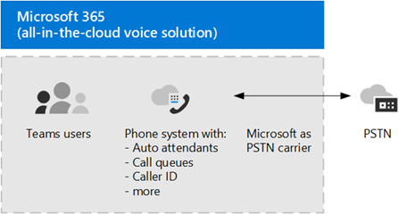
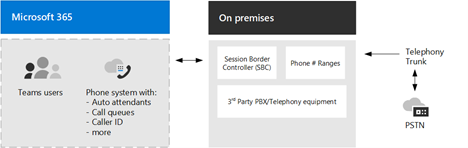

A Private Branch Exchange (PBX) is a phone system within a business. Microsoft 365 Phone System is Microsoft's technology for enabling call control and Private Branch Exchange (PBX) capabilities in the Microsoft 365 cloud with Microsoft Teams.

Calls between two users in your organization are handled within Teams Phone and never go to the Public Switched Telephone Network (PSTN). This also applies to multiparty calls between users in your organization, irrespective if they are in the same or different geographical areas, removing long-distance costs on these internal calls.

To connect the Phone System to the PSTN, you can choose one of the following options:

- **Phone System with Calling Plan:** An all-in-the-cloud solution with Microsoft as your PSTN carrier.

- **Phone System with your own PSTN carrier** by using Direct Routing to connect your on-premises environment to Teams.

## Teams Phone with Calling Plans

Teams Phone with Calling Plans is Microsoft's all-in-the-cloud solution that provides Private Branch Exchange (PBX) functionality and calls to the Public Switched Telephone Network (PSTN), as shown in the following diagram. With this solution, Microsoft is your PSTN carrier.

Microsoft 365 Phone System with Calling Plan might be the right solution for you if you can answer yes to the following questions:

- Is Calling Plan available in your region?

- Can you do without your current PSTN carrier?

- Are there no requirements for Contact Center and Call Recording?

With Calling Plans:

- You get Microsoft Teams Phone with added Domestic or International Calling Plans that enable calling to phones around the world (depending on the level of service being licensed).

- You do not require deployment or maintenance of an on-premises deployment—because Calling Plan operates out of Microsoft 365 or Office 365.

- If necessary, you can choose to connect a supported Session Border Controller (SBC) through Direct Routing for interoperability with third-party PBXs, analog devices, paging systems, and other third-party telephony equipment supported by the SBC.

This option requires an uninterrupted connection to Microsoft 365.

## Teams Phone with your own PSTN carrier with Direct Routing

It is possible that your system is more complex, and you cannot answer yes to the three questions above for Phone System with Calling Plan. For example, you might have offices in locations where Calling Plan isn't available. Or you might need a combination solution that supports a complex, multi-national deployment, with different requirements for different geographic locations. You might need to connect the Phone System to your telephony network using Direct Routing, as outlined in the following diagram.

If you answer yes to the following questions, then Phone System with Direct Routing is the right solution for you:
- You want to use Teams with Phone System.

- You must retain your current PSTN carrier.

- You want to mix routing, with some calls going through Calling Plan, some through your carrier.

- You must interoperate with third-party PBXs and/or equipment, such as overhead pagers, analog devices, and so on.

With Direct Routing:
- You connect your own supported Session Border Controller (SBC) to Microsoft Teams Phone System without the need for additional on-premises software.

- You can use virtually any telephone carrier with Microsoft Phone System.

- You can choose to configure and manage this option, or it can be configured and managed by your carrier or partner (ask if your carrier or partner provides this option).

- You can configure interoperability between your telephony equipment—such as a third-party PBX and analog devices—and Microsoft Phone System.

> [!NOTE]
> This option requires an uninterrupted connection to Microsoft 365.

## Deploying and maintaining a supported SBC

A contract with a third-party carrier. Unless deployed as an option to provide connection to third-party PBX, analog devices, or other telephony equipment for users who are on Phone System with Calling Plan.

The information presented above should give you an idea of what decisions you need to make to be able to deploy the proper configuration for the Phone System.
