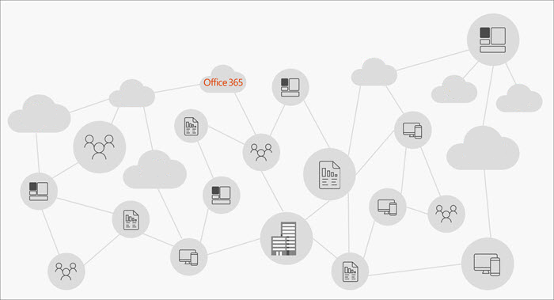
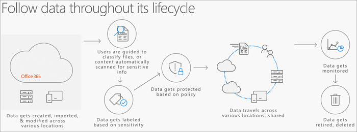
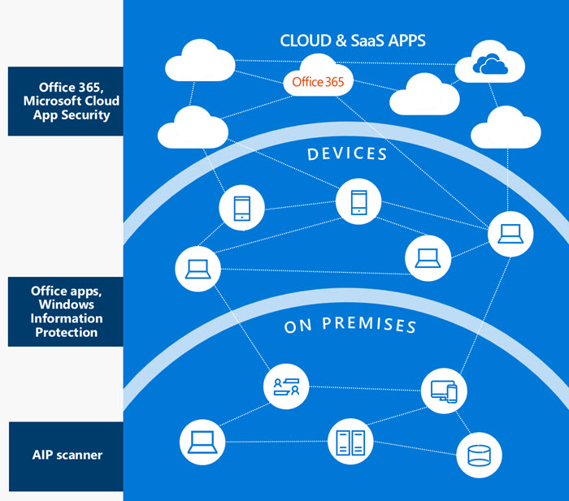
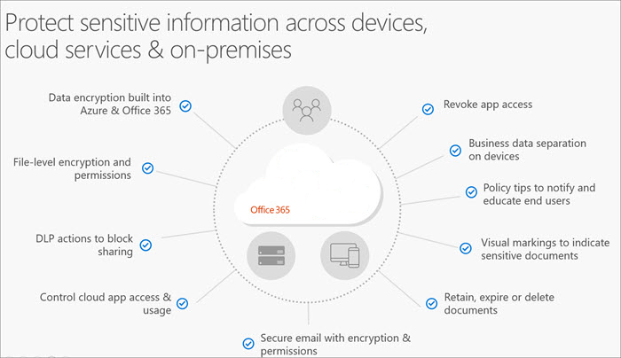

> [!VIDEO https://www.microsoft.com/videoplayer/embed/RE2YzPa]

In a mobile-first, cloud-first world, important business data lives and travels everywhere. 

*Your data travels everywhere*

Organizations need to balance productivity and security. How do you create and share information across boundaries, while preventing the unauthorized disclosure, modification, or destruction of that data? What can you do to reduce the risk that employees share sensitive information accidentally or use sensitive information inappropriately?

To balance productivity and security effectively, you need a strategy to protect and manage sensitive information. You need to know where your sensitive information is located. And you need to be able to control it as it travels within and outside your organization. You also need to have a way to classify, label, and apply appropriate protections to your information.

It can be helpful to think about your information protection strategy in terms of these four key activities:
- Discover
- Classify
- Protect
- Monitor

The Microsoft Information Protection solutions in Microsoft 365 help you protect sensitive data throughout its lifecycle—across devices, apps, cloud services, and on-premises locations.

## Integrated capabilities protect and manage data throughout its lifecycle
The unified labeling experience in Microsoft 365 provides organizations with a more integrated and consistent approach to creating, configuring, and automatically applying comprehensive policies to protect and govern data – across devices, apps, cloud services, and on-premises. The information protection capabilities also support your overall data governance strategy. Classifying and labeling data enables you to apply policy-based protections and/or retention actions. Advanced monitoring and analytics provide visibility and insights into your organization’s data. You can understand where important data resides, receive alerts on policy violations, and view recommendations on policy enhancements based on your environment.

*Integrated capabilities work together over the course of the data lifecycle to keep information protected and managed*

The following units will explain in greater detail how these capabilities work at each phase of the data lifecycle.

## Discover and classify sensitive information
The Discover and Classify phases of information protection involve scanning and detecting sensitive data – all based on the policies defined and configured by your organization. 

Key considerations:
- Is there an automated way to discover important data?
- Which regulations and compliance factors matter? 
- Is my data spread out across devices, the cloud, and on-premises servers? 
- Is my data spread out geographically? 
- Are certain employees or groups more relevant for discovery? 
- Do I know the characteristics of sensitive or important data?

### Discover sensitive information
In order to protect your organization’s information, you need to be able to discover sensitive information no matter where it is created or lives. That means having sensitive data discovery capabilities across your on-premises file shares or datacenters, on individual devices, as well as across cloud services and SaaS applications. 

*Where your sensitive data may be*

What counts as “sensitive data” for your organization is  determined by things like your industry (such as healthcare, financial services), governmental regulations and policies, as well as your organization’s internal policies.
- You can start by using **Content Search** to search for in-place items such as email, documents, and instant messaging conversations.
- Microsoft has many built-in **sensitive information types** (part of Data Loss Prevention) that can be used to detect common sensitive information types, like financial, healthcare-related, or personal information. 
- If you need more granular control beyond the built-in sensitive information types, you create your own **custom sensitive information types**, or add your own unique dictionary of terms to detect against. 
- Beyond detecting sensitive information in documents and emails, you can also use **Microsoft Defender for Cloud Apps** to detect content in cloud storage services, based on policy. You can discover sensitive data across third-party SaaS apps. You can also apply labels and protection to sensitive files with Microsoft Information Protection.
- The **Azure Information Protection Scanner** enables you to discover, classify, and protect files on on-premises servers, network shares, and on-premises SharePoint Server sites.

### Classify content with sensitivity labels
After you have identified the sensitive data you want to protect, you can apply sensitivity labels to help your organization monitor the transmission and usage of documents that are potentially sensitive.

You can use sensitivity labels to:
- **Enforce protection settings such as encryption or watermarks on labeled content**. For example, if your users applies a Confidential label to a document or email, that document or email is encrypted and given a Confidential watermark.
- **Protect content in Office apps across different platforms and devices**. Sensitivity labels work in Office apps on Windows, Mac, iOS, and Android. 
- **Prevent sensitive content from leaving your organization on devices running Windows, by using endpoint protection in Microsoft Intune**. After a sensitivity label has been applied to content that resides on a Windows device, endpoint protection can prevent that content from being copied to a third-party app, such as Twitter or Gmail, or being copied to removable storage, such as a USB drive.
- **Extend sensitivity labels to third-party apps and services**. With the Microsoft Information Protection SDK, third-party apps on Windows, Mac, and Linux can read sensitivity labels and apply protection settings. Support for apps on iOS and Android is coming soon.
- **Classify content without using any protection settings**. You can also assign a classification to content (like a sticker) that persists and roams with the content as it's used and shared. You can use this classification to generate usage reports and see activity data for your sensitive content. Based on this information, you can always choose to apply protection settings later.

You have flexibility in how you choose to apply sensitivity labels. You can configure a policy to automatically apply a sensitivity label to a document based on the detection of sensitive information. For example, policy could be defined to automatically mark a document as “confidential” if it contains social security numbers. 

Alternatively, you can set things up so that a recommended classification and sensitivity label can be provided to users. You can also give users the ability to override an automatic classification, while requiring a justification for the override.

Because individual users may be most familiar with the data in your organization, you can also enable users to classify and apply a sensitivity label themselves. For example, if they are working on a document that contains privileged information, they can apply a sensitivity label of “highly confidential” right within the app. 

## Protect information and prevent data loss
Sensitive data may initially be created on an individual device, but it's frequently shared or stored in other locations, like cloud-based storage, on-premises file shares, or email. There are complementary protection measures you can take to protect this sensitive information wherever it lives or travels: 

*Methods to protect your sensitive data*

- Microsoft 365 has data encryption built into the service – for both data at rest and data in transit. 
- To protect individual files, you can apply rights-based permissions so that only intended recipients can access and view the information.
- You can apply Data Loss Prevention actions, such as blocking the sharing of a file that has sensitive information like credit card or social security numbers.
- You can limit or block access to cloud apps present in your environment, or revoke app access among specific individuals.
- To help end-users make more informed decisions, you can enable policy tips that notify users that the document they are working with contains sensitive information, or you can even automatically apply a visual marking to documents, such as a header or footer. 
- To help prevent sensitive information from staying around longer than necessary and potentially posing a risk, you can automatically retain, expire, or delete documents, based on data governance policies defined by your company. 

## Monitor and respond to threats
There are two key activities in the “Monitor” phase of the information protection lifecycle. First, you need to **gain visibility** into all the events impacting your environment. Second, you need to **take action** or remediate, based on the event.

You can get visibility into relevant activity and events in several ways. You can review reports and alerts on policy violations, sensitive document access, and sharing. You can also review cloud app usage and anomalous activity, such as a large download of data from a specific cloud app within a certain period of time. 

Just as important as visibility is the ability to take immediate action. For example, if your end-user productivity is being negatively impacted because of restrictive DLP policies, you can tune your policies to find the right balance. Or, if you discover anomalous activity or inappropriate sharing, you can immediately revoke app access or quarantine a file or a user. 

If you use a security incident and event management system (SIEM), you can also feed certain events, such as DLP events, into these systems in order to give customers a centralized reporting and monitoring experience.

Here’s a closer look at some of the monitoring capabilities in Microsoft 365.

### Information protection reports and analytics

The Label Analytics dashboard in the Microsoft 365 compliance center aggregates label insights so that you can see how sensitivity and retention labels are being used for both Microsoft 365 and non-Microsoft 365 data.

*Label Analytics dashboard*

Additional capabilities that help you monitor information protection:

- **Data loss prevention**. Data loss prevention policy matches, false positives and overrides, and links to create or edit policies
- **Data governance**. Information about how labels are applied, labels classified as records, label trends, and more
- **Threat management dashboard**. Also referred to as the Security dashboard and the Threat Intelligence dashboard
- **Mail flow**. Information about sent and received email messages, recent alerts, top senders and recipients, email forwarding reports, and more
- **Data privacy**. Tools and guidance to facilitate ease in discovering, governing, protecting, and monitoring the personal data in your organization.
- **Audit log**. Information about Microsoft 365 activities, users, files or folders, and more
- **Compliance reports**. FedRAMP reports, governance, risk and compliance reports, ISO information security management reports, and Service Organization Controls audit and assessment reports
