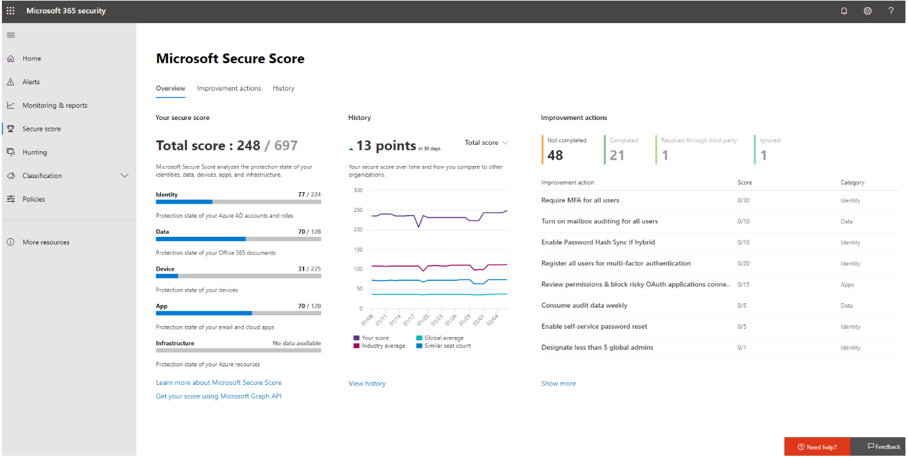

Managing your security posture to protect against a continually evolving threat landscape offers many challenges. From having too many security solutions with various places to configure lots of controls, a lack of knowledge around which controls are the most effective, and being unable to benchmark yourself against other organizations, it can be difficult for security teams to find the right balance of security and productivity.

With Microsoft Secure Score in the Microsoft 365 Defender portal, you can have increased visibility and control over your organization’s security posture. From a centralized dashboard you can monitor and improve the security for your Microsoft 365 identities, data, apps, devices, and infrastructure. 

*Your Secure Score reflects the overall security of your organization, at a glance*

Microsoft Secure Score gives you robust visualizations, integration with other Microsoft products, comparison of your score with other companies, filtering by category, and much more. With the tool, you can complete security improvement actions within your organization and track the history of your score. The score can also reflect when third-party solutions have addressed recommended improvement actions. 

*Microsoft 365 secure score center*

You're given points for configuring recommended security features, performing security-related tasks (such as viewing reports), or addressing the improvement action with a third-party application or software. Some actions are scored for partial completion, like enabling multi-factor authentication (MFA) for your users. Security should always be balanced with usability, and not every recommendation will work for your environment.

You can use Microsoft Secure Score recommendations to target the most important settings and make changes quickly. 
