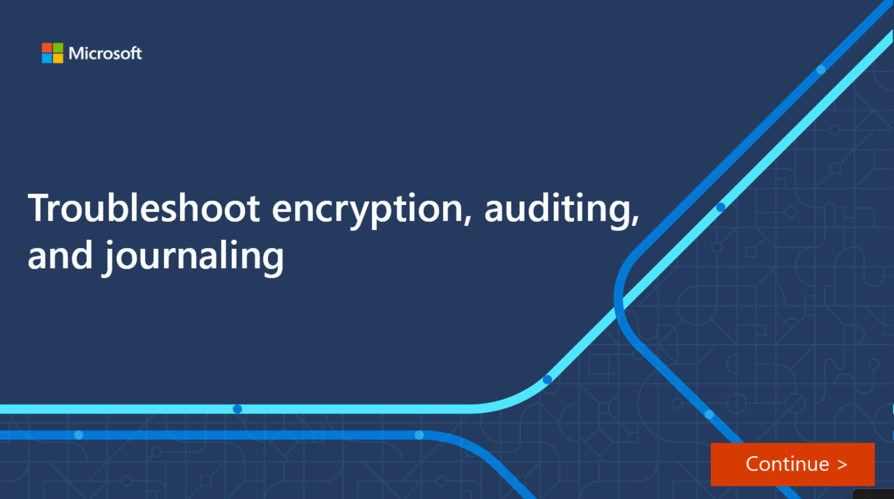

In this interactive demonstration, you’ll learn how to check the Office Message Encryption (OME) configuration in PowerShell and Exchange admin center. You’ll also correct a faulty transport rule.

[]
(https://edxinteractivepage.blob.core.windows.net/edxpages/ms-220/mod4-investigate-office-mail-encryption/index.html?azure-portal=true)