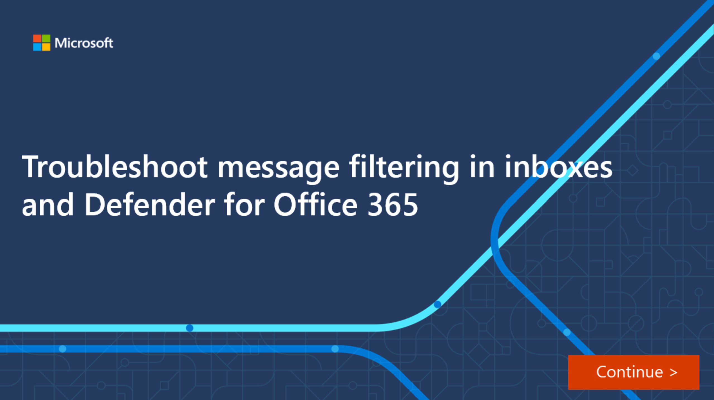

In this interactive guide, you’ll learn how to use Outlook and PowerShell to investigate and troubleshoot issues with inbox rules.

[]
(https://edxinteractivepage.blob.core.windows.net/edxpages/ms-220/mod2-problematic-inbox-rules/index.html?azure-portal=true)